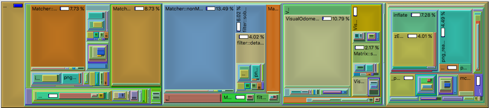

# EE109 Digital System Lab Final Report
Connor Normand, Pranav Padode

## Table of Contents
- Application Overview
- Software Simulation
- Hardware Implementation
- Design Tradeoffs
- Appendix

## Application Overview
- The aim of our project is to find ways to push very computationally-expensive computer vision tasks to hardware 
accelerators and improving performance numbers to completion. We are specifically interested in implementing a 
stereoscopic visual odometry system. This visual odometry system utilizes a set of pairs of images from two cameras to calculate a 6 DOF matrix that represents a change in position.

## Software Simulation 
- The visual odometry system that we are using is called libviso2 and is built on pure C++ with no external dependencies. The library implements normalization of images, feature matching, RANSAC and kalman-filtering to give a 6 DOF matrix that gives the change in position.

- [Libviso2 Link](http://www.cvlibs.net/software/libviso/) 

- When libviso2 was profiled, we found that a number of select functions represented the majority of the runtime, the two that we chose to focus on represented ~24& of all time spent inside of libviso2. These functions were nonMaximumSuppression and computeResidualsAndJacobian.



- When processing the runtime of libviso2, we chose to use the <chrono> package in the C++ software simulation to benchmark our progress in optimization. In our recordings, we found that the function nonMaximumSuppression took ~20.3 ms to process. Our goal moving forward was to bring this runtime down through hardware acceleration.

```
Example Output:
Processing: Frame: 28
Time taken by function: 16 milliseconds
Time taken by function: 24 milliseconds
Time taken by function: 17 milliseconds
Time taken by function: 24 milliseconds
Processing: Frame: 29
Time taken by function: 18 milliseconds
Time taken by function: 28 milliseconds
Time taken by function: 18 milliseconds
Time taken by function: 21 milliseconds
Processing: Frame: 30
Time taken by function: 17 milliseconds
Time taken by function: 24 milliseconds
Time taken by function: 14 milliseconds
Time taken by function: 23 milliseconds
Processing: Frame: 31
Time taken by function: 16 milliseconds
Time taken by function: 27 milliseconds
Time taken by function: 17 milliseconds
Time taken by function: 23 milliseconds
Processing: Frame: 32
Time taken by function: 18 milliseconds
Time taken by function: 29 milliseconds
Time taken by function: 16 milliseconds
Time taken by function: 29 milliseconds
Processing: Frame: 33
Time taken by function: 18 milliseconds
Time taken by function: 26 milliseconds
Time taken by function: 18 milliseconds
Time taken by function: 23 milliseconds
Processing: Frame: 34
Time taken by function: 17 milliseconds
Time taken by function: 27 milliseconds
Time taken by function: 18 milliseconds
Time taken by function: 24 milliseconds
Processing: Frame: 35
Time taken by function: 20 milliseconds
Time taken by function: 25 milliseconds
Time taken by function: 16 milliseconds
Time taken by function: 25 milliseconds
Processing: Frame: 36
Time taken by function: 18 milliseconds
Time taken by function: 26 milliseconds
Time taken by function: 17 milliseconds
Time taken by function: 21 milliseconds
Processing: Frame: 37
Time taken by function: 18 milliseconds
Time taken by function: 31 milliseconds
Time taken by function: 16 milliseconds
Time taken by function: 26 milliseconds
Processing: Frame: 38
Time taken by function: 19 milliseconds
Time taken by function: 24 milliseconds
Time taken by function: 17 milliseconds
Time taken by function: 20 milliseconds
```

## Hardware Implementation
- The driving function of the hardware implementation of nonMaximumSuppression (Full test function located in Milestone 2) is replicated here:

```scala
  @virtualize
  def nms(image: Matrix[T], image_2: Matrix[T], n: Int, tau: Int, margin: Int): Tensor4[T] = {
    val H = ArgIn[Int]
    val W = ArgIn[Int]
	val N = ArgIn[Int]
	val M = ArgIn[Int]
	val TAU = ArgIn[Int]
	
    setArg(H, image.rows)
    setArg(W, image.cols)
	setArg(N, n)
	setArg(M, margin)
	setArg(TAU, tau)
    val lb_par = 8

    val img = DRAM[T](W, H)
    val img_2 = DRAM[T](W, H)
    val imgOut = DRAM[T](W, H)
	val maximaOut = DRAM[Int](W, H, 4, 4)

    setMem(img, image)
    setMem(img_2, image_2)

    Accel {

	  // initialize and parallelize initial loops
	  val i_start = N + M 
	  val i_end = W - N- M
	  val i_step = N + 1

	  val j_start = N + M
	  val j_end = H - N - M
	  val j_step = N + 1

	  val img_mem = SRAM[T](Width, Height)
	  val img_mem_2 = SRAM[T](Width, Height)
	  img_mem load img(0::W, 0::H)
	  img_mem_2 load img_2(0::W, 0::H)

	  Sequential.Foreach(i_start until i_end by i_step){i =>
	    Sequential.Foreach(j_start until j_end by j_step){j =>
		  val f1mini = Reg[T]
		  val f1maxi = Reg[T]
		  val f2mini = Reg[T]
		  val f2maxi = Reg[T]
		  f1mini := i.to[T]
		  f1maxi := i.to[T]
		  f2mini := i.to[T]
		  f2maxi := i.to[T]

		  val f1minj = Reg[T]
		  val f1maxj = Reg[T]
		  val f2minj = Reg[T]
		  val f2maxj = Reg[T]

		  f1minj := j.to[T]
		  f1maxj := j.to[T]
		  f2minj := j.to[T]
		  f2maxj := j.to[T]

		  val f1minval = Reg[T]
		  val f1maxval = Reg[T]
		  f1minval := img_mem(i, j)
		  f1maxval := f1minval
		
		  val f2minval = Reg[T]
		  val f2maxval = Reg[T]
		  f2minval := img_mem_2(i, j)
		  f2maxval := f2minval

		  // Starting inner loop
	      val i2_start = Reg[Int]
	      val i2_end = Reg[Int]
	      val i2_step = Reg[Int]

	      val j2_start = Reg[Int]
	      val j2_end = Reg[Int]
	      val j2_step = Reg[Int]

	      i2_start := i
	      i2_end := i + N
	      i2_step := 1

	      j2_start := j
	      j2_end := j + N
	      j2_step := 1

		  // Must set thexe parallelization factors correctly prior to running
		  val i2_par = 3
		  val j2_par = 3

		  Foreach(i2_start until i2_end by i2_step par i2_par){ii =>
		    Foreach(j2_start until j2_end by j2_step par j2_par){jj =>
				val curr = Reg[Int]
				curr := img_mem(ii, jj) 
				if (curr < f1minval) {
					f1mini := ii
					f1minj := jj
					f1minval := curr	
				} else if (curr > f1maxval) {
					f1maxi := ii
					f1maxj := jj
					f1maxval := curr
				}
				val curr_2 = Reg[Int]
				curr_2 := img_mem_2(ii, jj)
				if (curr_2 < f2minval) {
					f2mini := ii
					f2minj := jj
					f2minval := curr
				} else if (curr_2 > f2maxval) {
					f2mini := ii
					f2maxj := jj
					f2maxval := curr
				}
		    }
		  }

		  val tile = SRAM[Int](4, 4)
		  tile.par(4)

		  if (f1minval.value.to[Int] <= -TAU) {
			Foreach(0::4 par 4){i_index =>
			  if (i_index == 0)
				tile(i_index, 0) = f1mini
			  else if (i_index == 1)
				tile(i_index, 0) = f1minj
			  else if (i_index == 2)
				tile(i_index, 0) = f1minval
			  else
				tile(i_index, 0) = 0
			}
		  } else {
			Foreach(0::4){i_index =>
			  tile(i_index, 0) = 0
			}
		  }
			if (f1maxval.value.to[Int] >= TAU) {
			  Foreach(0::4){i_index =>
			    if (i_index == 0)
			  	  tile(i_index, 1) = f1maxi
			    else if (i_index == 1)
				  tile(i_index, 1) = f1maxj
			    else if (i_index == 2)
				  tile(i_index, 1) = f1maxval
			    else
				  tile(i_index, 1) = 1
			  }
			} else {
			  Foreach(0::4){i_index =>
			    tile(i_index, 0) = 0
			  }
			}

			if (f2minval.value.to[Int] <= -TAU) {
			  Foreach(0::4){i_index =>
			    if (i_index == 0)
			  	  tile(i_index, 2) = f2mini
			    else if (i_index == 1)
				  tile(i_index, 2) = f2minj
			    else if (i_index == 2)
				  tile(i_index, 2) = f2minval
			    else
				  tile(i_index, 2) = 2
			  }
			} else {
			  Foreach(0::4){i_index =>
			    tile(i_index, 0) = 0
			  }
			}

			if (f2maxval.value.to[Int] >= TAU) {
			  Foreach(0::4){i_index =>
			    if (i_index == 0)
			  	  tile(i_index, 3) = f2maxi
			    else if (i_index == 1)
				  tile(i_index, 3) = f2maxj
			    else if (i_index == 2)
				  tile(i_index, 3) = f2maxval
			    else
				  tile(i_index, 3) = 3
			  }
			} else {
			  Foreach(0::4){i_index =>
			    tile(i_index, 0) = 0
			  }
			}
		
			maximaOut(j, i, 0::4 par 4, 0::4 par 4) store tile
		  }
		  // End first parallelization

	  // End overall loop
	  }

    }

    getTensor4(maximaOut)
  }
```

- Which when run on the board, we receive a runtime/cycle count of

```
Design done, ran for 5.592713 ms, status = 00000001
Kernel done, test run time = 0 ms
[memcpy] dummyBuf = 0x95893008, (phys = 0), arraySize = 247455752
[memcpy] dummyBuf = 0x95893008, dummyBuf[2621439] = 0
  x14605 - 566298 (566298 / 0) [0 iters/parent execution]
    x13280 - 40968 (40968 / 1) [1 iters/parent execution]
      x13241 - 17 (6028 / 335) [335 iters/parent execution]
      x13279 - 121 (40630 / 335) [335 iters/parent execution]
        x13259 - 7 (2679 / 335) [1 iters/parent execution]
        x13278 - 111 (37194 / 335) [1 iters/parent execution]
    x13383 - 40962 (40962 / 1) [1 iters/parent execution]
      x13344 - 17 (6028 / 335) [335 iters/parent execution]
      x13382 - 121 (40626 / 335) [335 iters/parent execution]
        x13362 - 7 (2679 / 335) [1 iters/parent execution]
        x13381 - 111 (37194 / 335) [1 iters/parent execution]
    x13416 - 6 (6 / 1) [1 iters/parent execution]
    x14604 - 484334 (484334 / 1) [1 iters/parent execution]
      x14603 - 5978 (484219 / 81) [81 iters/parent execution]
        x13498 - 7 (13607 / 1701) [21 iters/parent execution]
        x14282 - 49 (85048 / 1701) [21 iters/parent execution]
          x14281 - 13 (23812 / 1701) [1 iters/parent execution]
            x13762 - 9 (17008 / 1701) [1 iters/parent execution]
              x13580 - 9 (17008 / 1701) [1 iters/parent execution]
                x13560 - 0 (766 / 1701) [1 iters/parent execution]
                x13575 - 1 (2756 / 1701) [1 iters/parent execution]
                x13576 - 7 (13486 / 1701) [1 iters/parent execution]
              x13609 - 9 (17008 / 1701) [1 iters/parent execution]
                x13589 - 0 (716 / 1701) [1 iters/parent execution]
                x13604 - 1 (2792 / 1701) [1 iters/parent execution]
                x13605 - 7 (13500 / 1701) [1 iters/parent execution]
              x13638 - 9 (17008 / 1701) [1 iters/parent execution]
                x13618 - 0 (684 / 1701) [1 iters/parent execution]
                x13633 - 1 (2828 / 1701) [1 iters/parent execution]
                x13634 - 7 (13496 / 1701) [1 iters/parent execution]
              x13703 - 9 (17008 / 1701) [1 iters/parent execution]
                x13683 - 0 (762 / 1701) [1 iters/parent execution]
                x13698 - 1 (3386 / 1701) [1 iters/parent execution]
                x13699 - 7 (12860 / 1701) [1 iters/parent execution]
              x13732 - 9 (17008 / 1701) [1 iters/parent execution]
                x13712 - 0 (714 / 1701) [1 iters/parent execution]
                x13727 - 2 (3424 / 1701) [1 iters/parent execution]
                x13728 - 7 (12870 / 1701) [1 iters/parent execution]
              x13761 - 9 (17008 / 1701) [1 iters/parent execution]
                x13741 - 0 (692 / 1701) [1 iters/parent execution]
                x13756 - 2 (3448 / 1701) [1 iters/parent execution]
                x13757 - 7 (12868 / 1701) [1 iters/parent execution]
            x14021 - 9 (17008 / 1701) [1 iters/parent execution]
              x13839 - 9 (17008 / 1701) [1 iters/parent execution]
                x13819 - 0 (1132 / 1701) [1 iters/parent execution]
                x13834 - 3 (5853 / 1701) [1 iters/parent execution]
                x13835 - 5 (10023 / 1701) [1 iters/parent execution]
              x13868 - 9 (17008 / 1701) [1 iters/parent execution]
                x13848 - 0 (1140 / 1701) [1 iters/parent execution]
                x13863 - 3 (5880 / 1701) [1 iters/parent execution]
                x13864 - 5 (9988 / 1701) [1 iters/parent execution]
              x13897 - 9 (17008 / 1701) [1 iters/parent execution]
                x13877 - 0 (1140 / 1701) [1 iters/parent execution]
                x13892 - 3 (5916 / 1701) [1 iters/parent execution]
                x13893 - 5 (9952 / 1701) [1 iters/parent execution]
              x13962 - 9 (17008 / 1701) [1 iters/parent execution]
                x13942 - 0 (992 / 1701) [1 iters/parent execution]
                x13957 - 3 (6565 / 1701) [1 iters/parent execution]
                x13958 - 9451 (9451 / -1161889074) [-683062 iters/parent execution]
              x13991 - 0 (0 / 3) [0 iters/parent execution]
                x13971 - 31 (93 / 3) [1 iters/parent execution]
                x13986 - 16 (335 / 20) [6 iters/parent execution]
                x13987 - 1 (268684800 / 268435456) [89478485 iters/parent execution]
              x14020 - 0 (268560128 / 268809472) [158030 iters/parent execution]
                x14000 - 566298 (566298 / 0) [0 iters/parent execution]
                x14015 - 40968 (40968 / 1) [0 iters/parent execution]
                x14016 - 17 (6028 / 335) [0 iters/parent execution]
            x14280 - 121 (40630 / 335) [0 iters/parent execution]
              x14098 - 7 (2679 / 335) [1 iters/parent execution]
                x14078 - 111 (37194 / 335) [1 iters/parent execution]
                x14093 - 40962 (40962 / 1) [0 iters/parent execution]
                x14094 - 17 (6028 / 335) [1 iters/parent execution]
              x14127 - 121 (40626 / 335) [1 iters/parent execution]
                x14107 - 7 (2679 / 335) [1 iters/parent execution]
                x14122 - 111 (37194 / 335) [1 iters/parent execution]
                x14123 - 6 (6 / 1) [0 iters/parent execution]
              x14156 - 484334 (484334 / 1) [0 iters/parent execution]
                x14136 - 5978 (484219 / 81) [81 iters/parent execution]
                x14151 - 7 (13607 / 1701) [1701 iters/parent execution]
                x14152 - 49 (85048 / 1701) [1701 iters/parent execution]
              x14221 - 13 (23812 / 1701) [5 iters/parent execution]
                x14201 - 9 (17008 / 1701) [1 iters/parent execution]
                x14216 - 9 (17008 / 1701) [1 iters/parent execution]
                x14217 - 0 (766 / 1701) [1 iters/parent execution]
              x14250 - 1 (2756 / 1701) [5 iters/parent execution]
                x14230 - 7 (13486 / 1701) [1 iters/parent execution]
                x14245 - 9 (17008 / 1701) [1 iters/parent execution]
                x14246 - 0 (716 / 1701) [1 iters/parent execution]
              x14279 - 1 (2792 / 1701) [5 iters/parent execution]
                x14259 - 7 (13500 / 1701) [1 iters/parent execution]
                x14274 - 9 (17008 / 1701) [1 iters/parent execution]
                x14275 - 0 (684 / 1701) [1 iters/parent execution]
        x14299 - 1 (2828 / 1701) [21 iters/parent execution]
        x14320 - 7 (13496 / 1701) [21 iters/parent execution]
          x14313 - 9 (17008 / 1701) [1 iters/parent execution]
            x14312 - 0 (762 / 1701) [1 iters/parent execution]
          x14319 - 1 (3386 / 1701) [1 iters/parent execution]
            x14318 - 7 (12860 / 1701) [1 iters/parent execution]
        x14335 - 9 (17008 / 1701) [21 iters/parent execution]
        x14356 - 0 (714 / 1701) [21 iters/parent execution]
          x14349 - 2 (3424 / 1701) [1 iters/parent execution]
            x14348 - 7 (12870 / 1701) [1 iters/parent execution]
          x14355 - 9 (17008 / 1701) [1 iters/parent execution]
            x14354 - 0 (692 / 1701) [1 iters/parent execution]
        x14372 - 2 (3448 / 1701) [21 iters/parent execution]
        x14393 - 7 (12868 / 1701) [21 iters/parent execution]
          x14386 - 9 (17008 / 1701) [1 iters/parent execution]
            x14385 - 9 (17008 / 1701) [1 iters/parent execution]
          x14392 - 0 (1132 / 1701) [1 iters/parent execution]
            x14391 - 3 (5853 / 1701) [1 iters/parent execution]
        x14408 - 5 (10023 / 1701) [21 iters/parent execution]
        x14429 - 9 (17008 / 1701) [21 iters/parent execution]
          x14422 - 0 (1140 / 1701) [1 iters/parent execution]
            x14421 - 3 (5880 / 1701) [1 iters/parent execution]
          x14428 - 5 (9988 / 1701) [1 iters/parent execution]
            x14427 - 9 (17008 / 1701) [1 iters/parent execution]
        x14432 - 0 (1140 / 1701) [21 iters/parent execution]
        x14602 - 3 (5916 / 1701) [21 iters/parent execution]
          x14594 - 5 (9952 / 1701) [1 iters/parent execution]
            x14518 - 9 (17008 / 1701) [1 iters/parent execution]
            x14593 - 0 (992 / 1701) [1 iters/parent execution]
          x14601 - 3 (6565 / 1701) [1 iters/parent execution]
```

- As we can see, elaborating the design took more overall time than the software simulation. The elaboration time for the board is around 5.6 ms, which is about 27.5% of the runtime for the software simulation.

- The logic utilization is shown below

```
Logic utilization (in ALMs) : 54,959 / 251,680 ( 22 % )
Total registers : 83568
Total pins : 145 / 812 ( 18 % )
Total virtual pins : 0
Total block memory bits : 7,814,912 / 43,642,880 ( 18 % )
Total RAM Blocks : 496 / 2,131 ( 23 % )
Total DSP Blocks : 10 / 1,687 ( < 1 % )
Total HSSI RX channels : 0 / 48 ( 0 % )
Total HSSI TX channels : 0 / 48 ( 0 % )
Total PLLs : 50 / 96 ( 52 % )
```

- Compute Residuals and Jacobian found in viso_stereo.cpp is the other function we optimized. Hardware implementation of the code is given below.

```scala
import spatial.dsl._
import org.virtualized._

object Residual extends SpatialApp {
  type T = FixPt[TRUE, _16, _16];

  // This function does dotproducts with a bias. 
  // e.g. Calculating x1c would be: 
  // val x1c = dp(X1p, Y1p, Z1p, r00, r01, r02, tx) 
  // val y1c = dp(X1p, Y1p, Z1p, r10, r11, r12, ty)
  // val z1c = dp(X1p, Y1p, Z1p, r20, r21, r22, tz)
  @virtualize
  def dp[T:Type:Num](x1p: T, y1p: T, z1p: T, ele0: T, ele1: T, ele2: T, bias: T) = {
    ele0 * x1p + ele1 * y1p + ele2 * z1p + bias
  }

  // X2c = input - 1
  @virtualize
  def main() {
    val x = loadCSV1D[T](sys.env("SPATIAL_HOME") + "/apps/test/x.csv", ",");
    val y = loadCSV1D[T](sys.env("SPATIAL_HOME") + "/apps/test/y.csv", ",");
    val z = loadCSV1D[T](sys.env("SPATIAL_HOME") + "/apps/test/z.csv", ",");
    val active = loadCSV1D[T](sys.env("SPATIAL_HOME") + "/apps/test/active.csv", ",");
    val observe = loadCSV1D[T](sys.env("SPATIAL_HOME") + "/apps/test/observe.csv", ",");
    val param = loadCSV1D[Float](sys.env("SPATIAL_HOME") + "/apps/test/param.csv", ",");
    //out values that we want to check with
    val residual = loadCSV1D[T](sys.env("SPATIAL_HOME") + "/apps/test/residual_out.csv", ",");
    val predict = loadCSV1D[T](sys.env("SPATIAL_HOME") + "/apps/test/predict_out.csv", ",");
    val j = loadCSV1D[T](sys.env("SPATIAL_HOME") + "/apps/test/jacob_out.csv", ",");
    val sin = loadCSV1D[T](sys.env("SPATIAL_HOME") + "/apps/test/sin.csv", ",");
    val r = loadCSV1D[T](sys.env("SPATIAL_HOME") + "/apps/test/r.csv", ",")

    /*
  	 * This is the code we will have to parse from the c++ libviso2 program
  	 */
    val rx = param(0).to[Float]    //tr[0]
    val ry = param(1).to[Float]    //tr[1]
    val rz = param(2).to[Float]    //tr[2]
    val tx = param(3).to[T]    //tr[3]
    val ty = param(4).to[T]    //tr[4]
    val tz = param(5).to[T]    //tr[5]


    
    val size = 320      //size of the active vector, which we are fixing to 512 and making the same change in the c++ code
    val N = 320	        //size of the p_residual, p_observe and p_predict array of Floats

    val F = (645.24).to[T]
    val CU = (635.96).to[T]
    val CV = (194.13).to[T]
    val BASE = (0.5707).to[T]

    val active_in = DRAM[T](size)     //need to write active vector into this RAM for use in accel
    val p_observe_in = DRAM[T](4*N)		//observed points
    val X_in = DRAM[T](N)		          //X coordinate points(created as dynamic memory)
    val Y_in = DRAM[T](N)             //Y coordinate points(created as dynamic memory)
    val Z_in = DRAM[T](N)             //Z coordinate points(created as dynamic memory)

    /*
     * These are all the output RAMS from which the C++ code will read in the values again
     */
    val p_residual_out = DRAM[T](4*N)
    val p_predict_out = DRAM[T](4*N)
    val j_out = DRAM[T](24*N)

    val sx_h = sin(0).to[T]
    val cx_h = sin(1).to[T]
    val sy_h = sin(2).to[T]
    val cy_h = sin(3).to[T]
    val sz_h = sin(4).to[T]
    val cz_h = sin(5).to[T]

    // storing all the args into the fpga; should we do the trig stuff here too or let the fpga do that
    val r00_h = r(0).to[T]
    val r01_h = r(1).to[T]
    val r02_h = r(2).to[T]
    val r10_h = r(3).to[T]
    val r11_h = r(4).to[T]
    val r12_h = r(5).to[T]
    val r20_h = r(6).to[T]
    val r21_h = r(7).to[T]
    val r22_h = r(8).to[T]

    //  registers for accel
    val r00 = ArgIn[T]
    val r01 = ArgIn[T]
    val r02 = ArgIn[T]
    val r10 = ArgIn[T]
    val r11 = ArgIn[T]
    val r12 = ArgIn[T]
    val r20 = ArgIn[T]
    val r21 = ArgIn[T]
    val r22 = ArgIn[T]
    val sx = ArgIn[T]
    val cx = ArgIn[T]
    val sy = ArgIn[T]
    val cy = ArgIn[T]
    val sz = ArgIn[T]
    val cz = ArgIn[T]
    val tx_reg = ArgIn[T]
    val ty_reg = ArgIn[T]
    val tz_reg = ArgIn[T]

    //set input registers to val gotten from c++ program
    setArg(r00, r00_h)
    setArg(r01, r01_h)
    setArg(r02, r02_h)
    setArg(r10, r10_h)
    setArg(r11, r11_h)
    setArg(r12, r12_h)
    setArg(r20, r20_h)
    setArg(r21, r21_h)
    setArg(r22, r22_h)

    setArg(tx_reg, tx)
    setArg(ty_reg, ty)
    setArg(tz_reg, tz)

    setArg(sx, sx_h)
    setArg(cx, cx_h)
    setArg(sy, sy_h)
    setArg(cy, cy_h)
    setArg(sz, sz_h)
    setArg(cz, cz_h)

    setMem(X_in, x);
    setMem(Y_in, y);
    setMem(Z_in, z);
    setMem(active_in, active);
    setMem(p_observe_in, observe);

    Accel {
      // Need to load the whole of the X, Y and Z DRAM into the accel because we need to access arbitary indexes.
      val x_active = SRAM[T](N)       //store X
      val y_active = SRAM[T](N)       //store Y
      val z_active = SRAM[T](N)       //store Z
      val active_sram = SRAM[T](size) //store active points
      val j_active = SRAM[T](24*N)    //store jacobian
      val p_observe = SRAM[T](4*N)    //store observation
      val p_predict = SRAM[T](4*N)    //store prediction
      val p_residual = SRAM[T](4*N)   //store residual

      val r00_val = r00.value
      val r01_val = r01.value
      val r02_val = r02.value
      val r10_val = r10.value
      val r11_val = r11.value
      val r12_val = r12.value
      val r20_val = r20.value
      val r21_val = r21.value
      val r22_val = r22.value

      val tx_val = tx_reg.value
      val ty_val = ty_reg.value
      val tz_val = tz_reg.value

      // Registers to store all the RAM values on each loop
      val X1p = Reg[T](0)
      val Y1p = Reg[T](0)
      val Z1p = Reg[T](0)
      val rdrx10 = Reg[T](0)
      val rdrx20 = Reg[T](0)  
      val rdry00 = Reg[T](0)                  
      val rdry10 = Reg[T](0)              
      val rdry20 = Reg[T](0)              
      val rdrz00 = Reg[T](0)        
      val rdrz10 = Reg[T](0) 
      val rdrz20 = Reg[T](0) 
      val rdrx11 = Reg[T](0)
      val rdrx21 = Reg[T](0)
      val rdry01 = Reg[T](0) 
      val rdry11 = Reg[T](0)
      val rdry21 = Reg[T](0)
      val rdrz01 = Reg[T](0)
      val rdrz11 = Reg[T](0)
      val rdrz21 = Reg[T](0)
      val rdrx12 = Reg[T](0)
      val rdrx22 = Reg[T](0)
      val rdry02 = Reg[T](0)
      val rdry12 = Reg[T](0)
      val rdry22 = Reg[T](0)

      // Prepare x1c, y1c, z1c, x2c
      val x1c_reg = Reg[T](0)
      val y1c_reg = Reg[T](0)
      val z1c_reg = Reg[T](0)
      val x2c_reg = Reg[T](0)


      Parallel {
      
      rdrx10 := cx.value * sy.value * cz.value - sx.value * sz.value; 
      rdrx11 := -1.to[T] * cx.value * sy.value * sz.value - sx.value * cz.value; 
      rdrx12 := -1.to[T] * cx.value * cy.value;
      rdrx20 := sx.value * sy.value * cz.value + cx.value * sz.value; 
      rdrx21 := -1.to[T] * sx.value * sy.value * sz.value + cx.value * cz.value; 
      rdrx22 := -1.to[T] * sx.value * cy.value;
      rdry00 := -1.to[T] * sy.value * cz.value;          
      rdry01 := sy.value * sz.value;          
      rdry02 := cy.value;
      rdry10 := sx.value * cy.value * cz.value;       
      rdry11 := -1.to[T] * sx.value * cy.value * sz.value;       
      rdry12 := sx.value * sy.value;
      rdry20 := -1.to[T] * cx.value * cy.value * cz.value;       
      rdry21 := cx.value * cy.value * sz.value;       
      rdry22 := -1.to[T] * cx.value * sy.value;
      rdrz00 := -1.to[T] * cy.value * sz.value;          
      rdrz01 := -1.to[T] * cy.value * cz.value;
      rdrz10 := -1.to[T] * sx.value * sy.value * sz.value + cx.value * cz.value; 
      rdrz11 := -1.to[T] * sx.value * sy.value * cz.value - cx.value * sz.value;
      rdrz20 := cx.value * sy.value * sz.value + sx.value * cz.value; 
      rdrz21 := cx.value * sy.value * cz.value - sx.value * sz.value;
    
    }
      
      x_active load X_in(0::N)						        //load X into SRAM
      y_active load Y_in(0::N)						        //load Y into SRAM
      z_active load Z_in(0::N)						        //load Z into SRAM
      active_sram load active_in(0::size)				  //load active points into SRAM
      p_observe load p_observe_in(0::4*N)		      //load p_observe points into SRAM

           // Pipeline begins for main processing
      // This Foreach loop will need to stay sequential. 
      Sequential.Foreach(size by 1) { i =>
        
        Parallel {
          X1p := x_active(active_sram(i).to[Index]);
          Y1p := y_active(active_sram(i).to[Index]);
          Z1p := z_active(active_sram(i).to[Index]);
        }

        val x1p_val = X1p.value
        val y1p_val = Y1p.value
        val z1p_val = Z1p.value

        val rdrx10_val = rdrx10.value;  
        val rdrx20_val = rdrx20.value;  
        val rdry00_val = rdry00.value;                   
        val rdry10_val = rdry10.value;              
        val rdry20_val = rdry20.value;              
        val rdrz00_val = rdrz00.value;         
        val rdrz10_val = rdrz10.value;
        val rdrz20_val = rdrz20.value; 
        val rdrx11_val = rdrx11.value;
        val rdrx21_val = rdrx21.value;
        val rdry01_val = rdry01.value;
        val rdry11_val = rdry11.value;
        val rdry21_val = rdry21.value;
        val rdrz01_val = rdrz01.value;
        val rdrz11_val = rdrz11.value;
        val rdrz21_val = rdrz21.value;
        val rdrx12_val = rdrx12.value;
        val rdrx22_val = rdrx22.value;
        val rdry02_val = rdry02.value;
        val rdry12_val = rdry12.value;
        val rdry22_val = rdry22.value;

        Parallel {
          Pipe { x1c_reg := dp(x1p_val, y1p_val, z1p_val, r00_val, r01_val, r02_val, tx_val) }
          Pipe { y1c_reg := dp(x1p_val, y1p_val, z1p_val, r10_val, r11_val, r12_val, ty_val) }
          Pipe { z1c_reg := dp(x1p_val, y1p_val, z1p_val, r20_val, r21_val, r22_val, tz_val) }
          Pipe { x2c_reg := x1p_val - 1.to[T] }
        }

          val x1c_val = x1c_reg.value
          val y1c_val = y1c_reg.value
          val z1c_val = z1c_reg.value
          val z1c_val_sqr = z1c_val * z1c_val        
          val x2c_val = x1c_val - BASE

        Parallel {
          //update cur and residual
          Sequential.Foreach (4 by 1) { batch_idx => 
            val cur_predict = if (batch_idx == 0) (F * x1c_val / z1c_val + CU) else if (batch_idx == 1) (F * y1c_val / z1c_val + CV)
                              else if (batch_idx == 2) (F * x2c_val / z1c_val + CU) else (F * y1c_val / z1c_val + CV)
            p_predict(4 * i + batch_idx) = cur_predict
            p_residual(4 * i + batch_idx) = p_observe(4 * i + batch_idx) - cur_predict
          }

          //update jacobian values
          Sequential.Foreach (6 by 1) { batch_idx =>
            val x1cd = if(batch_idx == 1) dp(x1p_val, y1p_val, z1p_val, rdry00_val, rdry01_val, rdry02_val, 0.to[T]) 
                       else if(batch_idx == 2) dp(x1p_val, y1p_val, z1p_val, rdrz00_val, rdrz01_val, 0.to[T], 0.to[T]) 
                       else if(batch_idx == 3) 1.to[T] 
                       else 0.to[T];
            
            val y1cd = if(batch_idx == 0) dp(x1p_val, y1p_val, z1p_val, rdrx10_val, rdrx11_val, rdrx12_val, 0.to[T]) 
                       else if(batch_idx == 1) dp(x1p_val, y1p_val, z1p_val, rdry10_val, rdry11_val, rdry12_val, 0.to[T]) 
                       else if(batch_idx == 2) dp(x1p_val, y1p_val, z1p_val, rdrz10_val, rdrz11_val, 0.to[T], 0.to[T])
                       else if(batch_idx == 4) 1.to[T] 
                       else 0.to[T];
            
            val z1cd = if(batch_idx == 0) dp(x1p_val, y1p_val, z1p_val, rdrx20_val, rdrx21_val, rdrx22_val, 0.to[T]) 
                       else if(batch_idx == 1) dp(x1p_val, y1p_val, z1p_val, rdry20_val, rdry21_val, rdry22_val, 0.to[T]) 
                       else if(batch_idx == 2) dp(x1p_val, y1p_val, z1p_val, rdrz20_val, rdrz21_val, 0.to[T], 0.to[T]) 
                       else if(batch_idx == 5) 1.to[T] 
                       else 0.to[T];

            Sequential.Foreach(4 by 1) { batch_idx2 => 
              j_active((4 * i + batch_idx2) * 6 + batch_idx) = if(batch_idx2 == 0) (F * (x1cd * z1c_val - x1c_val * z1cd)/(z1c_val_sqr)).to[T] 
                                                               else if(batch_idx2 == 1 || batch_idx2 == 3) (F * (y1cd * z1c_val - y1c_val * z1cd)/(z1c_val_sqr)).to[T] 
                                                               else (F * (x1cd * z1c_val - x2c_val * z1cd)/(z1c_val_sqr)).to[T];
            }
          }
        }
      }
      // Store all the data back into the DRAM. (3rd stage of the pipeline)
      Parallel {
        p_residual_out store p_residual;
        p_predict_out store p_predict;
        j_out store j_active;
      }
    }
    val p_residual_cpu_out = getMem(p_residual_out)
    val p_predicted_cpu_out = getMem(p_predict_out)
    val j_cpu_out = getMem(j_out)
    //writeCSV1D[T](p_residual_cpu_out, sys.env("SPATIAL_HOME") + "/apps/test/results/p_residual_out.csv", ",")
    //writeCSV1D[T](p_predicted_cpu_out, sys.env("SPATIAL_HOME") + "/apps/test/results/p_predicted_out.csv", ",")
    //writeCSV1D[T](j_cpu_out, sys.env("SPATIAL_HOME") + "/apps/test/results/p_jacobian_out.csv", ",")
    printArray(p_residual_cpu_out, "p_residual = ")
    printArray(p_predicted_cpu_out, "p_predicted_out = ")
    printArray(j_cpu_out, "jacobian_out = ")
  }
}
```

- The above design ran for 164896 cycles on our runs. The same code-block takes close to 1625680 cycles on an Intel i7 running on 3.1Ghz. We see that the accelerated code has a total performance gain of 10x. There is a lot more scope to parallelize but we didn't implement it because the code would have just looked redundant. From our synthesis, we saw that we were only utilizing 25% of all logic components and less than 7% of all memory component. Since there are no data hazards, other than the bottleneck for writing, we could have just added duplicate blocks into the code to parallelize.

- Finally, we worked on optimizing findMatch. There is no use giving statistics on this function because we could never use the host code data and we couldn't parse our own data to the host code because of some weird byte-alignment technique which we will talk about in the design tradeoffs.

```scala
import spatial.dsl._
import org.virtualized._

object Match extends SpatialApp {
  type T = FixPt[FALSE, _8, _0];   //1 byte unsigned integer ptr maintained for the image
  type T_f = FixPt[TRUE, _16, _16];

  @virtualize
  def main(){

    val step_size = 12;
    
    //get data into the form of arrays
    val index = loadCSV1D[Int](sys.env("SPATIAL_HOME") + "/apps/find/index.csv", ","); //start and end index in vector
    val vector = loadCSV1D[Int](sys.env("SPATIAL_HOME") + "/apps/find/vector.csv", ","); //vector of data
    val img_data_t_in = loadCSV1D[T](sys.env("SPATIAL_HOME") + "/apps/find/img_dataT.csv", ","); //actual image data
    val img_data_i_in = loadCSV1D[Int](sys.env("SPATIAL_HOME") + "/apps/find/img_dataI.csv", ","); //actual image data
    val bin = loadCSV1D[Int](sys.env("SPATIAL_HOME") + "/apps/find/bin.csv", ",");  //variable data
    printArray(index, "Index: ");
    val NO_BINS = 896;
    val size = 507744;        //number picked from one of the simulations

    //create DRAM to hold all the CSV files
    val index_in = DRAM[Int](NO_BINS);
    val vector_in = DRAM[Int](NO_BINS);
    val img_data_i = DRAM[Int](size);
    val img_data_t = DRAM[T](size);

    setMem(img_data_i, img_data_i_in);
    setMem(img_data_t, img_data_t_in);

    //set registers to hold the bin data
    val u_bin_max = ArgIn[Int];
    val u_bin_min = ArgIn[Int];
    val v_bin_min = ArgIn[Int];
    val v_bin_max = ArgIn[Int];
    val u__ = ArgIn[T_f];
    val v__ = ArgIn[T_f];
    val u_min = ArgIn[Int];
    val v_min = ArgIn[Int];
    val u_max = ArgIn[Int];
    val v_max = ArgIn[Int];
    val u_bin_num = ArgIn[Int];
    val v_bin_num = ArgIn[Int];
    val c = ArgIn[Int];
    val min_cost = ArgOut[T_f];
    val min_ind = ArgOut[Int];
    val debug = ArgOut[Int];
    val u2 = ArgOut[Int];
    val v2 = ArgOut[Int];

    //load the bin data into the accel
    setArg(u_bin_min, bin(0));
    setArg(u_bin_max, bin(1));
    setArg(v_bin_min, bin(2));
    setArg(v_bin_max, bin(3));
    setArg(u__, bin(4).to[T_f]);
    setArg(v__, bin(5).to[T_f]);
    setArg(u_min, bin(6));
    setArg(u_max, bin(7));
    setArg(v_min, bin(8));
    setArg(v_max, bin(9));
    setArg(u_bin_num, bin(10));
    setArg(v_bin_num, bin(11));
    setArg(c, bin(12));
    

    Accel {

      val img_data_sram_t1 = SRAM[T](size);
      val img_data_sram_t2 = SRAM[T](size);
      val img_data_sram_1 = SRAM[Int](size);
      val img_data_sram_2 = SRAM[Int](size);
      val index_sram1 = SRAM[Int](NO_BINS);
      val index_sram2 = SRAM[Int](NO_BINS);
      val vector_sram1 = SRAM[Int](NO_BINS);
      val reg_f1 = RegFile[T](8);
      val reg_f2 = RegFile[T](8);

      //load all data into memory
      index_sram1 load index_in;
      index_sram2 load index_in;
      img_data_sram_t1 load img_data_t;
      img_data_sram_t2 load img_data_t;
      img_data_sram_1 load img_data_i;
      img_data_sram_2 load img_data_i;
      vector_sram1 load vector_in;

      //making work easy here, no intense computation
      val u_bin_max_val = u_bin_max.value;
      val u_bin_min_val = u_bin_min.value;
      val v_bin_max_val = v_bin_max.value;
      val v_bin_min_val = v_bin_min.value;
      val c_val = c.value;
      val u_bin_num_val = u_bin_num.value;
      val v_bin_num_val = v_bin_num.value;

      val cur_index = Reg[Int](0);
      val end_index = Reg[Int](0);
      val u_bin = Reg[Int](0);
      val v_bin = Reg[Int](0);
      val iter = Reg[Int](0);
    
      val cost = Reg[T_f](0);
      min_cost := 65000.to[T_f];    //max value of cost

      //loop variable for FSM
      val loop_1 = u_bin_max_val - u_bin_min_val;
      val loop_2 = v_bin_max_val - v_bin_min_val;

      u_bin := u_bin_min_val;
      v_bin := v_bin_min_val;
      
      FSM[Int](i => i != loop_2 * loop_1){ i =>         
        Sequential {
        Parallel {
            val k2_ind = (c_val * v_bin_num_val + v_bin.value) * u_bin_num_val + u_bin.value;
            val k2_ind2 = k2_ind + 1.to[Int];
            cur_index := index_sram1(k2_ind.to[Index]);
            end_index := index_sram2(k2_ind2.to[Index]);
        }
        debug := (c_val * v_bin_num_val + v_bin.value) * u_bin_num_val + u_bin.value;
        FSM[Int](x => x > (end_index.value - cur_index.value)){ x =>         
            
            debug := debug.value + 1.to[Int];
            iter := vector_sram1(cur_index.value.to[Index] + x);
            val iter_val = (iter.value * step_size).to[Index];
            //load the data from the SRAM
            Parallel{
              u2 := img_data_sram_1(iter_val);
              v2 := img_data_sram_2(iter_val + 1.to[Index]);
            }
            //load all 16 8 bit integer into the regfile
            if(u2.value >= u_min.value && u2.value <= u_max.value && v2.value >= v_min.value && v2.value <= v_max.value){
              debug := debug.value + 1.to[Int];
              Sequential.Foreach(8 by 1) { xx =>
                reg_f1.update(xx, img_data_sram_t1((step_size*iter_val + 4) * 8));
                reg_f2.update(xx, img_data_sram_t2((step_size*iter_val + 8) * 8)) ;
              }
              //cost is the horizontal sum of the absolute difference
              //hopefully, compiler will parallize this operation
              Foreach(8 by 1) {xxx =>
                cost := cost.value + (abs(reg_f1.apply(xxx).to[Int]) - abs(reg_f2.apply(xxx).to[Int])).to[T_f];
              }
            }
            if(u__.value >= 0 && v__.value >= 0){
              val du = (u2.value - u__.value.to[Int]).to[Float];
              val dv = (v2.value - v__.value.to[Int]).to[Float];
              val dist = sqrt(du * du + dv * dv).to[T_f];
              cost := cost.value + 4.to[T_f] * dist.to[T_f];
            }
            if(cost.value < min_cost.value){
              min_ind := iter.value;
              min_cost := cost.value;
            }
            cur_index := cur_index.value + 1.to[Int];
          }
          }{x => x + 1.to[Int]}
        v_bin := v_bin.value + 1.to[Int];
        
        //unrolled the loop and these counters will work accordingly
        if(i % loop_2 == loop_2 - 1){
          v_bin := v_bin_min_val
          u_bin := u_bin + 1.to[Int];
        }
      }
      }{i => i + 1.to[Int]}
    }
    val min_cost_out = getArg(min_cost);
    val min_ind_out = getArg(min_ind);
    val debug_out = getArg(debug);
    val u2_out = getArg(u2);
    val v2_out = getArg(v2);
    println("Min cost for run = " + min_cost_out);
    println("Min index for cost = " + min_ind_out);
  }
}
```

## Design Tradeoffs

#### Parallelization
- Throughtout the whole design process, we wanted to focus on parallelization as a primary method of optimizing runtime. In nonMaximumSuppression, we see the parallelization factors in a number of Foreach loops. This nonMaximumSuppression algorithm is allowed to be parallelized to a great extent. The implementation takes in two image matrices and performs nonMaximumSuppression iteratively through the matrix, analyzing the surrounding N pixels. Because each iteration doesn't modify the image matrix or interfere with other iteration's data, we are able to parallelize a major component of this function into a single cycle. Other parallelizations focus on writing in data into tiles and then loading it into maximaOut to be returned.

#### Focusing on the Common Case
- To determine the final i, j, and val parameters to be returned, the nonMaximumSuppression algorithm implemented in matcher.cpp in libviso2 has to reiterate throught the NxN bounding boxes determed by the previous loops in order to trim the output vectors. We found that it was much easier to disregard these values later in the program by designating them sentinal values of 0 for every index and disposing of those returned maxima.

#### Assumptions about data
- To optimize for some cases, we had to make some assumptions. One example of assumptions we made is in computeResidualsAndJacobian. We assumed that the maximum number of elements in the active point vector will always be less than 320. To do this, we also set a hardbound on our C++ code. However, from all runs we came to realize that the number of points never exceeds 320. We choose 320 because then we could parallise by a factor of 8, however, we didn't implement this 8x factor into the code because it would make it redundant.

#### Data order
- Since we were working with C++ code, a lot of the data was ordered randomly. However, since the machine was using pointers, it was easy for it to get to the right index. In the case of the accelerator though, these random reads prevented us from burst loading data and hence improving performance. We could have had the host CPU order the data correctly so all reads would have been sequential but we didn't do this - mainly because parallelizing the above code would just make it redundant.

#### Data alignment
- For the findMatch data, the host code had a weird way of byte-aligning the data which we could never pull out correctly into the CSV files. To make up for this, we did a cold-run with our own generated data to give us values. We solved the output result by hand and got the value the accelerator was supposed to give us based on the code logic. However, we could never use the actual image data for this. It was virtually impossible to figure out how the byte-aligned data would play out in a CSV with so many pointers and type conversions.

## Appendix
- The project was quite challenging. Some of the problems we faced were understanding the code base and figuring out how we could port it to hardware. Problems included pointer arithmetic, custom data types and random jumps in the code. Figuring out elegant solutions to this in hardware while getting significant performance gains was a hard task.
- The biggest challenge for our project had actually come somewhere towards the end. Initially, we had assumed that we could run the host code on the FPGA cpu, however, we found out that we couldn't. This was because the FPGA runs a ARM core while the library we were using was built for the x86 instruction set with built-in Intel instrinsics. Because of this, we had to rewire all our code to read data in the form of CSV files, which was a huge pain because of the way the library was written and the way the data was structured.
