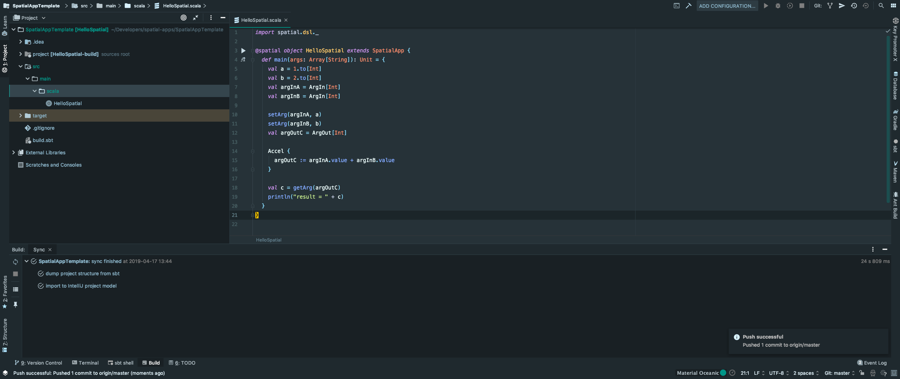
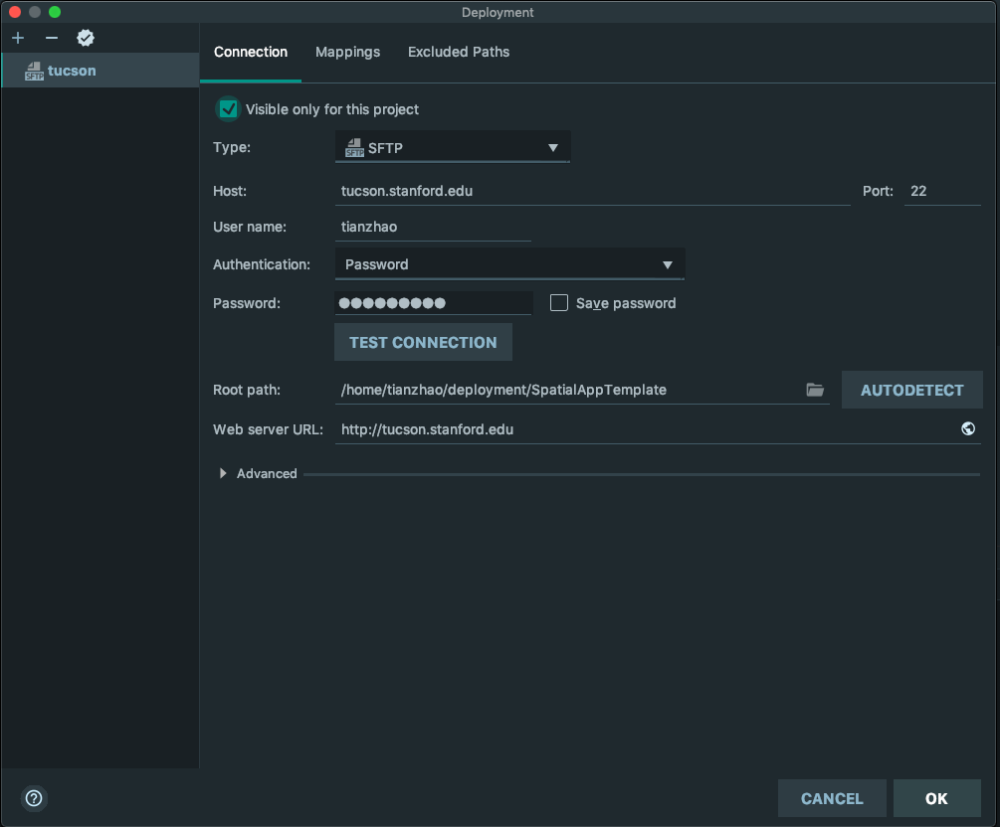
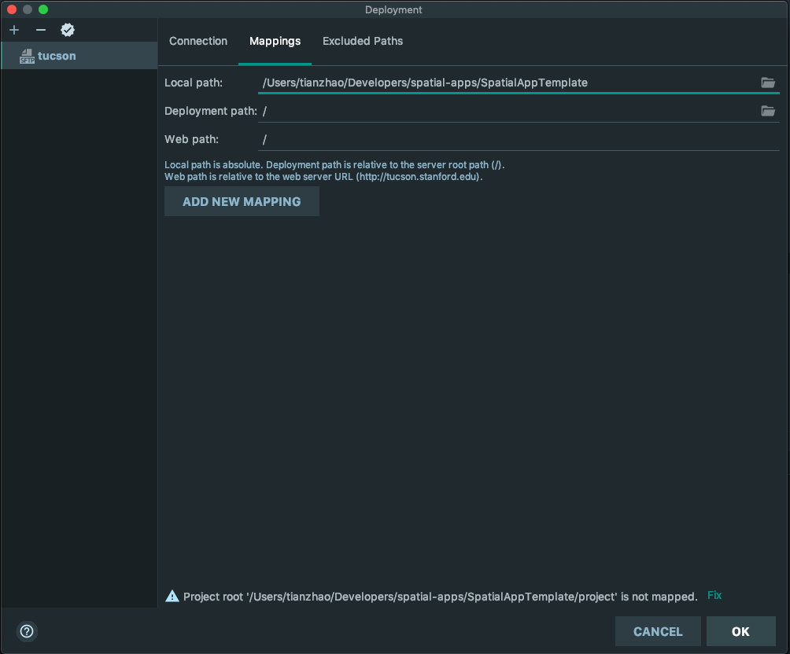
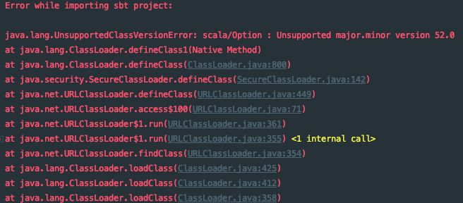

# Using IntelliJ IDE for Spatial Development

Since Spatial is an embedded language hosted by Scala, you can use an IDE to assist your development. This way, you can use the IDE features (such as type checking) to expose the errors in your code before even running the Spatial compiler.

## Mac
### Prerequisites
Install [IntelliJ](https://www.jetbrains.com/idea/). If you are a Stanford student, you can apply for an educational [license](https://www.jetbrains.com/student/).

### Installing Spatial Locally
First, you need to install Spatial on you local machine. This way, your IDE can use the Spatial library to analyze your code. To do so, run the following lines in your terminal:
```bash
git clone https://github.com/stanford-ppl/spatial.git
make && make install && make publish
```

This way, Spatial is published to your local ivy2 repostitory at ~/.ivy2/local.

Second, you need to download a template for making Spatial apps. You can clone the template by running:
```bash
git clone https://github.com/kelayamatoz/SpatialAppTemplate.git
```

The Spatial app is located at src/main/scala/APP_NAME.scala.

Then, in your IDE, open this folder. IntelliJ will first start analyzing the project structure. After the analysis is done, you will see a window that looks like:


You can replace the HelloSpatial.scala with your own Spatial application and use the IDE to edit it. For example, you can use the IDE to navigate to the definition of a Spatial node by using the key binding "Command + B". The IDE will also report type mismatch errors in your code before you run the compiler.

After you are done designing your app, you can upload the whole project onto tucson by setting up the deployment environment. The deployment setting is at Tools -> Deployment -> Configuration:


The "Root path" is where your remote directory is at. In this example, I upload my project to /home/tianzhao/deployment/SpatialAppTemplate on the tucson server. Once you set up the configuration, you need to map your project directory to the remote root path. To do so, go to "Mappings" and set the mapping rules as follows:


Once you set up your deployment configuration, you can upload your project directory to tucson by right click on the project folder, and then click Deployment -> Upload to.

To build the uploaded app, you need to login to tucson and navigate to the uploded directory. In the uploaded directory, you can run simulation by using: 
```bash
sbt "runMain APP_NAME --sim"
```
Or, you can run VCS simulation by using:
```bash
sbt "runMain APP_NAME --synth --fpga=VCS"
```
Or, you can run a synthesis job by using:
```bash
sbt "runMain APP_NAME --synth --fpga=zynq"
```
The rest of the flags is the same as how you run "bin/spatial".

### Troubleshooting
If you see an error that looks like: 


This means your Java version is too old. You need to update your Java to JDK 8. Please see the instructions on the [spatial website](https://spatial-lang.org/).