# Laboratory Exercise 1: Basic Usage of Spatial
This is an introductory exercise that involves using Spatial controllers and memories to design circuits. In this section, you will be building a few Spatial applications using the following elements:

Off-Chip Memory: DRAM

On-Chip Memories: Register, SRAM, FIFO, FILO

Registers: ArgIn, ArgOut Registers, Register

Controllers: Foreach, Fold, Reduce

Each part of the exercise covers the usage of a Spatial element. We will first guide you through some examples. Then you will need to modify the examples to make a few new apps.

## Setup
First, open your terminal app and login to tucson by running:
```bash
ssh -Y USERNAME@tucson.stanford.edu
```
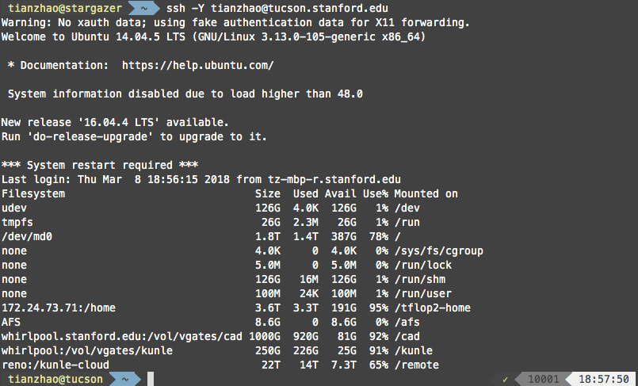

Tucson is the main server that we will be using to host our development environment. On tucson, the development directory is under spatial-lang. Go to your development directory by running: 
```bash
cd ~/spatial-lang
ls
``` 
And the directory will look like: 
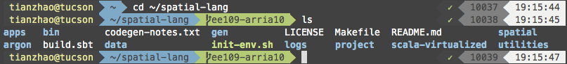

The apps/src directory stores the source code of Spatial apps. The gen directory contains the generated FPGA projects. To start developing apps, go to apps/src:
```bash
cd apps/src
ls
```
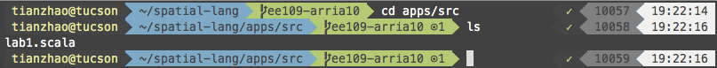

You will see that all the Spatial apps are stored as .scala files. For this exercise, we will complete our apps in lab1.scala.

## Using Registers
### Demo:
In this example, we build a circuit that reads in two inputs and add them together. First, we need to set up the Spatial template: 
```scala
import spatial.dsl._
import org.virtualized._

object Lab1Part1RegExample extends SpatialApp {
  @virtualize
  def main() {
    // Your code here
  }
}
```

The first two imports set up the dependencies for Spatial. The 4th line sets up your app called "Lab1Part1RegExample" as a Spatial app. For each function you declare within the scope of your app, you will need to add "@virtualize" before the body of the function.

Before we move forward, we need to think about the design of the app. In this case, we would want to send two scalars from the CPU side to the accelerator side. We then perform the addition at the accelerator side, and send the result back to the CPU. How can we do this? First, we will need two ArgIn registers and one ArgOut register to establish the communication between the host and the accelerator: 
```scala
object Lab1Part1RegExample extends SpatialApp {
  @virtualize
  def main() {

  // In this app, the type of numbers is Int.
  type T = Int

  @virtualize
  def main() {
    // In Spatial, you can get the Nth argument from the command line by using args(N). 
    // We need to cast it as type T because we use T as the type of the values throughout the whole app. 
    val N = args(0).to[T]
    val M = args(1).to[T]

    // Create two ArgIn registers
    val argRegIn0 = ArgIn[T]
    val argRegIn1 = ArgIn[T]

    // Set two ArgIn registers with N and M
    setArg(argRegIn0, N)
    setArg(argRegIn1, M)

    // Create one ArgOut register
    val argRegOut = ArgOut[T]
  }
}
```

We just finished writing our code for the CPU side; now we need to design our accelerator. In this demo, we are going to use a design that fetches two values from the CPU side and passes their sum back to the CPU:
```scala
    Accel {
      // Get values of the two argIn registers. We get the value of a register by using .value. 
      val argRegIn0Value = argRegIn0.value
      val argRegIn1Value = argRegIn1.value

      // Perform the addition, then set the output register with the result. The := sign is used to assign a value to a register.
      argRegOut := argRegIn0Value + argRegIn1Value
    }
```

We are not done yet. After we specify the accelerator design, we still need to fetch the result and verify that we get the right one: 
```scala 
    // Get the result from the accelerator.
    val argRegOutResult = getArg(argRegOut)

    // Print the result.
    println("Result = " + argRegOutResult)

    // Calculate the reference result. Make sure that it matches the accelerator output.
    val gold = M + N
    println("Gold = " + gold)
    val chksum = gold == argRegOutResult

    // Print PASS if the reference result matches the accelerator result.
    println("PASS = " + chksum)

```

Here's what the app looks like:
```scala
import spatial.dsl._
import org.virtualized._

object Lab1Part1RegExample extends SpatialApp {
  type T = Int

  @virtualize
  def main() {
    val N = args(0).to[T]
    val M = args(1).to[T]
    val argRegIn0 = ArgIn[T]
    val argRegIn1 = ArgIn[T]
    setArg(argRegIn0, N)
    setArg(argRegIn1, M)
    val argRegOut = ArgOut[T]

    Accel {
      val argRegIn0Value = argRegIn0.value
      val argRegIn1Value = argRegIn1.value
      argRegOut := argRegIn0Value + argRegIn1Value
    }

    val argRegOutResult = getArg(argRegOut)
    println("Result = " + argRegOutResult)

    val gold = M + N
    println("Gold = " + gold)
    val chksum = gold == argRegOutResult
    println("PASS = " + chksum)
  }
}
```

After you are done designing the app, go back to the spatial-lang directory. We will need to verify that the app is written correctly.

There are two ways to verify the correctness of your design, one by running Scala simulation and the other by running VCS simulation. The Scala simulation will run the Spatial compiler and use Scala as the simulation backend. If you just want to quickly check what your design produces, you should use the Scala simulation. To start the Scala simulation, you need to run:
```scalar
cd ~/spatial-lang
bin/spatial Lab1Part1RegExample --sim
```
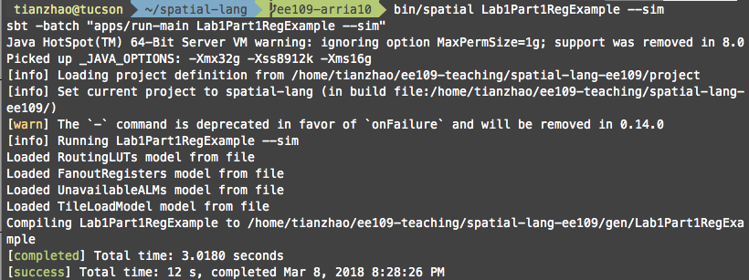

The second command generates the files needed for scala simulation. To start the simulation, run: 

```scalar
./Lab1Part1RegExample.sim "3 5"
```
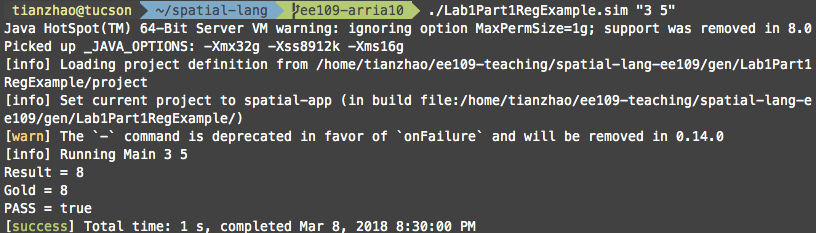

This command runs scala simulation for the app with command line inputs 3 and 5, and produces the correct result. 

However, if you want to make sure that your design is [cycle-accurate](https://retrocomputing.stackexchange.com/questions/1191/what-exactly-is-a-cycle-accurate-emulator), you will need to run the VCS simulation. Unlike Scala simulation, VCS simulation generates the Verilog description of your design and runs cycle-accurate simulation on the design with our DRAM model. Compared to Scala simulation, VCS simulation takes longer to complete (because the circuit needs to be simulated at every clock cycle), but it gives a simulation environment that's more similar to what will be running on the board. For example, you can have a design that passes the Scala simulation, but fails the VCS simulation because the circuit that gets generated is not correct. We will cover how VCS simulation can help us improve our design in Lab 2. 

In order to generate the files for VCS simulation, you need to run the following commands: 
```bash
cd ~/spatial-lang
bin/spatial Lab1Part1RegExample --synth --instrumentation --retime
cd ./gen
ls
```

The "--synth" flag means that we want to generate a synthesizable design. The "--instrumentation" flag means that we want to learn about the number of clock cycles needed to finish the design. The "--retime" flag means that Spatial would add retiming registers in your design. This flag is not particularly useful in this example; however when you come up with a design that contains large combinational circuit, inserting the retiming register would help you meet timing and reduce time needed for synthesizing. We will cover more about the flags in Lab 2. After generation finishes, your terminal will display some messages that look like: 


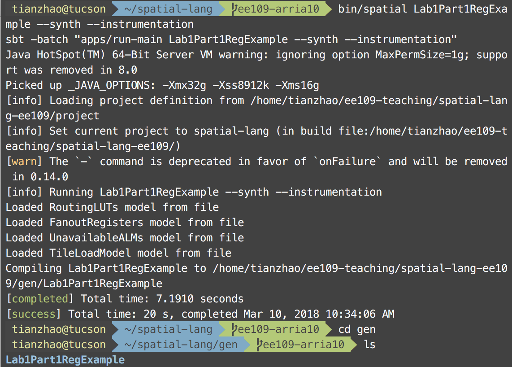

The synthesizable design of your Spatial app is stored under "Lab1Part1RegExample". Let's take a look at the generated files. 
```bash
cd Lab1Part1RegExample
ls 
```

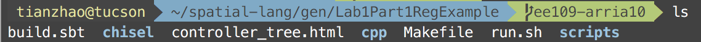
The chisel folder contains the RTL code generated from your design. Here are the commands to run VCS simulation: 

```bash
make vcs > vcs.log
bash run.sh 3 5 > dramsim.log
```

VCS simulation would start. After the simulation finishes, you will see the following messages: 
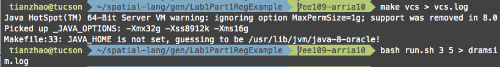

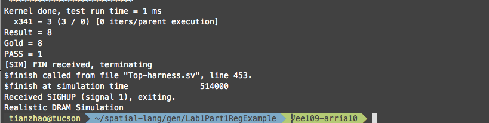

The VCS simulation result states that your app is simulated successfully and ran for 3 cycles. Now we can clean up the VCS simulation directory.

```bash
make vcs-clean
```

Now we can start deploying your design on the FPGA board. In this class, we are using [Intel Arria10 SoC Development Kit](https://www.altera.com/products/boards_and_kits/dev-kits/altera/arria-10-soc-development-kit.html) as our platform. Before synthesizing the design, we need to do a few more setups. First, we need to start a [screen](https://kb.iu.edu/d/acuy) session to run the synthesizer. This way, you can keep the job running even if you are off the server. The following command starts a screen session called Lab1Part1RegExample.
```bash
screen -S Lab1Part1RegExample
```

In the screen session, you can start the synthesizer by running: 
```bash
make arria10 | tee make.log
```

The "tee" command would log the output from the synthesizer to "make.log".
After you start the synthesizer, you can detach the screen session by pressing "Ctrl+A D". You can view the running screen sessions by using the command "screen -ls". To reattach a screen session, you can run "screen -r SESSIONNAME". 


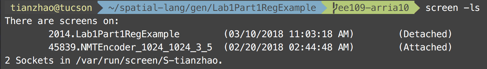
The synthesis process would take ~20 min to run. After the synthesis finishes, we would want to deploy the design onto the FPGA board. You will need to resume the session, copy the synthesized bitstream onto board, and then ssh onto the board:

```bash
screen -r Lab1Part1RegExample
// In the screen session. scp copies a file to a remote board. 
// Your board may have a different name than arria10.stanford.edu. 
scp Lab1Part1RegExample.tar.gz root@arria10.stanford.edu:~/
ssh root@arria10.stanford.edu
```
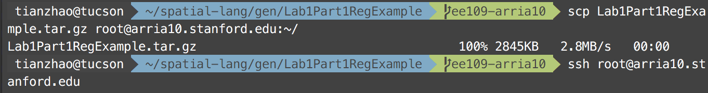

Lab1Part1RegExample.tar.gz is a compressed file. Once you login, you will need to first decompress it. After the decompression finishes, you can run the design by using the "Top" executable:
```bash
x Lab1Part1RegExample.tar.gz
cd Lab1Part1RegExample
./Top 32 32
```

If your design runs successfully, you will see the following message:
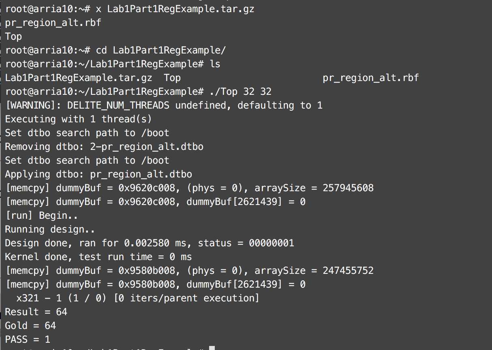

It states that your design ran for 1 cycle. Congratulations! You have successfully deployed your first accelerator design! 


### Your Turn
Can you modify this app so that it fetches three numbers from the CPU side and calculates their sum? You can assume that your user only enters integers. 

* Report on the modifications you made to the original app.

## Using DRAM and SRAM
### Demo
In this example, we build a circuit that reads in an array of values, augment each element in the array by x times, and then stores the array back. To do so, we will need 3 basic Spatial elements: DRAM, SRAM and Foreach Controller. 

A DRAM specifies a piece of memory that's accessible to both the host and the accelerator. It has the following syntax:
```scala
val dram = DRAM[data_type](n0, n1, n2, ...) // n0, n1, n2 are the sizes of each dimension 
setMem(dram, array) // set dram with array
val array_result = getMem(dram) // get the content in dram
```

An SRAM specifies a piece of memory that's embedded on the FPGA (accelerator). It has the following syntax:
```scala 
val sram = SRAM[data_type](n0, n1, n2, ...) // n0, n1, n2 are the sizes of each dimension
val ele_i = sram(i) // get the ith element of sram
sram(i) = 1.to[T] // set the ith element of sram to 1
sram load dram(k::k+n0) // load the elements from index k to k+n0 in dram to sram
dram(k::k+n0) store sram // store the elements from index k to k+n0 into dram
```

DRAM and SRAM are quite different. First, you can only access DRAM data through bursts, whereas you can access SRAM data element by element. Second, SRAM reads / writes can be much faster than DRAM reads / writes. On Arria10, a single SRAM access usually completes in one cycle. 

However, modern FPGAs usually don't have a lot of SRAM resources. For example, Arria10 SoC has 1GB of DRAM and only 42.6 Mbits of SRAM. Therefore, when designing your accelerator, you need to think of the design trade-off between using SRAM and DRAM. We will cover this topic in Lab 2.

A Foreach Controller can be thought of as a for loop. It has the following syntax: 
```scala

Foreach (N by n) { i =>
  // loop body
}
```

These elements would be enough to implement the circuit we want. Let's say that the size of our SRAM is tileSize, and we have an array of N elements. First we need to bring the N elements from the host side into DRAM. Second, we need to load the N elements into the accelerator. Third, we need to multiply each element by a factor of x. Fourth, we need to store the N elements into DRAM. Fifth, we need to instruct the host to fetch the results from DRAM. To translate these steps into a circuit, we would write the Spatial app that looks like this: 

```scala 
object Lab1Part2DramSramExample extends SpatialApp {

  val N = 32

  // In this example, we write the accelerator code in a function. 
  // [T:Type:Num] means that this function takes in a type T.
  // The operator "=" means that this function is returning a value.
  @virtualize
  def simpleLoadStore[T:Type:Num](srcHost: Array[T], value: T) = {
    val tileSize = 16

    val srcFPGA = DRAM[T](N)
    val dstFPGA = DRAM[T](N)

    // 1. Bring the N elements from the host side into DRAM
    setMem(srcFPGA, srcHost)

    val x = ArgIn[T]
    setArg(x, value)
    Accel {

      Sequential.Foreach(N by tileSize) { i =>
        val b1 = SRAM[T](tileSize)

        b1 load srcFPGA(i::i+tileSize)

        // 2. Bring the elements into the accelerator
        val b2 = SRAM[T](tileSize)
        Foreach(tileSize by 1) { ii =>
          // 3. Multiply each element by a factor of x
          b2(ii) = b1(ii) * x
        }

        // 4. Store the result back to DRAM
        dstFPGA(i::i+tileSize) store b2
      }
    }

    // 5. Intruct the host to fetch data from DRAM
    getMem(dstFPGA)
  }

  @virtualize
  def main() {
    val arraySize = N
    val value = args(0).to[Int]

    // This line means that we are creating an array of size "arraySize", where each 
    // element is an integer. "i => i % 256" means that for each index i, populate an 
    // element with value i % 256. 
    val src = Array.tabulate[Int](arraySize) { i => i % 256 }
    val dst = simpleLoadStore(src, value)

    // This line means that for each element in src, generate an element using 
    // the function "_ * value". Map is an operator that maps a function to 
    // every single element of an array.
    val gold = src.map { _ * value }

    println("Sent in: ")
    (0 until arraySize) foreach { i => print(gold(i) + " ") }
    println("Got out: ")
    (0 until arraySize) foreach { i => print(dst(i) + " ") }
    println("")

    // This line means that for every pair of elements in dst, gold, check if each 
    // pair contains equal elements. Reduce coalesces all the pairs by using the 
    // function "_&&_".
    val cksum = dst.zip(gold){_ == _}.reduce{_&&_}
    println("PASS: " + cksum)
  }
}
```

### Your Turn
* Simulate the app using Scala and VCS simulation. Report on the simulation result. 
* Synthesize the design and run on the FPGA. Report the number of cycles needed for the design. 

Cycle count is not the only aspect that shows how good your design is. Moreover, we would want to understand the resource utilization of your design. The synthesizer would give you some information about it.  

After the synthesis finishes, go to ~/spatial-lang/gen/Lab1Part2DramSramExample/verilog-arria10/output_files. The resource utilization report is named "pr_alternate_fit.fit.summary", and it contains information that looks like this: 
```bash
cd ~/spatial-lang/gen/Lab1Part2DramSramExample/verilog-arria10/output_files
cat pr_alternate_fit
```

```bash
Fitter Status : Successful - Sat Mar 10 17:13:14 2018
Quartus Prime Version : 17.1.0 Build 240 10/25/2017 SJ Pro Edition
Revision Name : pr_alternate_fit
Top-level Entity Name : ghrd_a10_top
Family : Arria 10
Device : 10AS066N3F40E2SG
Timing Models : Final
Logic utilization (in ALMs) : 37,069 / 251,680 ( 15 % )
Total registers : 59012
Total pins : 145 / 812 ( 18 % )
Total virtual pins : 0
Total block memory bits : 3,263,232 / 43,642,880 ( 7 % )
Total RAM Blocks : 227 / 2,131 ( 11 % )
Total DSP Blocks : 2 / 1,687 ( < 1 % )
Total HSSI RX channels : 0 / 48 ( 0 % )
Total HSSI TX channels : 0 / 48 ( 0 % )
Total PLLs : 50 / 96 ( 52 % )
```

It indicates that your design uses 15% of logic and 7% of on-chip memory.

* Report the resource utilization of your design. 

## Using FIFO and FILO
In Spatial, [FIFO](http://spatial-lang.readthedocs.io/en/latest/api/hw/onchip/fifo.html?highlight=FIFO) and [FILO](http://spatial-lang.readthedocs.io/en/latest/api/hw/onchip/filo.html?highlight=FILO) can be thought of as queue and stack. 

### Demo
Here is an example of using FIFO: 
```scala
// Create a FIFO called f1 with type T and with size tileSize
val f1 = FIFO[T](tileSize)
// Load the elements from index i to index i + tileSize in dram to f1
f1 load dram(i::i+tileSize)
// Create an enqueue port for data to f1 
f1.enq(data)
// Create a deque port for data to f1 
f1.deq(data)
// Peek the head of f1 without removing it
f1.peek()
// 
```

Here is an example of using FILO:
```scala
// Create a FILO called f1 with type T and with size tileSize
val f1 = FILO[T](tileSize)
// Load the elements from index i to index i + tileSize in dram to f1
f1 load dram(i::i+tileSize) 
// Create a write port for data to f1
f1.push(data) 
// Create a read port for data to f1
f1.pop(data)
// Peek the tail of f1 without removing it
f1.peek()
``` 

In Spatial, both FIFO and FILO are implemented using embedded FPGA memories. Therefore, you can reimplement the example in Part 2 using FIFO / FILOs. 

### Your Turn
* Reimplement the example in Part 2 using FIFO / FILO. You can leave your implementation under Lab1Part4FIFOExample and Lab1Part5FILOExample. 
* Run Scala simulation and VCS simulation. Report the results of VCS simulation.
* Synthesize the design and run it on the board. Report the number of cycles for running the design. 
* Check the utilization report. Report the resource utilization of your design.

## Using Controllers
We have already introduced the usage of the Foreach controller. In this part, we will be learning about other controllers: Fold, Reduce, MemFold and MemReduce.

Before we dive into the details of these controllers, we need to understand what a fold / reduce operation is. Let's say that we have a list of elements, and we have a binary operator. Our goal is to combine all the elements together using the binary operator. The process of combining all the elements is a reduce operation. 

Let's take the task of calculating the sum of a list of numbers as an example. In this case, let's say we have a list [1,2,3,4,5]. Our binary operator would be +. If we use a for loop to calculate the sum, it would look like: 
```python
# pseudo code
list = [1,2,3,4,5]
accum = 0
for (i; i < list.len; i = i + 1)
  accum = accum + i
return accum 
```

We can also use a reduce operation to describe the sum:
```python
# pseudo code
list = [1,2,3,4,5]
accum = reduce(list){_+_}
return accum
```

What the reduce does is that it first performs + on the first two elements, 1 and 2, and stores the temporary result 3 somewhere. It then performs + on the temporary result and the third element, 3, and gets 6. This process is repeated until no elements are left in the list.

Similarly, fold performs the same operation, except that fold can take in a value as the initial starting point.

Now we have a general idea of what reduce and fold do. The Reduce and Fold controllers in Spatial implement these two operations, and can be used as follows: 
```scala
val accum = Reg[T](0) // create a register to hold the reduced result
Reduce(accum)(N by n) { i =>
  // map body	
}{// binary operator}
```

### Demo
Here is an example of using Reduce to compute the sum of a list of elements in Spatial. In this example, we have two Reduce controllers. The first Reduce loads a block of elements from the DRAM, and leave this block for the second Reduce to consume. The second Reduce takes in the block, adds all the elements in the block, and save the result in a register. At last, the first Reduce collects the results created by the second Reduce and coalesces the results using + to create the final sum. 

```scala
object Lab1Part6ReduceExample extends SpatialApp {
  val N = 32
  val tileSize = 16
  type T = Int

  @virtualize
  def main() {
    val arraySize = N
    val srcFPGA = DRAM[T](N)
    val src = Array.tabulate[Int](arraySize) { i => i % 256 }
    setMem(srcFPGA, src)
    val destArg = ArgOut[T]

    Accel {
      // First Reduce Controller
      val accum = Reg[T](0)
      Sequential.Reduce(accum)(N by tileSize) { i =>
        val b1 = SRAM[T](tileSize)
        b1 load srcFPGA(i::i+tileSize)
        // Second Reduce Controller. In Scala / Spatial, the last element 
        // of a function will be automatically returned (if your function
        // should return anything). Therefore you don't need to write a 
        // return at this line explicitly.
        Reduce(0)(tileSize by 1) { ii => b1(ii) }{_+_}
      }{_+_}


      destArg := accum.value
    }

    val result = getArg(destArg)
    val gold = src.reduce{_+_}
    println("Gold: " + gold)
    println("Result: : " + result)
    println("")

    val cksum = gold == result
    println("PASS: " + cksum)
  }
}
```

Although Reduce and Fold operate in similar manners, Fold requires user to specify
a initial value to perform the reduction, whereas Reduce starts from the first
element of the list. For example, when using Fold, you have to manually
initialize your fold register: 
```scala
val a = Reg[T](0)
Fold(a)(N by n){ i =>
  // Fold body
}{ // binary operator }
```
Compared to Foreach, Reduce and Fold allow users to write more precise code. Moreover, it provides the compiler with more information so that the compiler can perform more aggressive optimizations.

### Your Turn
* Use Fold controller to calculate the sum of an element. You can leave your implementation in Lab1Part7FoldExample.  

MemFold and MemReduce perform the same way as Fold and Reduce; however they are used to operate on on-chip memories. We will cover more details of these two controllers in the next lab.
