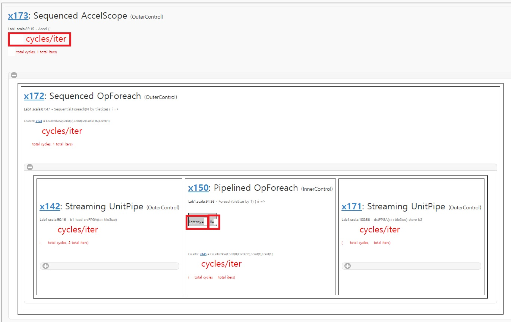

# Getting Started with Digital Systems Design Using Spatial

This is an introductory exercise that involves using Spatial controllers and memories to design circuits. In this section, you will build a few Spatial applications using the following elements:

Off-Chip Memory: DRAM

On-Chip Memories: Register, SRAM, FIFO

Registers: ArgIn, ArgOut Registers, Register

Controllers: Foreach, Fold, Reduce

Each part of the exercise covers the usage of a Spatial element. We will first guide you through some examples. Then you will need to modify the examples to make a few new apps.

1. [Set up](./lab1.md#setup)
    * [Packages](./lab1.md#packages)
    * [SDKMAN!](./lab1.md#sdkman)
    * [Java, Scala, sbt](./lab1.md#java-scala-sbt)
    * [Spatial](./lab1.md#spatial)
2. [Manually Running Spatial Applications](./lab1.md#manually-running-spatial-applications)
3. [Using Registers](./lab1.md#using-registers)
4. [Using DRAM and SRAM](./lab1.md#using-dram-and-sram)
5. [Using FIFO](./lab1.md#using-fifo)
6. [Using Controllers](./lab1.md#using-controllers)
7. [Submission](./lab1.md#submission)

## Setup
### Packages
#### Linux/Unix (Ubuntu) 
##### Setting up WSL (Window users should use WSL)
Spatial is currently supported in Linux/Unix (Ubuntu), therefore Windows users should download and use Ubuntu with Windows Subsystem for Linux (WSL). Here are some useful tutorials to setup WSL.
* [Set up a WSL development environment](https://learn.microsoft.com/en-us/windows/wsl/setup/environment)
* [Setup VSCode and WSL](https://dev.to/jennieji/a-quick-setup-for-front-end-development-with-vscode-in-windows-10-3pok)

For the IDE, we recommend using VScode. Here is a documentation on how to use VS code with WSL.
* [Get started using VS Code with WSL](https://learn.microsoft.com/en-us/windows/wsl/tutorials/wsl-vscode)

It's also possible to move files between WSL and Windows. Refer to this [doc](https://learn.microsoft.com/en-us/windows/wsl/setup/environment#file-storage) for the root directories for the Linux file system and the Windows file system.

Linux/Unix users and Windows users running WSL can use the following linux script to get everything set up from the Ubuntu terminal:

```shell
#!/bin/bash

## Build essentials
sudo apt update
sudo apt install build-essential

## Others
sudo apt update
sudo apt install pkg-config libgmp3-dev libisl-dev
```

#### MAC
Mac users can use homebrew to install packages.
```shell
brew install isl
brew install gmp
brew install pkg-config
```

### SDKMAN!
We will use SDKMAN! (a Software Development Kit Manager) to install java, scala, and sbt.
With SDKMAN, you can install multiple JDK versions simultaneously on your system and easily switch between different versions based on your project requirements.
```shell
curl -s "https://get.sdkman.io" | bash
```
Reopen your terminal and check if SDKMAN! is properly installed by running:
```shell
sdk version
```

### Java, Scala, sbt
Whether you’re working on macOS, WSL, or Linux, SDKMAN adapts to your environment. Therefore, we can use the following commands regardless of the operating system you’re using. The version we will use for Java, Scala, and sbt is as follows:
* Java: JDK 11
* Scala: 2.12
* sbt: 1.8.2

You can install these using this script.
```shell
#!/bin/bash
## Java (JDK 11)
sdk install java 11.0.22-tem
sdk use java 11.0.22-tem

## Scala
sdk install scala 2.12.18

## SBT
sdk install sbt 1.8.2
```

Once the steps above are done, reopen the terminal and check whether you got everything set up properly by running:
```shell
#!/bin/bash
java --version  # Java JDK (should print openjdk 11)
scala -version  # scala (ver: 2.12)
sbt --version   # sbt (ver: 1.8.2)
```

### sbtopt
For small experiments, this will not be an issue, but as your program gets complicated and larger, you may run into issues such as "Make runs out of memory".
This means that Java is running out of memory and we need to increase Java's allotted memory.

We will use  `.sbtopts` file to set these options. Any command argument with a leading -J is interpreted as a java vm argument. Setting the `-J-Xms` and `-J-Xmx` flags will automatically increase the heap in a project. You can find more detials in this [link](https://www.scala-sbt.org/1.x/docs/Troubleshoot-Memory-Issues.html#Troubleshoot+memory+issues).

I have mine set at 8GB each. The `.sbtopts` file will then look like:

```
-J-Xmx8g
-J-Xms8g
```

You can place the `.sbtopts` in your lab1 folder, or you can place it under the `/etc/sbt/sbtopts/` directory. If this directory doesn't exist, create one. The `.sbtopts` file stored under this directory [will have precedence over the `.sbtopts` file in the lab1 directory](https://stackoverflow.com/questions/63699204/what-takes-precedence-sbt-opts-or-sbtopts).


### Spatial
For these labs, we will be using the CS217 branch of Spatial, available at https://github.com/stanford-ppl/spatial/tree/CS217

Setting up the CS217 branch of Spatial:

```shell
git clone https://github.com/stanford-ppl/spatial.git
git checkout CS217

bash bin/update_resources.sh
make publish
```

In order to update Spatial

```shell
make clean
make publish
```


## Manually Running Spatial Applications
For the labs, we will use GitHub Classroom to release the skeleton code. If you don't have a GitHub account, please create one [https://github.com/](https://github.com/).

The skeleton Code will be accessible by accepting the invitation to the assignment through [https://classroom.github.com/a/WSsIeHJy](https://classroom.github.com/a/WSsIeHJy). If it's the first time using GitHub classroom, please refer to [this doc](https://docs.google.com/document/d/1cgPLa6V26DEOppgDrKcIn8uaosUrQSEAcLYpinZXdHw/edit?usp=sharing)

This will include the code used in this lab and run commands to run the simulation.
A variety of applications are already written in Spatial. A tutorial, documentation, and other resources can be found at https://spatial-lang.org/.

When you are ready to test your application, go back to the lab1 directory and run the following command:

```shell
sbt -Dtest.CS217=true "; testOnly <appname>" 
```

To run the code used in this lab, you can also run the `run.sh` file in the lab1 directory:

```shell
chmod +x ./run.sh   # do this if you see "Permission denied" when trying to run ./run.sh
./run.sh
```

You can comment out tests that you don't want to run.

## Using Registers
### Demo:
In this example, we build a circuit that reads in two inputs and add them together. First, we need to set up the Spatial template:
```scala
import spatial.dsl._

@spatial class Lab1Part1RegExample extends SpatialTest {
  def main(args: Array[String]): Unit = {
    // Your code here
  }
}
```

The first line imports the spatial library. The 3rd line declares an app called "Lab1Part1RegExample". Before we move forward, we need to think about the design of the app. In this case, we want to send two scalars from the CPU side to the accelerator side. We then perform the addition at the accelerator side, and send the result back to the CPU. How can we do this? First, we will need two ArgIn registers and one ArgOut register to establish the communication between the host and the accelerator:
```scala

@spatial class Lab1Part1RegExample extends SpatialTest {
  // In this app, the type of numbers is Int.
  type T = Int

  // Sets the runtime arguments for args(0) and args(1). These can be overridden later via command line, but are used for simulation.
  override def runtimeArgs = "3 5"

  def main(args: Array[String]): Unit = {
    // In Spatial, you can get the Nth argument from the command line by using args(N). 
    // We need to cast it as type T because we use T as the type of the values throughout the whole app. 
    val N = args(0).to[T]
    val M = args(1).to[T]

    // Create two ArgIn registers
    val argRegIn0 = ArgIn[T]
    val argRegIn1 = ArgIn[T]

    // Set two ArgIn registers with N and M
    setArg(argRegIn0, N)
    setArg(argRegIn1, M)

    // Create one ArgOut register
    val argRegOut = ArgOut[T]
  }
}
```

We just finished writing our code for the CPU side; now we need to design our accelerator. In this demo, we are going to use a design that fetches two values from the CPU side and passes their sum back to the CPU:
```scala
    Accel {
      // Get values of the two argIn registers. We get the value of a register by using .value. 
      val argRegIn0Value = argRegIn0.value
      val argRegIn1Value = argRegIn1.value

      // Perform the addition, then set the output register with the result. The := sign is used to assign a value to a register.
      argRegOut := argRegIn0Value + argRegIn1Value
    }
```

We are not done yet. After we specify the accelerator design, we still need to fetch the result and verify that we get the right one: 
```scala 
    // Get the result from the accelerator.
    val argRegOutResult = getArg(argRegOut)

    // Print the result.
    println("Result = " + argRegOutResult)

    // Calculate the reference result. Make sure that it matches the accelerator output.
    val gold = M + N
    println("Gold = " + gold)
    val cksum = gold == argRegOutResult

    // Print PASS if the reference result matches the accelerator result.
    println("PASS = " + cksum)

    // To make the compiler happy
    assert(cksum == 1)

```

Here's what the app looks like:
```scala
import spatial.dsl._

@spatial class Lab1Part1RegExample extends SpatialTest {

  type T = Int
  override def runtimeArgs = "3 5"

  def main(args: Array[String]): Unit = {
    val N = args(0).to[T]
    val M = args(1).to[T]
    val argRegIn0 = ArgIn[T]
    val argRegIn1 = ArgIn[T]
    setArg(argRegIn0, N)
    setArg(argRegIn1, M)
    val argRegOut = ArgOut[T]

    Accel {
      val argRegIn0Value = argRegIn0.value
      val argRegIn1Value = argRegIn1.value
      argRegOut := argRegIn0Value + argRegIn1Value
    }

    val argRegOutResult = getArg(argRegOut)
    println("Result = " + argRegOutResult)

    val gold = M + N
    println("Gold = " + gold)
    val cksum = gold == argRegOutResult
    println("PASS = " + cksum)

    // To make the compiler happy
    assert(cksum == 1)
  }
}
```

After you are done designing the app, go back to the spatial directory. We will need to verify that the app is written correctly.

In this lab we will verify our designs by using a Scala simulation. You can run the following command to test the first example:
```scala
sbt -Dtest.CS217=true "; testOnly Lab1Part1RegExample" 
```

<!-- However, if you want to make sure that your design is [cycle-accurate](https://retrocomputing.stackexchange.com/questions/1191/what-exactly-is-a-cycle-accurate-emulator), you will need to run the VCS simulation. Unlike Scala simulation, VCS simulation generates the Verilog description of your design and runs a cycle-accurate simulation. Compared to Scala simulation, VCS simulation takes longer to complete (because the circuit needs to be simulated at every clock cycle), but it gives a simulation environment that's more similar to what will be running on the board. For example, you can have a design that passes the Scala simulation, but fails the VCS simulation because the circuit that gets generated is not correct. In addition, we can also use the VCS simulation results to help us tune our design. We will cover the details and use VCS simulation in Lab 2. -->


### Your Turn
Can you modify this app so that it fetches three numbers from the CPU side and calculates their sum? You can assume that your user only enters integers. This is the version of the app that you should submit.

## Using DRAM and SRAM
### Demo
In this example, we build a circuit that reads in an array of values, augment each element in the array by x times, and then stores the array back. To do so, we will need 3 basic Spatial elements: DRAM, SRAM and Foreach Controller.

A DRAM specifies a piece of memory that's accessible to both the host and the accelerator. It has the following syntax:
```scala
val dram = DRAM[data_type](n0, n1, n2, ...) // n0, n1, n2 are the sizes of each dimension
setMem(dram, array) // set dram with array
val array_result = getMem(dram) // get the content in dram
```

An SRAM specifies a piece of memory that's embedded on the FPGA (accelerator). It has the following syntax:
```scala
val sram = SRAM[data_type](n0, n1, n2, ...) // n0, n1, n2 are the sizes of each dimension
val ele_i = sram(i) // get the ith element of sram
sram(i) = 1.to[T] // set the ith element of sram to 1
sram load dram(k::k+n0) // load the elements from index k to k+n0 in dram to sram
dram(k::k+n0) store sram // store the elements from index k to k+n0 into dram
```

DRAM and SRAM are quite different. First, you can only access DRAM data through bursts, whereas you can access SRAM data element by element. Second, SRAM reads / writes can be much faster than DRAM reads / writes. On an FPGA, a single SRAM access usually completes in one cycle.

However, modern FPGAs usually don't have a lot of SRAM resources. For example, An FPGA SoC has 1GB of DRAM and only 31 Mbits of SRAM. Therefore, when designing your accelerator, you need to think of the design trade-off between using SRAM and DRAM. We will cover this topic in Lab 2.

A Foreach Controller can be thought of as a for loop. It has the following syntax:
```scala

Foreach (N by n) { i =>
  // loop body
}
```

These elements would be enough to implement the circuit we want. Let's say that the size of our SRAM is tileSize, and we have an array of N elements. First, we need to bring the N elements from the host side into DRAM. Second, we need to load the N elements into the accelerator. Third, we need to multiply each element by a factor of x. Fourth, we need to store the N elements into DRAM. Fifth, we need to instruct the host to fetch the results from DRAM. You can use "override def runtimeArgs =" to control the main function arguments just like in exercise 1. To translate these steps into a circuit, we would write the Spatial app that looks like this:

```scala
@spatial class Lab1Part2DramSramExample extends SpatialTest {

  val N = 32
  type T = Int

  // In this example, we write the accelerator code in a function.
  // [T:Type:Num] means that this function takes in a type T.
  // The operator "=" means that this function is returning a value.
  def simpleLoadStore(srcHost: Array[T], value: T) = {
    val tileSize = 16

    val srcFPGA = DRAM[T](N)
    val dstFPGA = DRAM[T](N)

    // 1. Bring the N elements from the host side into DRAM
    setMem(srcFPGA, srcHost)

    val x = ArgIn[T]
    setArg(x, value)
    Accel {

      Sequential.Foreach(N by tileSize) { i =>
        val b1 = SRAM[T](tileSize)

        b1 load srcFPGA(i::i+tileSize)

        // 2. Bring the elements into the accelerator
        val b2 = SRAM[T](tileSize)
        Foreach(tileSize by 1) { ii =>
          // 3. Multiply each element by a factor of x
          b2(ii) = b1(ii) * x
        }

        // 4. Store the result back to DRAM
        dstFPGA(i::i+tileSize) store b2
      }
    }

    // 5. Intruct the host to fetch data from DRAM
    getMem(dstFPGA)
  }

  def main(args: Array[String]): Unit = {
    val arraySize = N
    val value = args(0).to[Int]

    // This line means that we are creating an array of size "arraySize", where each 
    // element is an integer. "i => i % 256" means that for each index i, populate an 
    // element with value i % 256. 
    val src = Array.tabulate[Int](arraySize) { i => i % 256 }
    val dst = simpleLoadStore(src, value)

    // This line means that for each element in src, generate an element using 
    // the function "_ * value". Map is an operator that maps a function to 
    // every single element of an array.
    val gold = src.map { _ * value }

    println("Sent in: ")
    (0 until arraySize) foreach { i => print(gold(i) + " ") }
    println("Got out: ")
    (0 until arraySize) foreach { i => print(dst(i) + " ") }
    println("")

    // This line means that for every pair of elements in dst, gold, check if each 
    // pair contains equal elements. Reduce coalesces all the pairs by using the 
    // function "_&&_".
    val cksum = dst.zip(gold){_ == _}.reduce{_&&_}
    println("PASS: " + cksum)

    assert(cksum == 1)
  }
}
```

### Your Turn
Simulate the app using Scala simulation. Report the following measurements from the simulation:
  * total simulated cycles
  * for the inner `foreach` loop in the `simpleLoadStore` function (this is the `foreach` loop that multiplies each element by a factor of x):
    * the latency
    * initiation interval (II)

This can be found in `gen/CS217/Lab1Part2DramSramExample/info/PostExecution.html`. The three metrics can be found in the red boxes in this picture.



Reasoning this file will help you understand how to understand the throughput of your design. In the `Lab1Part2DramSramExample` function, there is a comment asking you to fill in these information. Please fill them in.

## Using FIFO
A [FIFO](https://stanford-ppl.github.io/spatial-doc/v1.1/spatial/lang/FIFO.html) can be thought of as a queue.
### Demo
Here is the syntax of using a FIFO:
```scala
// Create a FIFO called f1 with type T and with size tileSize
val f1 = FIFO[T](tileSize)
// Load the elements from index i to index i + tileSize in dram to f1
f1 load dram(i::i+tileSize)
// Create an enqueue port for data to f1 
f1.enq(data)
// Create a deque port for data to f1 
val data = f1.deq()
// Peek the head of f1 without removing it
f1.peek()
// 
```

<!-- Here is some syntax of using FILO functions: -->
<!-- ```scala
// Create a FILO called f1 with type T and with size tileSize
val f1 = FILO[T](tileSize)
// Load the elements from index i to index i + tileSize in dram to f1
f1 load dram(i::i+tileSize) 
// Create a write port for data to f1
// f1.push(data) 
// Create a read port for data to f1
// f1.pop(data)
// Peek the tail of f1 without removing it
// f1.peek()
```  -->

In Spatial, a FIFO is implemented using embedded FPGA memories. Therefore, you can reimplement the example in Part 2 using FIFO.

### Your Turn
* Reimplement the example in Part 2 using FIFO. You can leave your implementation under Lab1Part4FIFOExample.
* Run Scala simulation.

## Using Controllers
We have already introduced the usage of the Foreach controller. In this part, we will be learning about other controllers: Fold, Reduce, MemFold and MemReduce.

Before we dive into the details of these controllers, we need to understand what a fold / reduce operation is. Let's say that we have a list of elements, and we have a binary operator. Our goal is to combine all the elements together using the binary operator. The process of combining all the elements is a reduce operation.

Let's take the task of calculating the sum of a list of numbers as an example. In this case, let's say we have a list [1,2,3,4,5]. Our binary operator would be +. If we use a for loop to calculate the sum, it would look like:
```python
# pseudo code
list = [1,2,3,4,5]
accum = 0
for (i; i < list.len; i = i + 1)
  accum = accum + i
return accum
```

We can also use a reduce operation to describe the sum:
```python
# pseudo code
list = [1,2,3,4,5]
accum = reduce(list){_+_}
return accum
```

What the reduce does is that it first performs + on the first two elements, 1 and 2, and stores the temporary result 3 somewhere. It then performs + on the temporary result and the third element, 3, and gets 6. This process is repeated until no elements are left in the list.

Similarly, fold performs the same operation. The only difference is that a fold operation can take in a value as the initial starting point.

Now we have a general idea of what reduce and fold do. The Reduce and Fold controllers in Spatial implement these two operations, and can be used as follows:
```scala
val accum = Reg[T](0) // create a register to hold the reduced result
Reduce(accum)(N by n) { i =>
  // map body
}{// binary operator}
```
Since Reduce is simply using accum as an accumulator, the initial value stored in accum will be ignored.

### Demo
Here is an example of using Reduce to compute the sum of a list of elements in Spatial. In this example, we have two Reduce controllers. The first Reduce loads a block of elements from the DRAM, and leave this block for the second Reduce to consume. The second Reduce takes in the block, adds all the elements in the block, and save the result in a register. At last, the first Reduce collects the results created by the second Reduce and coalesces the results using + to create the final sum.

```scala
@spatial class Lab1Part6ReduceExample extends SpatialTest {
  val N = 32
  val tileSize = 16
  type T = Int

  def main(args: Array[String]): Unit = {
    val arraySize = N
    val srcFPGA = DRAM[T](N)
    val src = Array.tabulate[Int](arraySize) { i => i % 256 }
    setMem(srcFPGA, src)
    val destArg = ArgOut[T]

    Accel {
      // First Reduce Controller
      val accum = Reg[T](0)
      Sequential.Reduce(accum)(N by tileSize) { i =>
        val b1 = SRAM[T](tileSize)
        b1 load srcFPGA(i::i+tileSize)
        // Second Reduce Controller. In Scala / Spatial, the last element
        // of a function will be automatically returned (if your function
        // should return anything). Therefore you don't need to write a
        // return at this line explicitly.
        Reduce(0)(tileSize by 1) { ii => b1(ii) }{_+_}
      }{_+_}


      destArg := accum.value
    }

    val result = getArg(destArg)
    val gold = src.reduce{_+_}
    println("Gold: " + gold)
    println("Result: : " + result)
    println("")

    val cksum = gold == result
    println("PASS: " + cksum)

    assert(cksum == 1)
  }
}
```

Although Reduce and Fold operate in similar manners, Fold requires user to specify
a initial value to perform the reduction, whereas Reduce starts from the first
element of the list. Here's a [link](https://stackoverflow.com/questions/25149359/difference-between-reduce-and-fold) that explains the difference between Fold and Reduce in the context of functional programming. 

```scala
val a = Reg[T](1)
Fold(a)(N by n){ i => // Fold will read the data stored in a, and use that as the starting value for accumulation.
  // Fold body
}{ // binary operator }
```
Compared to Foreach, Reduce and Fold allow users to write more precise code. Moreover, it provides the compiler with more information so that the compiler can perform more aggressive optimizations.

### Your Turn
* Use Fold controller to calculate the sum of an element. You can leave your implementation in Lab1Part6FoldExample.

MemFold and MemReduce perform the same way as Fold and Reduce; however they are used to operate on on-chip memories. We will cover more details of these two controllers in the next lab.

## Submission
* [Using Registers](./lab1.md#using-registers): Modify this app so that it fetches three numbers from the CPU side and calculates their sum. You can assume that your user only enters integers. Leave your implementation in `Lab1Part1RegExample3`.
* [Using DRAM and SRAM](./lab1.md#using-dram-and-sram): Fill in the fields in `Lab1Part2DramSramExample` according to the instructions in [this section](./lab1.md#your-turn-1).
* [Using FIFO](./lab1.md#using-fifo): Reimplement the example in Part 2 using FIFO. You can leave your implementation under Lab1Part4FIFOExample.
* [Using Controllers](./lab1.md#using-controllers): Use Fold controller to calculate the sum of an element. Leave your implementation in `Lab1Part6FoldExample`.
* There will be no report submission for this lab. Please upload your completed `Lab1.scala` file to Gradescope.
