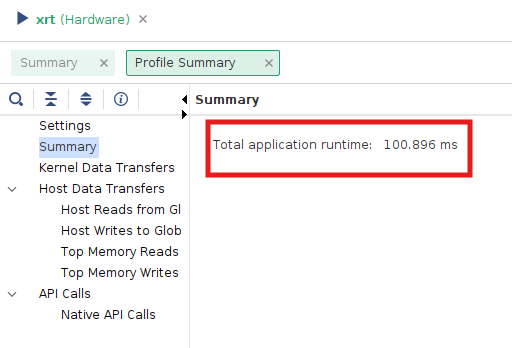

# Getting Started with Digital Systems Design Using F1 FPGAs

The second part of lab1 we will be translating Spatial code to Vitis C++ code. Vitis is a complete development environment for applications accelerated using Xilinx FPGAs. It leverages the OpenCL heterogeneous computing framework to offload compute intensive workloads to the FPGA.
The accelerated application is written in C/C++, OpenCL, or RTL with OpenCL APIs. For the purpose of lab 1, all the exercises done with Spatial have been converted to C/C++ HLS. Lab1, part 2 will walk you through setting up an environment for running hardware emulation, generating the F1 instance bitstream, and running on the FPGA.

# Prerequisite (Need to do them only once)
1. You should have received an email with a subject "[EE109] AWS Instance Instructions". Download the private key attached to the email and save it under your `.ssh` folder. Your path to the `.ssh` folder is usually:
    * Linux / Mac : `~/.ssh`
    * Windows: `\Users\$USERNAME\.ssh` or `\user\$USERNAME\.ssh` (replace the $USERNAME with your laptop's username)
2. Sign into the AWS account using the link and information in the email. It will require you to change your password if it's your first time logging in.
3. Once you're logged in, search for the 'ec2' service. If you click on EC2, this will bring you to the screen below. Press 'Instances'.
    <div style="padding-left: 0px; padding-bottom: 30px; text-align: center;">
        
    </div>
4. Select your instance and go to **Instance State > Start instance**. The designated instance is stated in the email with the AWS login instructions.
    <div style="padding-left: 0px; padding-bottom: 30px; text-align: center;">
        
    </div>
5. Click the 'Instance ID' and press 'connect'. 
    <div style="padding-left: 0px; padding-top: 0px; text-align: center;">
        
    </div>

    Move to the 'SSH Client' tab and copy the address shown in the boxed field in this picture. This address changes whenever you start the instance. 
    <div style="padding-left: 0px; padding-top: 10px; padding-bottom: 30px; text-align: center;">
        
    </div>
6. SSH into your instance
    * Option 1: VSCode (We recommend this option when you edit code & run sw/hw emulations)
    
        1. Install the 'remote-ssh' extension
            <div style="padding-left: 0px; padding-bottom: 30px; text-align: center;">
                
            </div>

        2. Press the small button on the lower right and select **Connect to host > Configure SSH Hosts** and choose the first file (this will look something like `\user\$USERNAME\.ssh\config`).
            <div style="padding-left: 0px; padding-bottom: 30px; text-align: center;">
                
            </div>
        3. Add the following entry to the file and save it. The value for `HostName` is the address you copied in step 5. **This address changes whenever you start the instance. So you will have to update this field whenever you stop and re-start the instance.** The 'IdentityFile' field is the location where you saved the private key file in step 1. **In the screenshot shown in step 5, it uses 'root' as the user name, but use 'centos' instead.**
            ```bash
            Host ee109-vitis
                HostName ec2-34-203-199-5.compute-1.amazonaws.com
                User ubuntu
                IdentityFile "C:\Users\gina7\.ssh\ginasohn_aws2.pem"
            ```
        4. Go back and press the small button on the lower right you clicked in step 6-2 and select **Connect to host**. The host you've just added will now appear. Selecting the newly added AWS host will connect you to your instance. Once you're connected, you can open folders in your instance using the 'File > Open Folder' feature and run code using the 'Terminal > New Terminal' feature.

        <br/>

    * Option 2: Terminal (We recommend this option when you want to open a gui to view the emulation reports) 
        The value after the `-i` option is the location of the private key.

        ```bash
        ssh -i \Users\gina7\.ssh\ginasohn_aws2.pem ubuntu@ec2-34-203-199-5.compute-1.amazonaws.com
        ``` 
    
7. Install packages (Paste the command one by one)
    ```bash
    sudo apt update
    sudo apt install libxtst6
    sudo apt install x11-apps
    sudo apt install xauth
    sudo apt install xfonts-base
    sudo apt install x11-utils
    ```

8. Clone the `aws-fpga` github repository and setup the required [XRT installations](https://github.com/aws/aws-fpga/blob/f1_xdma_shell/Vitis/docs/XRT_installation_instructions.md). Note that this step will take close to 30 minutes
    ```bash
    git clone https://github.com/aws/aws-fpga.git $AWS_FPGA_REPO_DIR
    cd $AWS_FPGA_REPO_DIR
    git switch f1_xdma_shell
    source vitis_setup.sh 

    XRT_RELEASE_TAG=202410.2.17.319 

    cd $VITIS_DIR/Runtime
    export XRT_PATH="${VITIS_DIR}/Runtime/${XRT_RELEASE_TAG}"
    git clone http://www.github.com/Xilinx/XRT.git -b ${XRT_RELEASE_TAG} ${XRT_PATH}

    cd ${XRT_PATH}
    sudo ./src/runtime_src/tools/scripts/xrtdeps.sh

    cd build
    ./build.sh

    cd Release
    sudo apt install ./xrt_*.deb
    ```
9. Setup [CLI and create S3 bucket](https://github.com/aws/aws-fpga/blob/f1_xdma_shell/Vitis/docs/Setup_AWS_CLI_and_S3_Bucket.md) for creating Amazon FPGA Image (AFI)
    * CLI Setup
    ```bash
    cd ~/
    curl "https://awscli.amazonaws.com/awscli-exe-linux-x86_64.zip" -o "awscliv2.zip"
    unzip awscliv2.zip
    sudo ./aws/install
    # Use --update if the command output tells you to
    ```
    * Check if it's properly installed by running:
    ```bash
    aws --version
    ```
    * Set your credentials, region and output. If you run the following command, it will ask you for Access Key ID and Secret Access Key which can be found in the email sent to you with the title "[EE109] AWS F1 resource". For the region, write 'us-east-1' and for the output write 'json'.
    ```bash
    aws configure
    ```

    * The result should look like:
    ```bash
    [centos@ip-172-31-21-2 src]$ aws configure
    AWS Access Key ID [None]: <Your Access Key>
    AWS Secret Access Key [None]: <Your Secret Access Key>
    Default region name [None]: us-east-1
    Default output format [None]: json
    ```
    * S3 bucket creation (You should go through this process whenever you want to make a new S3 bucket). This S3 bucket will be used by the AWS scripts to upload your DCP to AWS for AFI generation which will be packaged into a tar file. Start by creating a bucket. Bucket names must be between 3 (min) and 63 (max) characters long. Bucket names can consist only of lowercase letters, numbers, dots (.), and hyphens (-). As a bucket name has to be unique, we recommend including your user name. For example, I used `psmriti` to run the lab 1 parts.
    ```bash
    aws s3 mb s3://<bucket-name> --region us-east-1  # Create an S3 bucket (choose a unique bucket name)
    touch FILES_GO_HERE.txt                          # Create a temp file
    aws s3 cp FILES_GO_HERE.txt s3://<bucket-name>/<dcp-folder-name>/  # Choose a dcp folder name 
    ```
    * The AFI creation process will generate logs and will be placed in your S3 bucket. These logs can be used for debug if the AFI generation fails. Next, create a folder for your log files:
    ```bash
    touch LOGS_FILES_GO_HERE.txt                     # Create a temp file
    aws s3 cp LOGS_FILES_GO_HERE.txt s3://<bucket-name>/<logs-folder-name>/  # Choose a logs folder name
    ```
    * Once your AFI has been created successfully, you are free to delete the tar file and logs as needed. Deleting these files will not delete or modify your AFI.

## Setting up X11 Forwarding

To view the emulation results, using the vitis analyzer's gui will be useful. However, to use a gui when working with a remote server, you will have to set up X11 forwarding. X11 forwarding is a mechanism that allows a user to start up remote applications, and then forward the application display to their local machine.

**For Mac users**, follow the ['X11 forwarding for Mac' section in this link](https://www.businessnewsdaily.com/11035-how-to-use-x11-forwarding.html#what-is-x11-forwarding). 

**For Window users**, follow these steps:
 * Install [PuTTy](https://www.chiark.greenend.org.uk/~sgtatham/putty/latest.html) on your local Windows machine: Download the installer & run it
 * Install [Xming](https://sourceforge.net/projects/xming/) on your local Windows machine: Download the installer & run it
 * Convert your private key from a pem format to a ppk format using PuTTygen. Follow the instructions in [this link](https://www.puttygen.com/convert-pem-to-ppk).
 * Open PuTTy and follow these steps to ssh into your instance. Make sure to change `centos` to `ubuntu`
    

    
    
 * Activate xming.
 * Run this command in your instance. If you see a clock showing up, you're all set.
    ```bash
    xclock
    ```


<br/>

## Creating Alarm for you instance
AWS instances: We will soon set up a AWS credit limitation for each student. We are planning to allocate $200 − $250 for each student to cover the labs and the final project. We will announce more detailed information about this soon. However, in the meanwhile, **please make sure you stop your instances after using it so that you don't mistakenly use up all your credits!!**

To prevent such issues, we **highly recommend** setting up an alarm to stop the instance after a certain duration of low usage.

To set up the alarm, select the **+** button for your instance.
<div style="padding-left: 0px; padding-top: 0px; text-align: center;">
        
</div>

Then follow the instructions in this screenshot. This will be an example configuration for setting an alarm to stop the instance after the maximum CPU utilization was lower than 10% for more than an hour.
<div style="padding-left: 0px; padding-top: 0px; text-align: center;">
        
</div>


<br/>

<br/>

# Running hardware emulation and FPGA instance 

1. Accept the assignment in Github Classroom and clone your Lab1 directory.

2. Copy the `Lab1Part1RegExample` folder to the Vitis xilinx folder.
    ```
    cp -rf $LAB1_DIR/Lab1Part1RegExample $VITIS_DIR/examples/xilinx
    ```

3. Source vitis_setup.sh 
    ```bash
    cd $VITIS_DIR
    source vitis_setup.sh 
    cd $VITIS_DIR/examples/xilinx/Lab1Part1RegExample
    ```

4. Run hardware emulation (this might take about 10-15 minutes)
    ```bash

    # Hardware Emulation (Compile and runtime ~10 mins)
    make clean
    make run TARGET=hw_emu PLATFORM=$AWS_PLATFORM all
    # You should see a TEST PASSED print at the end
    ```
5. Generate bitstream for running on FPGA (bitstream generation takes about 1 hour 40 mins)
    ```bash    
    make clean
    make TARGET=hw PLATFORM=$AWS_PLATFORM all
    ```
6. Generating AFI image
    ```bash
    $VITIS_DIR/tools/create_vitis_afi.sh -xclbin=build_dir.hw.xilinx_aws-vu9p-f1_shell-v04261818_201920_4/vadd.xclbin -o=vadd -s3_bucket=<bucket-name> -s3_dcp_key=dcp-folder -s3_logs_key=logs-folder
    ```
    After running the above step, check the status of the `FpgaImageId`. Wait till status turns available from pending to proceed further. This will take about 15 minutes to generate the AFI.
    ```bash
    ubuntu@ip-172-31-89-122:~/src/project_data/aws-fpga/Vitis/examples/xilinx/Lab1Part1RegExample$ cat 25_04_06-080556_afi_id.txt 
    {
        "FpgaImageId": "afi-0e16cc800ad7049f1",
        "FpgaImageGlobalId": "agfi-00851c94144a3bc55"
    }
    ubuntu@ip-172-31-89-122:~/src/project_data/aws-fpga/Vitis/examples/xilinx/Lab1Part1RegExample$ aws ec2 describe-fpga-images --fpga-image-ids afi-0e16cc800ad7049f1
    {
        "FpgaImages": [
            {
                "FpgaImageId": "afi-0e16cc800ad7049f1",
                "FpgaImageGlobalId": "agfi-00851c94144a3bc55",
                "Name": "vadd",
                "Description": "vadd",
                "ShellVersion": "0x04261818",
                "PciId": {
                    "DeviceId": "0xf010",
                    "VendorId": "0x1d0f",
                    "SubsystemId": "0x1d51",
                    "SubsystemVendorId": "0xfedd"
                },
                "State": {
                    "Code": "available"
                },
                "CreateTime": "2025-04-06T08:06:01+00:00",
                "UpdateTime": "2025-04-06T08:44:48+00:00",
                "OwnerId": "891377270430",
                "Tags": [],
                "Public": false,
                "DataRetentionSupport": false,
                "InstanceTypes": [
                    "f1.2xlarge",
                    "f1.4xlarge",
                    "f1.16xlarge"
                ]
    ```
7. Running the generated AFI
    ```bash
    cd $AWS_FPGA_REPO_DIR
    source vitis_runtime_setup.sh   # Other runtime env settings needed by the host app should be setup after this step
    # Wait till the MPD service has initialized. Check systemctl status mpd
    cd $VITIS_DIR/examples/xilinx/Lab1Part1RegExample
    ./Lab1Part1RegExample ./vadd.awsxclbin
    # You should see a TEST PASSED print at the end
    ```
    Expected output:
    ```bash
    ubuntu@ip-172-31-89-122:~/src/project_data/aws-fpga/Vitis/examples/xilinx/Lab1Part1RegExample$ ./Lab1Part1RegExample ./vadd.awsxclbin
    Found Platform
    Platform Name: Xilinx
    INFO: Reading ./vadd.awsxclbin
    Loading: './vadd.awsxclbin'
    Trying to program device[0]: xilinx_aws-vu9p-f1_shell-v04261818_201920_3
    Device[0]: program successful!
    TEST PASSED
    ```   

# Understanding Lab1Part2DramSramExample Vitis HLS code
In this walkthrough, we will be comparing Vitis C++ code to the Lab1Part2DramSramExample code in Spatial. We will be multiplying `x` to a `DATA_SIZE`-long 32bit integer vector.

Let's assume the datawidth between the on-chip and off-chip transfer is 512 bits. We will load `NUM_WORDS` number of elements from DRAM to SRAM in parallel (this is similar as loading in a `NUM_WORDS`-long vector). It will then do an element-wise multiplication for the `NUM_WORDS` elements in parallel and store it back to DRAM. This process will be sequentially repeated until all the `DATA_SIZE` elements are computed (iterations of the outer loop will not be pipelined due to the `Sequential` directive in front of the `Foreach` controller).
<br/>

## Understanding Vitis C++ code
Now we will look at the Vitis C++ code for the same application. The code can be found under `Lab1Part2DramSramExample/src` in Lab1's directory. `host.cpp` describes the behavior of the host and the accelerator design is specified in `vadd.cpp` which is the equivalent to the `Accel` block in Spatial.

When accelerating applications with FPGAs, there are four major components. Host, Global Memory (DRAM), the on-chip memory and logic on the FPGA accelerator.

<div style="padding-left: 0px; padding-top: 0px; text-align: center;">
    
</div>

<br/> 

## Section A: create test data in the host memory (`host.cpp`)
The first step is to create test data in the host memory. If you are not familiar with `std::vector`, please read [this](https://www.geeksforgeeks.org/vector-in-cpp-stl/).
```c++
// host.cpp
std::vector<int, aligned_allocator<int>> source_in1(DATA_SIZE);
std::vector<int, aligned_allocator<int>> source_hw_results(DATA_SIZE);
std::vector<int, aligned_allocator<int>> source_sw_results(DATA_SIZE);

// Create the test data
std::generate(source_in1.begin(), source_in1.end(), std::rand);
int x = 5;
for (int i = 0; i < DATA_SIZE; i++)
{
    source_sw_results[i] = x * source_in1[i] ;
    source_hw_results[i] = 0;
}
```

<br/>

## Getting the device and kernel ready (`host.cpp`)
The code in this region upto **section D** will program the device and run the FPGA accelerator. To do this, it will use several OpenCL C++ Bindings such as `cl::Program, cl::Context, cl::CommandQueue, cl::Kernel`.

The first step is to get the list of devices connected to the Xilinx platform.
```c++
auto devices = xcl::get_xil_devices();
```

Then it will get the binary file of the kernel to run. To learn more about `cl::Program::Binaries`, read:
* [`cl::Program`](https://github.khronos.org/OpenCL-CLHPP/classcl_1_1_program.html)
* [OpenCL C++ doc page 28](https://registry.khronos.org/OpenCL/specs/opencl-cplusplus-1.2.pdf)
```c++
auto fileBuf = xcl::read_binary_file(binaryFile);
cl::Program::Binaries bins{{fileBuf.data(), fileBuf.size()}};
```

In the following for loop, the Context and Command Queue are created for the device.
* Reference:
    * [`cl::Context`](https://github.khronos.org/OpenCL-CLHPP/classcl_1_1_context.html)
    * [OpenCL C++ doc page 6](https://registry.khronos.org/OpenCL/specs/opencl-cplusplus-1.2.pdf)
    * [`cl::CommandQueue`](https://github.khronos.org/OpenCL-CLHPP/classcl_1_1_command_queue.html)
    * [OpenCL C++ doc page 47](https://registry.khronos.org/OpenCL/specs/opencl-cplusplus-1.2.pdf)
```c++
OCL_CHECK(err, context = cl::Context(device, nullptr, nullptr, nullptr, &err));
OCL_CHECK(err, q = cl::CommandQueue(context, device, CL_QUEUE_PROFILING_ENABLE, &err));        
```

Then, it tries to program the selected device using the binary of the kernel. 
* Reference:
    * [`cl::Program`](https://github.khronos.org/OpenCL-CLHPP/classcl_1_1_program.html)
    * [OpenCL C++ doc page 28](https://registry.khronos.org/OpenCL/specs/opencl-cplusplus-1.2.pdf)
    * [`cl::Kernel`](https://github.khronos.org/OpenCL-CLHPP/classcl_1_1_kernel.html)
    * [OpenCL C++ doc page 36](https://registry.khronos.org/OpenCL/specs/opencl-cplusplus-1.2.pdf)
```c++
cl::Program program(context, {device}, bins, nullptr, &err);
if (err != CL_SUCCESS)
{
    std::cout << "Failed to program device[" << i << "] with xclbin file!\n";
}
else
{
    std::cout << "Device[" << i << "]: program successful!\n";
    OCL_CHECK(err, krnl_vector_op = cl::Kernel(program, "vadd", &err));
    valid_device = true;
    break; // we break because we found a valid device
}
```

<br/>

## Section B: allocate DRAM in Global Memory (`host.cpp`)
Then, we allocate DRAM that will hold the input vectors and the output vector in Global Memory. The DRAMs are initialized with the vectors created in section A. To express DRAMs in Global Memory, we will use [OpenCL Buffers](https://downloads.ti.com/mctools/esd/docs/opencl/memory/buffers.html). `buffer_in1` and `buffer_in2` will be the DRAMs that store the input vectors and the output will be stored in `buffer_output` DRAM.

```c++
// Allocate Buffer in Global Memory
// Buffers are allocated using CL_MEM_USE_HOST_PTR for efficient memory and
// Device-to-host communication
OCL_CHECK(err, cl::Buffer buffer_in1(context, CL_MEM_USE_HOST_PTR | CL_MEM_READ_ONLY, vector_size_bytes,
                                        source_in1.data(), &err));
OCL_CHECK(err, cl::Buffer buffer_output(context, CL_MEM_USE_HOST_PTR | CL_MEM_WRITE_ONLY, vector_size_bytes,
                                        source_hw_results.data(), &err));
```

We have created the kernel that will run on the FPGA accelerator (`krnl_vector_op`) in [this section](./lab3_vitis_spatial.md#getting-the-device-and-kernel-ready-hostcpp). We will set the arguments for this kernel now.
```c++
int size = DATA_SIZE;
OCL_CHECK(err, err = krnl_vector_op.setArg(0, buffer_in1));
OCL_CHECK(err, err = krnl_vector_op.setArg(1, x));
OCL_CHECK(err, err = krnl_vector_op.setArg(2, buffer_output));
OCL_CHECK(err, err = krnl_vector_op.setArg(3, size));

// Copy input data to device global memory
OCL_CHECK(err, err = q.enqueueMigrateMemObjects({buffer_in1}, 0 /* 0 means from host*/));
```

<br/>

## Section C: Invoke the kernel (`host.cpp`)
Finally, we will invoke the HLS kernel so the program can run on the FPGA accelerator.
```c++
// Launch the Kernel
// For HLS kernels global and local size is always (1,1,1). So, it is
// recommended
// to always use enqueueTask() for invoking HLS kernel
OCL_CHECK(err, err = q.enqueueTask(krnl_vector_op));
```

<br/>

## Section D: Bring back results from DRAM (`host.cpp`)
Then, the we will bring back the results from the output DRAM in global memory (`buffer_output`) to the host memory.
```c++
OCL_CHECK(err, err = q.enqueueMigrateMemObjects({buffer_output}, CL_MIGRATE_MEM_OBJECT_HOST));
q.finish();
```
<br/>

## Section E: Compare with gold (`host.cpp`)
Since we are done working with the FPGA accelerator, there will be no OpenCL C++ bindings from this section and will only be C++. The results will be stored in the `source_hw_results` and we compare this with the gold `source_sw_results` we have computed in section A.

<br/>

# Your Turn:
1. Run hardware emulation for Lab1Part1RegExample, Lab1Part2DramSramExample, Lab1Part4FIFOExample and Lab1Part6ReduceExample and report the runtimes in `lab1_submit.md`. They can be found in the 'profile summary' tab in the `xrt.run_summary' file. You can open this with a gui (note that this needs the X11 forwarding setup) by running:
```bash
cd $VITIS_DIR/examples/xilinx/Lab1Part1RegExample
vitis_analyzer --classic xrt.run_summary
```
<div style="padding-left: 0px; padding-top: 0px; text-align: center;">
    
</div>
2. Generate bitstream, create AFI image and run F1 instance for Lab1Part1RegExample. Submit the `vadd.awsxclbin` in the submission.
3. Compare Lab1Part1RegExample, Lab1Part2DramSramExample, Lab1Part4FIFOExample and Lab1Part6ReduceExample's `host.cpp` and `vadd.cpp` with the respective .scala implamentation and add your inferences to the `lab1_submit.md`

Important Notes - 
* **Because of limited disk space, you will run out of space intermittently. It is recommended that you clean up as you go and save the important files (like vadd.awsxclbin and other .csv files). Feel free to clean up the build_dir, _x.hw.* and _x.hw_emu* directory once your are done running them and see a `TEST PASSED` print.**
* **Don't forget to add the submission files to your lab1 directory! We will grade using your lab1 directory, so make sure you copy your required files from the AWS FPGA repo to your lab1 repository and push them.**
* The kernel execution time and compute unit utilization can also be found in the 'profile summary' tab in the `xrt.run_summary' file. But there seems to an issue with the current setup and is under debug

<br/>

# Submission:
* Gradescope: a doc with your commit ID & repo
* Lab 1 Part 1: Leave your implementation under **your Github Classroom repository's** `src/test/scala/Lab1.scala` file.
* Lab 1 Part 2: 
    * Lab1Part1RegExample - Submit the generated AFI image to the **your Github Classroom repository's** `Lab1Part1RegExample/`
    * Lab1Part1RegExample, Lab1Part2DramSramExample, Lab1Part4FIFOExample and Lab1Part6ReduceExample add hw_emu's summary.csv to the **your Github Classroom repository's** `Lab1Part1RegExample`, `Lab1Part2DramSramExample`, `Lab1Part4FIFOExample` and `Lab1Part6ReduceExample` respectively 
* Fill in **your Github Classroom repository's** `lab1_submit.md`


<br/>

<br/>

# Additional Materials for Vitis C++
This is a very simplified example to introduce how to develop hardware with Vitis and show how we can translate Spatial code to Vitis C++ code. There are many other ways to make this code better.
* **dataflow pragma**: The dataflow pragma instructs the compiler to enable task-level pipelining. This is required for load/compute/store functions to execute in a parallel and pipelined manner. The new implementation of the same application using dataflow pramas can be found [here](https://github.com/Xilinx/Vitis_Accel_Examples/tree/f61637e9263ecc1be3df34182ea6c53a0ca10447/hello_world).
* [Various example kernels](https://github.com/Xilinx/Vitis_Accel_Examples/tree/bb80c8ec699c3131e8874735bd99475ac6fe2ec7/cpp_kernels): The Vitis repository has a series of example kernel implementations, which can be a useful reference.
* [Vitis Unified Software Platform Documentation](https://docs.amd.com/r/en-US/Vitis-Tutorials-Getting-Started/Vitis-Tutorials-Getting-Started-XD098): This official documentation hold many useful information.
* [Vitis HLS Command Reference](https://docs.amd.com/r/2021.2-English/ug1399-vitis-hls/Getting-Started-with-Vitis-HLS): This will be useful to look up HLS pragmas and HLS data types (these will start with a `hls::` prefix in the code).
* [Quick Start Guide](https://github.com/aws/aws-fpga/blob/f1_xdma_shell/Vitis/README.md)