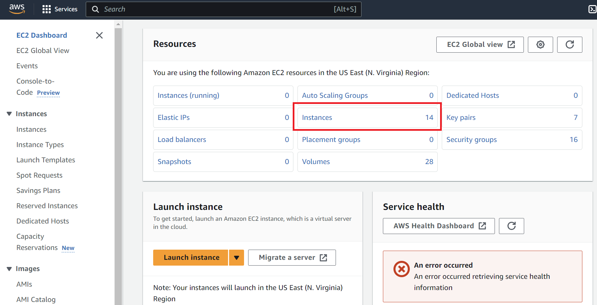
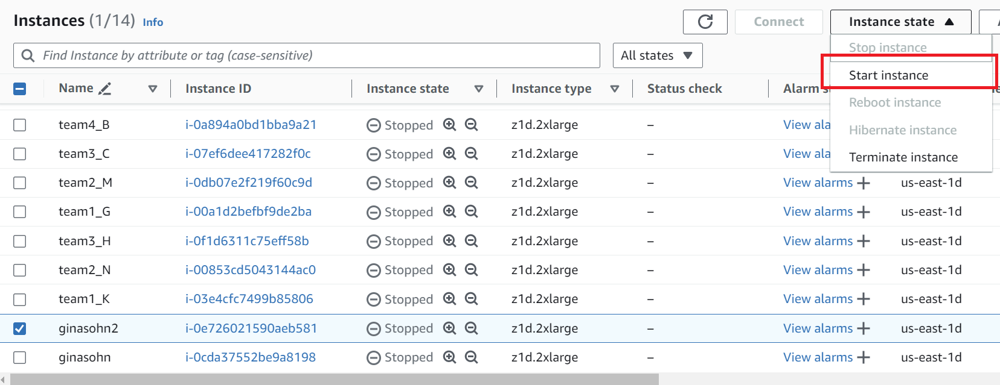
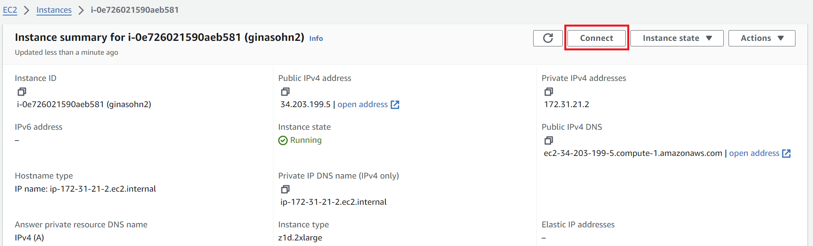
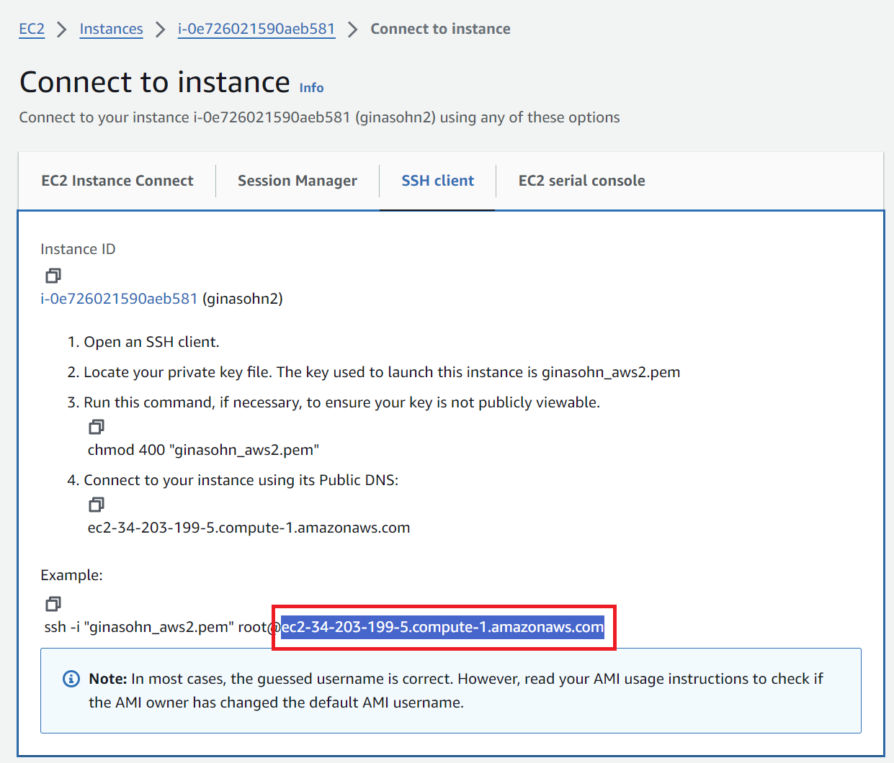
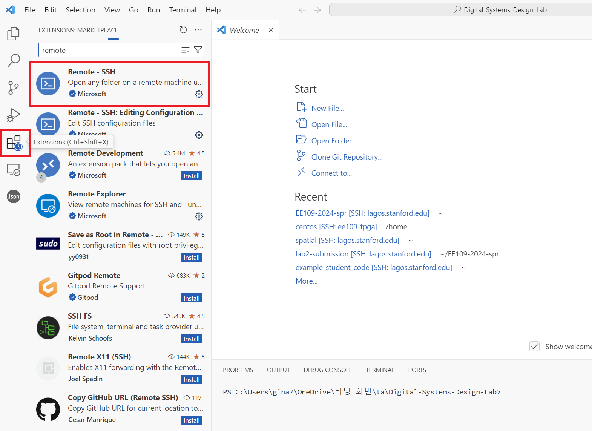
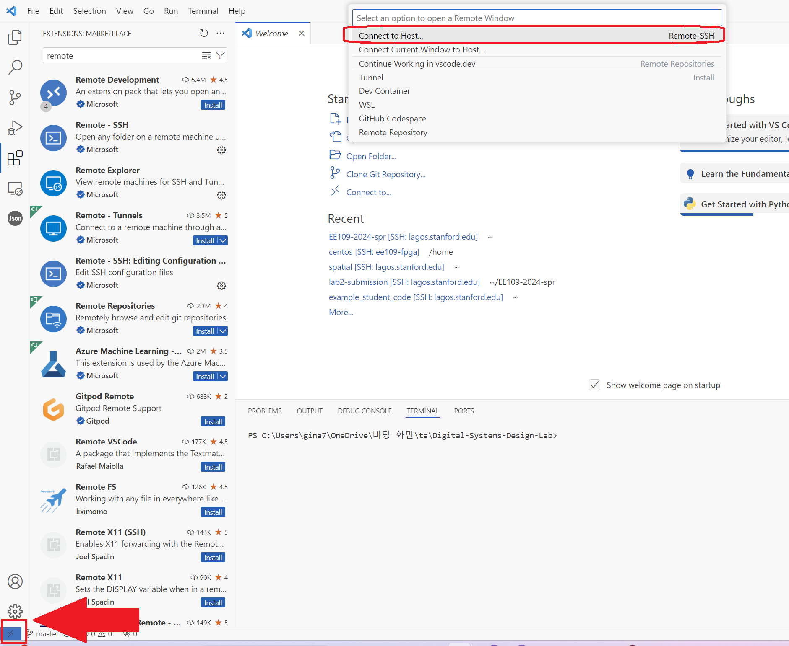
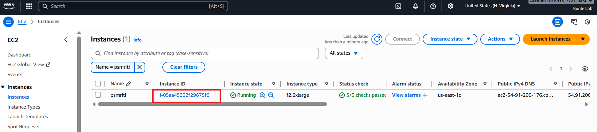
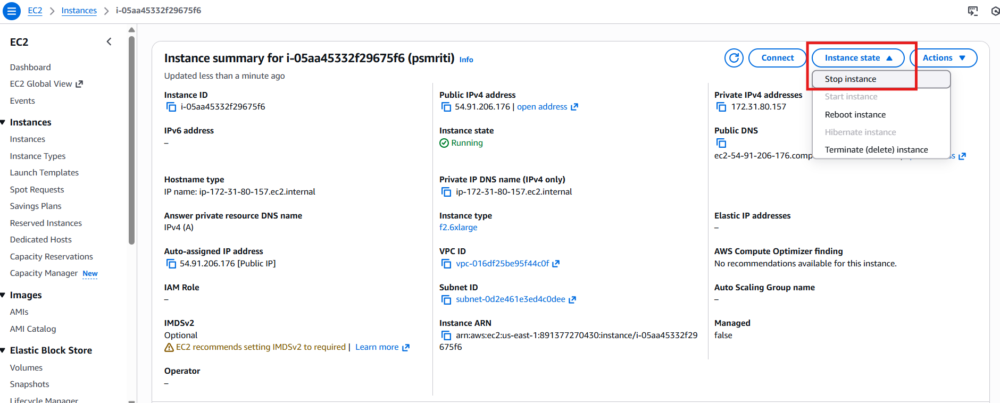
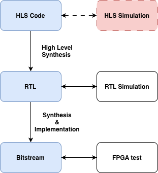
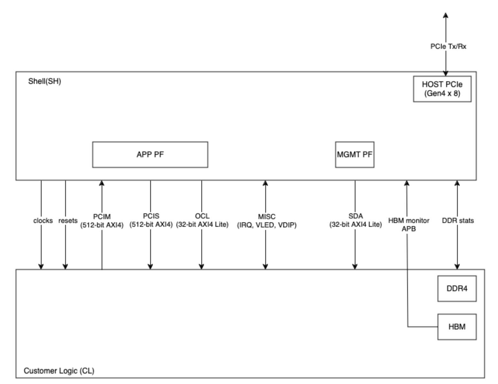

## Getting Started with Digital Systems Design Using F1 FPGAs

For the second part of lab1 we will be translating Spatial code to Vitis C++ code. Vitis is a complete development environment for applications accelerated using Xilinx FPGAs. It leverages the OpenCL heterogeneous computing framework to offload compute intensive workloads to the FPGA.

The accelerated application is written in C/C++, OpenCL, or RTL with OpenCL APIs. For the purpose of lab 1, all the Spatial exercises have already been converted to C/C++ HLS for you. This part of the lab will walk you through setting up an AWS instance, as well as the full AWS F2 HLS flow, from HLS to RTL conversion, RTL simulation, and running on the FPGA.

## AWS Setup
You should have received an email with a subject "[EE109] AWS Instance Instructions". The email contains two attachments, an `ssh` key and a `csv` file with your AWS API credentials. Make sure you download both before proceeding.

1. Move the private SSH key under your `.ssh` folder. Your path to the `.ssh` folder is usually:
    * Linux / Mac : `~/.ssh`
    * Windows: `\Users\$USERNAME\.ssh` or `\user\$USERNAME\.ssh` (replace the $USERNAME with your laptop's username)
2. Sign into the AWS account using the link and information in the email. It will require you to change your password if it's your first time logging in.
3. Once you're logged in, search for the 'ec2' service. If you click on EC2, this will bring you to the screen below. Press 'Instances'.
    <div style="padding-left: 0px; padding-bottom: 30px; text-align: center;">
        
    </div>
4. Select your instance as noted in the email, and go to **Instance State > Start instance**.
    <div style="padding-left: 0px; padding-bottom: 30px; text-align: center;">
        
    </div>
5. Click the 'Instance ID' and press 'connect'. 
    <div style="padding-left: 0px; padding-top: 0px; text-align: center;">
        
    </div>

    Move to the 'SSH Client' tab and copy the address shown in the boxed field in this picture. This address changes whenever you start the instance. 
    <div style="padding-left: 0px; padding-top: 10px; padding-bottom: 30px; text-align: center;">
        
    </div>
6. SSH into your instance
    * Option 1: VSCode (We recommend this option when you edit code & run sw/hw emulations)
    
        1. Install the 'remote-ssh' extension
            <div style="padding-left: 0px; padding-bottom: 30px; text-align: center;">
                
            </div>

        2. Press the small button on the lower right and select **Connect to host > Configure SSH Hosts** and choose the first file (this will look something like `\user\$USERNAME\.ssh\config`).
            <div style="padding-left: 0px; padding-bottom: 30px; text-align: center;">
                
            </div>
        3. Add the following entry to the file and save it. The value for `HostName` is the address you copied in step 5. **This address changes whenever you start the instance. So you will have to update this field whenever you stop and re-start the instance.** The 'IdentityFile' field is the location where you saved the private key file in step 1.
            ```bash
            Host ee109-vitis
                HostName ec2-34-203-199-5.compute-1.amazonaws.com
                User ubuntu
                IdentityFile "PATH TO YOUR .pem FILE"
            ```
        4. Go back and press the small button on the lower right you clicked in step 6-2 and select **Connect to host**. The host you've just added will now appear. Selecting the newly added AWS host will connect you to your instance. Once you're connected, you can open folders in your instance using the 'File > Open Folder' feature and run code using the 'Terminal > New Terminal' feature.

        <br/>

    * Option 2: Terminal (We recommend this option when you want to open a gui to view the emulation reports) 
        The value after the `-i` option is the location of the private key.

        ```bash
        ssh -i \Users\gina7\.ssh\ginasohn_aws2.pem ubuntu@ec2-34-203-199-5.compute-1.amazonaws.com
        ``` 
    
## Configure IAM user access key

After ssh'ing to your instance, configure the aws settings using the `csv` file you downloaded from the aforementioned email, and by running `aws configure`. Set your credentials, region, and output format. If you run the following command, it will ask you for Access Key ID and Secret Access Key, For the region, write 'us-east-1' and for the output write `json`

```
aws configure
```

The result should look like:
```
[centos@ip-172-31-21-2 src]$ aws configure
AWS Access Key ID [None]: <Your Access Key>
AWS Secret Access Key [None]: <Your Secret Access Key>
Default region name [None]: us-east-1
Default output format [None]: json
```

## Create S3 bucket 

S3 Bucket is used to upload and store the generated Amazon FPGA image (AFI). Please follow the steps below to create the S3 bucket.

1. Add the following to the end of your bashrc file (`~/.bashrc`) and open a new terminal or run `source ~/.bashrc`
```bash
export DCP_BUCKET_NAME=<SUNetID>
export DCP_FOLDER_NAME=EE109_SPR2026
export REGION=us-east-1
export LOGS_FOLDER_NAME=logs_folder
export LOGS_BUCKET_NAME=$DCP_BUCKET_NAME
```
2. Run the following commands. If your chosen `DCP_BUCKET_NAME` gives you an error in creating the S3 bucket, use any unique ID.
```bash
# Create an S3 bucket (choose a unique bucket name)
aws s3 mb s3://${DCP_BUCKET_NAME} --region ${REGION}

# Create a folder for your tarball files
aws s3 mb s3://${DCP_BUCKET_NAME}/${DCP_FOLDER_NAME}/

# Create a folder to keep your logs
aws s3 mb s3://${LOGS_BUCKET_NAME}/${LOGS_FOLDER_NAME}/ --region ${REGION}

# Create a temp file
touch LOGS_FILES_GO_HERE.txt

# Create the folder on S3
aws s3 cp LOGS_FILES_GO_HERE.txt s3://${LOGS_BUCKET_NAME}/${LOGS_FOLDER_NAME}/
```

## Stopping Instance
Credits are used based on the number of hours the instance is run. Always turn off the instance once you are done.
1. To the stop the instance navigate to the EC2/Instances. Click "stop instance" under the "Instance State' drop down. It will take sometime for the instance to shut down. 


2. You can also stop it by running the following command on the aws terminal `sudo shutdown -h now`

## AWS FPGA setup

1. Do this once: Clone the following repository

```bash
cd ~/
git clone https://github.com/aws/aws-fpga.git
```

2. Do this once: Download the following if not already installed

```bash
sudo apt-get install -y git-lfs
sudo apt install -y jq
sudo apt install -y python3-pip
sudo apt install -y python3.8-venv
```

3. Do this every time you enter the instance: Source the HDK environment

```bash
cd ~/aws-fpga
source hdk_setup.sh
```

4. Do this every time you enter the instance: Source the SDK environment

```bash
cd ~/aws-fpga
source sdk_setup.sh
```

> Note: if you see any dependency errors after sourcing the scripts above, download the relevant dependencies.

## HLS to FPGA development flow

A simplified HLS to FPGA development flow is shown below. The primary benefit of HLS is faster design iteration, as it allows the designer to verify, and evaluate different implementations with a significantly faster turn-around time compared to traditional RTL design. This is because designs can be evaluated for correctness through HLS simulation (effectively the same as running a C++ testbench) which is much lighter compared to traditional RTL simulation tools.



After correctness is evaluated, the HLS code is converted to Verilog RTL. Note that the generated outputs cannot be trusted blindly, and because of this we perform RTL simulation to verify correctness. A reasonable question would be why we even bother with the higher level flow if the RTL simulation is inevitable; Although the total overhead is higher, the tighter design loop at the HLS level still reduces development time.

Following RTL verification, we rely on traditional FPGA synthesis and implementation to generate an FPGA bitstream. The bitstream contains information that tells the FPGA how its internal cells and interconnect should be configured in order to implement the design functionality. We then perform a final FPGA test, and conclude the process.

> Note: For the purposes of Lab 1, and since the HLS designs are already given to you, we skip HLS simulation in the interest of time. That being said you will need to deal with this step for Labs 2 & 3 as well as your project.

## AWS F2 specifics

Generating bitstreams to run on an AWS F2 instance is quite a bit more involved than the process you would follow for a typical FPGA. Each AWS FPGA is divided into two partitions, called the `Shell` and `Custom Logic`. At the end of the development process, the two are combined to generate an Amazon FPGA Image AFI, which can then be loaded to an F2 FPGA to run a testbench. This structure is shown below:



First, look at the arrow on the top right. The PCIE block inside the shell is responsible for establishing the host to device communication. The host communicates with the shell, which in turn implements a number of peripherals that it uses to communicate with the custom logic, including clocks, resets, and other interfaces such as PCIM, PCIS, OCL, and SDA. For more information on the respective interfaces, you can look [here](https://awsdocs-fpga-f2.readthedocs-hosted.com/latest/hdk/docs/AWS-Shell-Interface-Specification.html).

These static connections impose strict constraints on the exposed interface of your custom logic. Your custom HLS block will, of course, not match this arbitrary interface. Because of this, we create a wrapper around your generated RTL, to expose the ports expected by `CL` partition. In the current and all future labs, this wrapper is called `design_top.sv`.

As explained, this wrapper is responsible for implementing the expected `CL` interface, and instantiating your generated block, which will be called `vadd` in the current and all future labs. Beyond this however, note that the wrapper also includes controller instantiations for the on-chip memories. In our labs we use the DRAM controller, called `sh_ddr`.


## Running the AWS F2 HLS Flow

0. Enter the lab directory and create the symlink.
``` bash
cd skeleton-lab-1

# Only run this once: Create a symlink to avoid a compilation path error.
ln -s ~/aws-fpga/hdk ./hdk
```
1. Enter the part 1 directory.
``` bash
cd Lab1Part1RedExample
```
2. You can see this part's HLS source code under `src/vadd.cpp`. Inspect the source and answer the following short questions in `lab1_submit.md`.
    * What is the purpose `HLS INTERFACE` pragmas in the `vadd.cpp`?
    * Look at the protocol each call uses. In a few words, describe what this protocol choice means for this block. For example, what would it mean for the design if `s_axilite` was used instead of `m_axi`? 
    * How many physical interfaces are actually instantiated? How is this apparent from the pragma calls?
> Note: the second question especially is non-trivial. Our current host-device strategy stressed the flow of: (1) Host writing data to device DRAM, (2) Device interacting with DRAM to read inputs and store outputs, (3) Host reading outputs from device DRAM. Would this flow be possible had we implemented an s_axilite interface instead of m_axi?
3. Lets generate RTL from this source code. Run the following:
```bash
cd design_top
source setup.sh
make gen_rtl
```
4. The generated RTL is visible here: `design_top/design/concat_top.sv`. Take a look at this file, RTL generated from HLS code tends to be unreadable, but you can see your `vadd` module definition near the bottom. This is important, because this definition is used by the `design_top.sv` wrapper to instantiate your block in the `CL` partition.  
As you can see, your module's interface includes the standard clock, reset, start, and done ports, as well as an axi master which will be connected to the DRAM, and a slave AXI control port, such that the logic can be configured by the host.
5. Take a look at the `design_top.sv` file, and the `vadd` instantiation. The block's axi master interface is meant to connect to the DDR controller `sh_ddr`, such that it can read data from DRAM. Currently however, it first passes through a MUX Arbiter in line 450. Answer the following:
    * Why is the MUX necessary? Why can't we statically connect the vadd AXI Master to the DRAM controller?
6. Proceed to the RTL simulation. Run the following:
```bash
make hw_sim
```
7. The RTL testbench can be found under `verif/test/design_top_base_test.sv`. It simply defines two numbers, stores them into DRAM, and then configures the custom block with the correct input and output pointers. After the block is done, it reads the output pointer location and checks the result. The testbench outputs the cycles taken for data transfer (From Host - Device) as well as the cycles taken by the block to compute the result. Answer the following:
    * What are the RTL Sim data transfer cycles?
    * What are the RTL Sim compute cycles?
    * The compute cycles look higher than expected for a simple addition, why are they this high
8. We can now move on to the FPGA test. First we need to perform synthesis and implementation. Run the following command. Note that it takes about an hour to complete.
```bash
make fpga_build
```
9. After the build finishes, generate the AWS FPGA Image AFI as such.
```bash
make generate_afi
```
10. We now need to wait until the AFI becomes available. Run the following command. The AFI will most likely be listed as "Pending", and will take about 20 minutes to become available. Run the command periodically and only proceed when it shows "Available".
```bash
make check_afi_available
```
11. Now that the AFI is available, program the FPGA, and run the FPGA test.
```bash
make program_fpga
make run_fpga_test
```
12. The FPGA test loads our custom logic to the FPGA, and then executes the C testbench under `software/src/design_top.c`. This testbench mimics our RTL test, in that it also simply defines two numbers, stores them to device DRAM, programs the FPGA logic with the correct pointers, and eventually reads the result. We will look at this in depth in the following section, but for now; answer the following questions:
    * What are the RTL Sim data transfer cycles?
    * What are the RTL Sim compute cycles?
    * The data transfer cycles are now significantly higher than in the RTL simulation. Why is this?

> Note: The third question is once again non-trivial. Consider how the Host interacts with DRAM in the RTL simulation vs the FPGA test. In the RTL sim, we use tb.poke() and tb.peek() methods, while in the FPGA test we use fpga_pci_poke() and fpga_pci_peek(). Hint: The former calls drive the PCIS AXI bus directly (look back at the CL diagram), what do you think the fpga calls do?

# Understanding Lab1Part2DramSramExample Vitis HLS code
In this walkthrough, we will be comparing Vitis C++ code to the Lab1Part2DramSramExample code in Spatial. We will be multiplying `x` to a `DATA_SIZE`-long 32bit integer vector.

Let's assume the datawidth between the on-chip and off-chip transfer is 512 bits. We will load `NUM_WORDS` number of elements from DRAM to SRAM in parallel (this is similar as loading in a `NUM_WORDS`-long vector). It will then do an element-wise multiplication for the `NUM_WORDS` elements in parallel and store it back to DRAM. This process will be sequentially repeated until all the `DATA_SIZE` elements are computed (iterations of the outer loop will not be pipelined due to the `Sequential` directive in front of the `Foreach` controller).
<br/>

## Understanding Host C code
Now we will look at the Vitis C++ code for the same application. The code can be found under `Lab1Part2DramSramExample`. `/design_top/software/src/design_top.c` describes the behavior of the host and the accelerator design is specified in `/src/vadd.cpp` which is the equivalent to the `Accel` block in Spatial.

When accelerating applications with FPGAs, there are four major components. Host, Global Memory (DRAM), the on-chip memory and logic on the FPGA accelerator.

## Section A: Create test data in host memory, and write to DRAM:

This section generates values in host memory, and immediately loads them to DRAM using the `ddr_wr32()` function. The data is loaded as a contiguous memory block, with 32 bit offsets.

```c++
for (int i = 0; i < DATA_SIZE; i++) {
    uint32_t val = (uint32_t)(i + 1);
    if (ddr_wr32(pcis_handle, in_ptr + i * 4, val)) goto fail;
}
```

## Section B: Configure Logic

Following, we use the OCL interface to write the logic control registers. These define the input and output starting pointers for the two arrays, as well as the x and size arguments to the block.

```c++
// configure vadd control registers
printf("Configuring vadd control registers (x=%u, size=%d)\n", x_val, DATA_SIZE);
if (ocl_wr32(ocl_handle, ADDR_IN_LO,  (uint32_t)(in_ptr)))        goto fail;
if (ocl_wr32(ocl_handle, ADDR_IN_HI,  (uint32_t)(in_ptr >> 32)))  goto fail;
if (ocl_wr32(ocl_handle, ADDR_OUT_LO, (uint32_t)(out_ptr)))       goto fail;
if (ocl_wr32(ocl_handle, ADDR_OUT_HI, (uint32_t)(out_ptr >> 32))) goto fail;
if (ocl_wr32(ocl_handle, ADDR_X,      x_val))                     goto fail;
if (ocl_wr32(ocl_handle, ADDR_SIZE,   DATA_SIZE))                 goto fail;
```

## Section C: Start the device

As you saw in the `vadd` module instantiation, the device includes a `start` port. To start the device, the `design_top.sv` wrapper snoops OCL writes to address 0x00. When a "1" is written to this address, the custom logic starts operating.

```c++
// start kernel
printf("Starting vadd kernel (ap_start)\n");
if (ocl_wr32(ocl_handle, ADDR_CTRL, AP_START)) goto fail;
```


## Section D: Wait for completion

After starting the device, we wait for some time for the custom logic to conclude, prior to reading the output pointer locations. Note that since the block includes a `done` port it would be more efficient to add additional logic such that the done event is broadcasted on the axi bus, allowing us to poll for it. In this case we avoid this for the sake of simplicity.

## Section E: Read output data and compare results

In this section we simply read the generates outputs starting from the programmed output pointer, and compare them with the gold result as such:

```c++
for (int i = 0; i < DATA_SIZE; i++) {
    uint32_t got_val = 0;
    uint32_t exp_val = x_val * (uint32_t)(i + 1);

    if (ddr_rd32(pcis_handle, out_ptr + i * 4, &got_val)) goto fail;

    if (got_val != exp_val) {
        fprintf(stderr, "  vadd[%d]: got %u, expected %u (x=%u, in=%u)\n",
                i, got_val, exp_val, x_val, (uint32_t)(i + 1));
        errors++;
    }
    else {
        printf("  vadd[%d]: got %u, expected %u (x=%u, in=%u)\n",
                i, got_val, exp_val, x_val, (uint32_t)(i + 1));
    }
}
```


# Your Turn:

1. Repeat the AWS F2 HLS flow for the remaining lab parts.
2. Answer all questions in `lab1_submit.md`.
  
# Submission:

- Gradescope: a doc with your commit ID & repo
- Lab 1 Part 1: Leave your implementation under **your Github Classroom repository's** `src/test/scala/Lab1.scala` file.
- Lab 1 Part 2: 
  - Lab1Part1RegExample, Lab1Part2DramSramExample, Lab1Part4FIFOExample and Lab1Part6ReduceExample: make sure the `logs` directory of each part contains: `gen_rtl.log.txt`, `hw_sim.log.txt` & `fpga_test.log.txt` in **your Github Classroom repository**.
  - Make sure that **your Github Classroom repository's** `lab1_submit.md` file is filled in.


# Additional Materials for Vitis C++

This is a very simplified example to introduce how to develop hardware with Vitis and show how we can translate Spatial code to Vitis C++ code. There are many other ways to make this code better.

- **dataflow pragma**: The dataflow pragma instructs the compiler to enable task-level pipelining. This is required for load/compute/store functions to execute in a parallel and pipelined manner. The new implementation of the same application using dataflow pramas can be found [here](https://github.com/Xilinx/Vitis_Accel_Examples/tree/f61637e9263ecc1be3df34182ea6c53a0ca10447/hello_world).
- [Various example kernels](https://github.com/Xilinx/Vitis_Accel_Examples/tree/bb80c8ec699c3131e8874735bd99475ac6fe2ec7/cpp_kernels): The Vitis repository has a series of example kernel implementations, which can be a useful reference.
- [Vitis Unified Software Platform Documentation](https://docs.amd.com/r/en-US/Vitis-Tutorials-Getting-Started/Vitis-Tutorials-Getting-Started-XD098): This official documentation hold many useful information.
- [Vitis HLS Command Reference](https://docs.amd.com/r/2021.2-English/ug1399-vitis-hls/Getting-Started-with-Vitis-HLS): This will be useful to look up HLS pragmas and HLS data types (these will start with a `hls::` prefix in the code).
- [Quick Start Guide](https://github.com/aws/aws-fpga/blob/f1_xdma_shell/Vitis/README.md)

