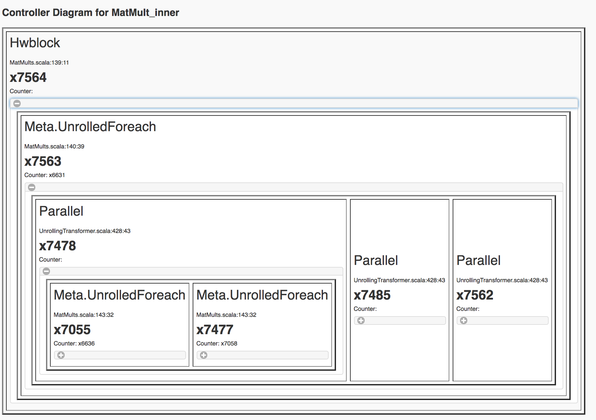
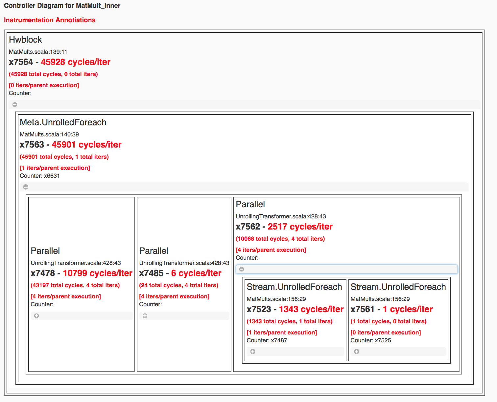

# Laboratory Exercise 2: Advanced Usage of Spatial
In the last lab, we went through the basics of Spatial. In this lab, we are going to explore more advanced features of Spatial.

We will first go through the usage of more advanced controllers. Then we will use the controllers to build an app that performs matrix multiplication. After we finish the app, we will learn about how to improve the performance of your app by making it parallel. We will also learn about how to use the tools Spatial provides to optimize the application.

More specifically, we will be covering the usage of the following elements: 

Controllers: MemReduce, MemFold, FSM

On-Chip Memories: LUT

Features for Optimizing Applications: Instrumentation, Choosing Parallelization

## MemReduce, MemFold
MemReduce is very similar to Reduce, but different in the sense that Reduce operates on a register while MemReduce operates on a piece of on-chip memory (SRAM). If we take a step back and try to understand the two controllers from an abstract level, we will see that Reduce is designed for scalars and MemReduce is designed for tensors. Here is the syntax for using MemReduce:

```scala
// Create a MemReduce Controller
MemReduce(accum_sram)(N by n){ i =>
  // map body
}{// binary operator}
```

For example, you can add a list of arrays using MemReduce: 
```scala
// Create an SRAM to store the reduced results
val a = SRAM[Int](16)
// Add 10 SRAMs together, where each SRAM contains only ones.
MemReduce(a)(-5 until 5 by 1) { i =>
  // Create an SRAM
  val tmp = SRAM[Int](16)
  // For each element in the tmp SRAM, fill it with 1
  Foreach(16 by 1) { j => 
    tmpSRAM(j) = 1
    tmpSRAM
  }{_+_}
}
```

We can compile a Spatial App that further demonstrate this example: 
```scala
// MemReduce
object Lab2Part1SimpleMemReduce extends SpatialApp { 

  val N = 16.to[Int]

  @virtualize
  def main() {
    val out = DRAM[Int](16)
    Accel {
      val a = SRAM[Int](16)
      MemReduce(a)(-5 until 5 by 1){i =>
        val tmp = SRAM[Int](16)
        Foreach(16 by 1) { j => tmp(j) = 1}
        tmp
      }{_+_}
      out store a
    }

    val result = getMem(out)
    val gold = Array.tabulate(16){i => 10.to[Int]}
    printArray(gold, "expected: ")
    printArray(result, "result:   ")

    val cksum = gold.zip(result){_==_}.reduce{_&&_}
    println("PASS: " + cksum + " (Lab2Part1SimpleMemReduce)")
  }
}
```

## Your turn
* Synthesize the example application. Report on the resource utilization and
cycle counts.
* We also have a MemFold controller, which operates the same way as fold but
work with memories. In this part of the exercise, we would like to reimplement
Lab2Part1SimpleMemReduce using MemFold. You can put your implementation under Lab2Part2SimpleMemFold.

Make sure that you intialize your SRAM before passing it to the MemFold
controller. Like Fold, MemFold assumes that you have intialized your MemFold
SRAM. 

## FSM
Spatial also supports Finite State Machine by providing an FSM controller. It
has the following syntax: 
```scala
FSM[Int]{// constraints on the state} { state =>
  // Body of the state machine
}{ // rules for updating the state }
```

For example, you can write the following example using an FSM controller:
Example: Fill an SRAM of size 32 using the following rules: 
* If index of the SRAM is greater than or equal to 16: 
  * If index == 16, set the element at index - 16 to 17.
  * If index == 17, set the element at index - 16 to reg.value.
  * Otherwise, set the elementat index - 16 to be the value of the index.
* If state is smaller than 16:
  * If index < 8, set the element at 31 - index to be index
  * Otherwise, set the element at 31 - index to be index + 1

As you have observed, there are quite a few transitions of states as we iterate
through the SRAM. An FSM controller would handle the transitions nicely.
Here is how it is implemented in Spatial: 
```scala
reg := 16
FSM[Int]{state => state < 32} { state =>
  if (state < 16) {
    if (state < 8) {
      bram(31 - state) = state // 16:31 [7, 6, ... 0]
    } else {
      bram(31 - state) = state+1 // 16:31 [16, 15, ... 9]
    }
  }
  else {
    bram(state - 16) = if (state == 16) 17 else if (state == 17) reg.value else state
  }
}{state => state + 1}
```

An example of the complete app looks as follows: 
```scala
object Lab2Part3BasicCondFSM extends SpatialApp { 

  @virtualize
  def main() {
    val dram = DRAM[Int](32)
    Accel {
      val bram = SRAM[Int](32)
      val reg = Reg[Int](0)
      reg := 16
      FSM[Int]{state => state < 32} { state =>
        if (state < 16) {
          if (state < 8) {
            bram(31 - state) = state // 16:31 [7, 6, ... 0]
          } else {
            bram(31 - state) = state+1 // 16:31 [16, 15, ... 9]
          }
        }
        else {
          bram(state - 16) = if (state == 16) 17 else if (state == 17) reg.value else state // Test const, regread, and bound Mux1H
        }
      }{state => state + 1}

      dram(0::32 par 16) store bram
    }
    val result = getMem(dram)
    val gold = Array[Int](17, 16, 18, 19, 20, 21, 22, 23, 24, 25, 26, 27, 28,
                          29, 30, 31, 16, 15, 14, 13, 12, 11, 10, 9, 7, 6, 5, 4, 3, 2, 1, 0)
    printArray(result, "Result")
    printArray(gold, "Gold")
    // for (i <- 0 until 32){ assert(result(i) == gold(i)) }
    val cksum = gold.zip(result){_ == _}.reduce{_&&_}
    println("PASS: " + cksum + " (BasicCondFSM)")
  }
}
```

## Your Turn
* Synthesize the example application. Report on the resource utilization and
cycle counts. The example application is stored as Lab2Part3BasicCondFSM.
* Let's try a different example. Here is the description: 

Example: Fill an SRAM of size 32 using the following rules: 
* If index of the SRAM is greater than or equal to 16: 
  * If index < 8, set the element at 31 - index to be index * 2
  * Otherwise, set the element at 31 - index to be index + 2
* If state is smaller than 16:
  * If index == 16, set the element at index - 16 to 17.
  * If index == 17, set the element at index - 16 to reg.value * 2.
  * Otherwise, set the elementat index - 16 to be the value of the index.

You can modify Lab2Part3BasicCondFSM to implement this new example. Please save
this new example as Lab2Part3BasicCondFSMAlt. 


### LUT
In Spatial, a LUT has the following syntax: 
```scala
val lut = LUT[Type](N0,N1, ..., Nm)(const0.to[T], const1.to[T], ...)
```
This would create a LUT of m dimensions. You can access an element in lut by
using: 
```scala
val lut_ijmn = lut(i,j,m,n)
```

## Your Turn
* Please use the LUT syntax to implement the app in Lab2Part4LUT. What we want
to do here is that given a LUT, the user will provide a base value, index i and
index j. The output should be base + LUT(i,j).

### A More Involved Application: GEMM
A large part of this section is borrowed from the official [Spatial tutorial](http://spatial-lang.readthedocs.io/en/latest/tutorial/gemm.html). 
You can visit the Spatial GEMM example for more information.

General Matrix Multiply (GEMM) is a common algorithm in linear algebra, machine learning,
statistics, and many other domains. It provides a more interesting trade-off space than
the previous tutorial, as there are many ways to break up the computation. This includes
using blocking, inner products, outer products, and systolic array techniques. In this tutorial,
we will demonstrate how to build a blocked GEMM app that uses outer products, and leave it to the
user to try and build a GEMM version that uses inner products. 

## Data Setup and Validation
Let's start by creating the data structures above the Accel that we will set up the matrices and compute the 
gold check. We will expose the dimensions of the matrices as command-line arguments.
```scala
import spatial.dsl._
import org.virtualized._

object GEMM extends SpatialApp {

  @virtualize
  def main() {
  
    type T = FixPt[TRUE,_24,_8]
    
    val M = ArgIn[Int]
    val N = ArgIn[Int]
    val K = ArgIn[Int]
    setArg(M,args(0).to[Int])
    setArg(N,args(1).to[Int])
    setArg(K,args(2).to[Int])
    
    val a_data = (0::args(0).to[Int], 0::args(2).to[Int]){(i,j) => random[T](3)}
    val b_data = (0::args(2).to[Int], 0::args(1).to[Int]){(i,j) => random[T](3)}
    val c_init = (0::args(0).to[Int], 0::args(1).to[Int]){(i,j) => 0.to[T]}
    val a = DRAM[T](M, K)
    val b = DRAM[T](K, N)
    val c = DRAM[T](M, N)
    
    setMem(a, a_data)
    setMem(b, b_data)
    setMem(c, c_init)
    
    Accel {
      // TODO: Set up accelerator code for MatMult
    }
    
    val accel_matrix = getMatrix(c)
    
    val gold_matrix = (0::args(0).to[Int], 0::args(1).to[Int]){(i,j) => 
      Array.tabulate(args(2).to[Int]){k => a_data(i,k) * b_data(k,j)}.reduce{_+_}
    }
    
    printMatrix(accel_matrix, "Received: ")
    printMatrix(gold_matrix, "Wanted: ")
    val cksum = accel_matrix.zip(gold_matrix){_==_}.reduce{_&&_}
    println("Pass? " + cksum)
  }
}
```

Notice that we create an initial matrix for the result and set all values to 0.  This is necessary
because GEMM using outer products computes part of a tile of the result and accumulates this on top 
of what was previously in that tile.  This means we will need to fetch a tile from off-chip DRAM
and accumulate a new result on top of that, then write this new tile back.


## Using MemReduce and MemFold for Outer Products
The animation below shows how to compute GEMM without tiling, using outer products.


Because we cannot create hardware to handle variable-sized matrices, we must tile the problem.
The animation below shows one valid scheme for doing so.  We will set our tile sizes in the
M, N, and K dimensions above the Accel as follows
```scala
val tileM = 16
val tileN = 16
val tileK = 16
```


Now let's write the code to implement this computation.  The large arrows and boxes represent
matrix multiplies on the highlighted tiles using outer products.  There will be six nested loops:
one for each dimension of tiling and one for each dimension within the tile.  

Considering the tiling loops first, this particular animation shows that we are treating the N dimension
as the innermost loop, followed by the M dimension, and finally the K dimension. Below shows the nested 
loops along with the data structures and their tile transfers required within each scope.  
Remember that you may add parallelization wherever you please:
```scala
Accel {
  Foreach(K by tileK){kk => 
    val numel_k = min(tileK.to[Int], K - kk)
    Foreach(M by tileM){mm =>
      val numel_m = min(tileM.to[Int], M - mm)
      val tileA_sram = SRAM[T](tileM, tileK)
      tileA_sram load a(mm::mm+numel_m, kk::kk+numel_k)
      Foreach(N by tileN){nn =>
        val numel_n = min(tileN.to[Int], N - nn)
        val tileB_sram = SRAM[T](tileK, tileN)
        val tileC_sram = SRAM.buffer[T](tileM, tileN)
        tileB_sram load b(kk::kk+numel_k, nn::nn+numel_n)
        tileC_sram load c(mm::mm+numel_m, nn::nn+numel_n)

        // Implement the full outer product here

        c(mm::mm+numel_m, nn::nn+numel_n) store tileC_sram
      }
    }
  }
}
```

Note that we must compute the ``numel_*`` values to handle the edge cases correct, when the tile dimensions
do not evenly divide the full matrices.

Also note that we declare ``tileC_sram`` as a `.buffer` SRAM.  If you do not declare it this way,
then the compiler will throw an error about this and explain the issue.  You will learn more about
this in the `Advanced Buffering`

Next, we will implement the full outer product of the tiles that we have brought into the chip.
## Your Turn
* In every iteration of the innermost Foreach, we bring in two SRAMs of data.
From the animation, you should have seen how we use the two SRAMs to populate a
third one, and then write it back to Matrix C. In the comment session, please
implement this design. As a little hint, you should first think of the proper
controller to use. We would first populate an SRAM using tileB_sram and
tileC_sram. Then we would coalesce the result numel_k times. You can add your implementation to Lab2Part5GEMM.


## Advanced Buffering

This Accel above already implements coarse-grain pipelining at various levels.  For example, the controller whose counter is ``nn`` has 
three stages in it.  The first stage loads ``tileB_sram`` and ``tileC_sram`` in parallel, the second stage performs the ``MemFold`` 
into ``tileC_sram``, and the third stage writes the resulting ``tileC_sram`` back into the appropriate region of DRAM.  This is an
example where the compiler will create a triple-buffer for ``tileC_sram`` in order to ensure that the correct values are being worked with
when this coarse-grain pipeline fills up and executes.  

If you had not declared ``tileC_sram`` as a `.buffer` SRAM, then the compiler is suspicious of your code.  This is because it is generally
very easy when specifying pipelined hardware to accidentally create loop-carry dependency issues.  Specifically, in this code, it sees that 
you write to the SRAM in the first stage, and then write to it again in the second stage.  It is very easy, even for advanced users, to
write this kind of structure without realizing it and then receive an incorrect result when using a cycle-accurate simulator of the hardware
because of values "rotating" through the buffer inadvertently.

The animation below specifically demonstrates the triple buffer ``tileC_sram`` in this algorithm.


Note that at the beginning and end of each row, there are a few iterations where parts of the buffer are not being used.
This is because of the way the loops are written, such that we step through each tile in the N dimension before we
increment the tile for M.  If you want to write the app such that there are no wasteful fill and drain iterations,
you must combine loops appropriately.

## Advanced Banking

Let's now add in more optimizations to improve the performance of this application.  Specifically, we will parallelize two of the
loops in such a way to expose hierarchical banking.  The following code shows the loops for ``k`` and ``j`` parallelized by 2 and 4
respectively:
```scala
  Accel {
    Foreach(K by tileK){kk => 
      val numel_k = min(tileK.to[Int], K - kk)
      Foreach(M by tileM){mm =>
        val numel_m = min(tileM.to[Int], M - mm)
        val tileA_sram = SRAM[T](tileM, tileK)
        tileA_sram load a(mm::mm+numel_m, kk::kk+numel_k)
        Foreach(N by tileN){nn =>
          val numel_n = min(tileN.to[Int], N - nn)
          val tileB_sram = SRAM[T](tileK, tileN)
          val tileC_sram = SRAM.buffer[T](tileM, tileN)
          tileB_sram load b(kk::kk+numel_k, nn::nn+numel_n)
          tileC_sram load c(mm::mm+numel_m, nn::nn+numel_n)

          MemFold(tileC_sram)(numel_k by 1 par 2){k => 
            val tileK_local = SRAM[T](tileM, tileN)
            Foreach(numel_m by 1, numel_n by 1 par 4){(i,j) => 
              tileK_local(i,j) = tileA_sram(i,k) * tileB_sram(k,j)
            }
            tileK_local
          }{_+_}

          c(mm::mm+numel_m, nn::nn+numel_n) store tileC_sram
        }
      }
    }
  }
```

Now let's look at what happens to ``tileB_sram``.  It's first and second indices are both parallelized.
Index ``j`` is vectorized by 4, while index ``k`` is duplicated for two different values of k when the 
loop is unrolled by 2.  This means we must bank ``tileB_sram`` in both the horizontal and vertical dimensions
in order to guarantee that all 8 of these accesses will be able to touch unique banks every time we read from this memory.
The animation below demonstrates how we hierarchically bank this SRAM.


Let's consider the situation if we instead decided to parallelize a different way.  Below is the code for the application
if we chose to parallelize the loading of tileB_sram by 8 while also parallelizing the ``k`` loop by 2:
```scala
  Accel {
    Foreach(K by tileK){kk => 
      val numel_k = min(tileK.to[Int], K - kk)
      Foreach(M by tileM){mm =>
        val numel_m = min(tileM.to[Int], M - mm)
        val tileA_sram = SRAM[T](tileM, tileK)
        tileA_sram load a(mm::mm+numel_m, kk::kk+numel_k)
        Foreach(N by tileN){nn =>
          val numel_n = min(tileN.to[Int], N - nn)
          val tileB_sram = SRAM[T](tileK, tileN)
          val tileC_sram = SRAM.buffer[T](tileM, tileN)
          tileB_sram load b(kk::kk+numel_k, nn::nn+numel_n par 8)
          tileC_sram load c(mm::mm+numel_m, nn::nn+numel_n)

          MemFold(tileC_sram)(numel_k by 1 par 2){k => 
            val tileK_local = SRAM[T](tileM, tileN)
            Foreach(numel_m by 1, numel_n by 1){(i,j) => 
              tileK_local(i,j) = tileA_sram(i,k) * tileB_sram(k,j)
            }
            tileK_local
          }{_+_}

          c(mm::mm+numel_m, nn::nn+numel_n) store tileC_sram
        }
      }
    }
  }
```

While the hierarchical banking scheme shown above will still work for this case, where we have 2 banks along the rows
and 8 banks along the columns, the Spatial compiler will perform a memory-saving optimization called Diagonal Banking.
In this example, we need to be able to access 8 elements along the column simultaneously, and later in the app we need to
access 2 elements from different rows simultaneously.  However, these accesses do not occur at the same time, so we do
not need 16 unique banks (as is implied by the previous example) and can get away with 8 banks.


If the parallelizations of the various accesses are not multiples of each other, the compiler will figure out the most
minimalistic banking scheme that guarantees correctness.


## Instrumentation Hooks

Now that you have finished writing an algorithm, you will want to try to get the best performance possible.  In order to
get optimal performance, it is important to balance the stages in your pipelines.  While you could get a good estimate
by eyeballing your code, there is a way to get actual execution cycles on a controller-by-controller basis using
a Spatial/special feature called "instrumentation."

To turn on instrumentation hooks, use the ``bin/spatial <app name> --synth --instrument`` flag when compiling the app.  This flag
injects performance counters that count the number of cycles each controller is enabled, as well as the number of times a particular
controller is done.  Note that performance counters will only be injected in the --synth backend.

Once you compile your app, you should run it normally with the run.sh script.  You may notice that there are some extra lines
that are spitting out information about the app.  Running the run.sh script created a file in your current directory called
`instrumentation.txt`, which will be used to populate a visualization of your app.  Let's start by opening up the controller tree:

```bash
google-chrome controller_tree.html # Or whatever your favorite browser is (firefox, etc.)
```

You will get a screen that looks like this:


If you play around with this screen, you will see that this shows you the control hierarchy in your app, and points each box
back to the original source code.  To make this a more useful tool, we will now inject the instrumentation results into this
page.  Run the script:
```bash
bash scripts/instrument.sh
```

Now refresh the controller tree page.  There should be a lot of red text, similar to the image shown below:



You can now play around with this page and look at how the various stages in your pipelines are performing.  We leave it up
to the user to figure out how to use parallelizations and rewrite portions of the app to figure out how to balance the pipelines
and get better performance.

## Your Turn:
With the information from instrumentation results, can you set the parallelization differently to  get the fewest clock cyle for your GEMM? What's the best number you can get?

In the next lab, we will cover how to use RegFile, LUTs, ShiftRegisters, and
Streaming interfaces.
