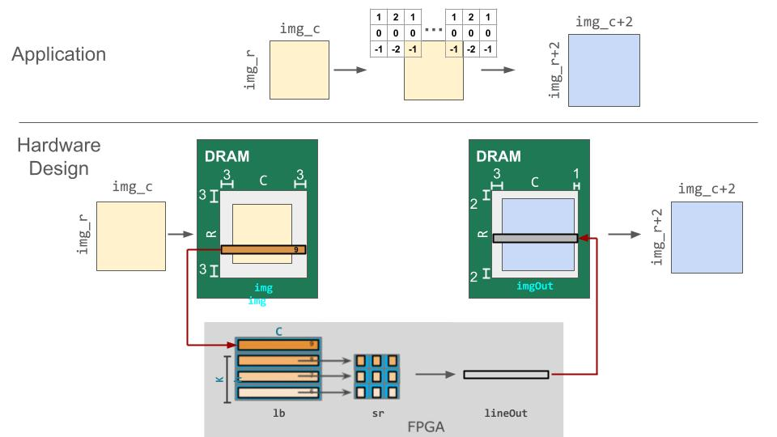
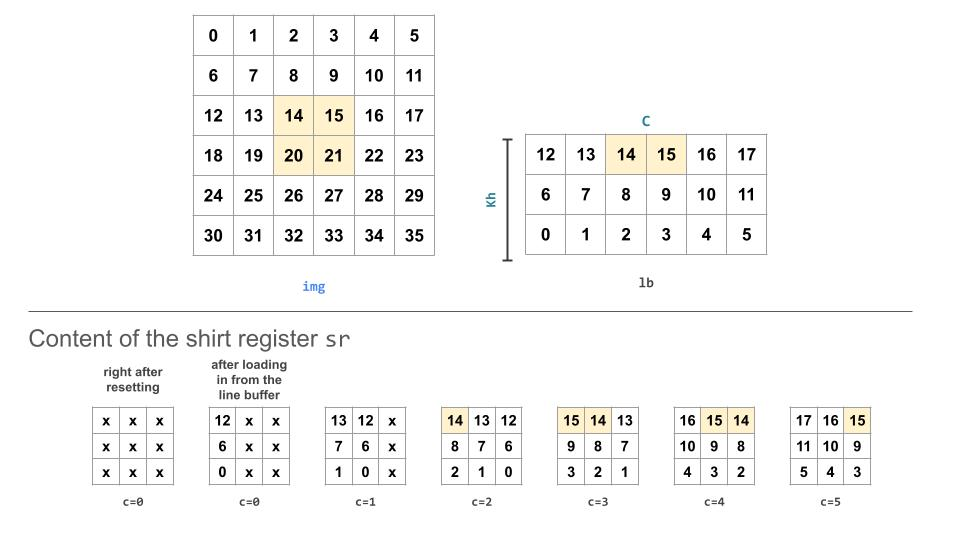

# Laboratory Exercise 3: Algorithm Specific Hardware Design & Spatial-Vitis Hello World
Lab 1 covers the basics of data types and controls. Lab 2 gives an example of implementing and optimizing a math kernel. In this lab, we will design a domain-specific hardware accelerator that combines the components introduced in the previous labs.


## Remote Development with Lagos
This lab uses VCS for simulation which requires a license. Therefore, you will remotely log into the Lagos server. <span style="color:red">**However, this is a research server used by the Pervasive Parallelism Lab. So, please use the server for only EE109 related work. As other graduate students in the lab are also using this server, make sure to avoid doing any destructive behaviors.**</span>

Here is how to log into Lagos:
### Option1: SSH through terminal
Open your terminal and ssh into lagos using your SUID. It will ask you for your password which will be the password you use to log into websites like Canvas or Axess. Once you enter your password, you're all set!

```bash
ssh $SUID@lagos.stanford.edu
```

### Option2: VSCode
Option1 can be convenient, but sometimes we may want to use IDE while developing remotely. To do so, we recommend using Visual Studio Code.
Follow instuctions in [this link](https://code.visualstudio.com/docs/remote/ssh) to use VSCode while developing on Lagos.


## Application: Convolution
In this example, we will design an accelerator for 2D convolution on an image. We will execute a [Sobel filter](https://en.wikipedia.org/wiki/Sobel_operator) which is used in image processing and computer vision, particularly within edge detection algorithms where it creates an image emphasising edges. 

<div style="padding-left: 0px; padding-top: 0px; text-align: center;">
    
</div>

This is executed as:
1. Given an image of N by M, it will add padding to the image accordingly. The padding size in our case is 2 for all directions.
2. Convolve each pixel with a 3x3 horizontal kernel and a vertical kernel. The stride for all direction will be 1. 
<div style="padding-left: 0px; padding-top: 30px; text-align: center;">
    
</div>

3. Given that `horz` and `vert` is the result of the convolution operation of each kernel, store the sum of the absolute values to the output. The value should be sqrt(`horz`<sup>2</sup> + `vert`<sup>2</sup>), but this can be approximated with |`horz`| + |`vert`|. To learn more about sobel filters, you can take a look at [this page](https://homepages.inf.ed.ac.uk/rbf/HIPR2/sobel.htm).


## Line Buffers & LUTs
To support buffering 2-D data, we introduce a LineBuffer memory structure. A LineBuffer is a special case on an N-buffered 1D SRAM exposed to the user. It allows one or more rows of DRAM to be buffered into an on-chip memory while the previous rows can be accessed in a logically-rotating way. A LineBuffer is generally coupled with a shift register, and the animation below shows the specific usage of this pair in this tutorial.


Note that in the last frame, the “buffer” row of the line buffer contains row 7 of the image. This is because this line buffer is physically implemented with four SRAMs and uses access redirection to create the logical behavior shown in the animation. This is the steps when the last row is loaded.
1. Buffers inside the line buffer rotate (``9 8 7 6 -> 6 9 8 7``)
2. The last row (row 10) is laoded (``6 9 8 7 -> 10 9 8 7``)
3. Buffers inside the line buffer rotate (``10 9 8 7 -> 7 10 9 8``)
4. No new line will fill the buffer SRAM, leaving behind the data from row 7 even though it will not get used in this particular case.
The Spatial compiler will also determine how to bank and duplicate the SRAMs that compose the line buffer automatically, should you choose to have a strided convolution.

<!-- It is also possible now to see why we must set a hard cap on the number of columns in the image if we are to use the line buffer - shift register combination. The logic that handles the rotation of the line buffer rows is tied to the controller hierarchy that manages the writes and reads about the line buffer. If we were to try to tile this operation along the columns, then our line buffer would load one tile of the row into the buffer, while row 0 of the line buffer would contain the previous part of that row. This splitting of a single line is semantically incorrect for convolution. -->

For this 2D convolution, we will use the lookup table (LUT). This is a read-only memory whose values are known at compile time. It is implemented using registers and muxes to index into it. In this example, we will be using the LUTs to store the two kernels.


## Overall Hardware Design
When implementing this algorithm in hardware, the overall pipeline will look like:
<div style="padding-left: 0px; padding-top: 30px; text-align: center;">
    
</div>

The size of the filter will be 3x3 and we will assume the padded image's size for each dimension will be a multiple of 16.
```scala
// Set the size of the image
// As the size of the kernel is 3x3, we will pad each dimension by 2.
// You can assume (img_r + 2 * 2) and (img_c + 2 * 2) are multiples of 16. We will only test cases such as 12, 28, 44 ...
val img_r = 12
val img_c = 12

// Filters size
val Kh = 3
val Kw = 3

type T = Int
```

As the first step, we will create the DRAM memory that will hold the input and output based on the size of the input image and padding.
```scala
val pad_r = Kh-1
val pad_c = Kw-1

// Prepare a properly padded input image
val R = img_r + pad_r * 2
val C = img_c + pad_c * 2
val image = (0::R, 0::C){(i,j) => if (j >= pad_c && j < C-pad_c && i >= pad_r && i < R - pad_r) (i-pad_r+1)*16 else 0}

val img = DRAM[T](R, C)
val imgOut = DRAM[T](R, C)

setMem(img, image)
```

Then, in the FPGA accelerator, we will create line buffer, shift register, SRAM to store the results, and the LUT to store the filters.
```scala
// Create line buffer, shift register, and SRAM to store the results
val lb = LineBuffer[T](Kh, C)
val sr = RegFile[T](Kh, Kw)
val lineOut = SRAM[T](C)

// Filters (Rotated 180 degrees due to how data is loaded into the linebuffer)
val kh = LUT[T](3,3)(
    -1.to[T], 0.to[T], 1.to[T],
    -2.to[T], 0.to[T], 2.to[T],
    -1.to[T], 0.to[T], 1.to[T])

val kv = LUT[T](3,3)(
    -1.to[T], -2.to[T], -1.to[T],
    0.to[T],  0.to[T],  0.to[T],
    1.to[T],  2.to[T],  1.to[T])
```

Then, we start the computation by:
1. Load in a each row from the off-chip DRAM to the on-chip line buffer
2. Shift in data from the line buffer to the shift register (The behavior of this will be dealt in more detail in the following section.)
3. Do the convolution
4. Store the data to the SRAM that stores the output row (`lineOut`)
5. Once the computation for the whole row is done by repeating step 2-4, move the output row from the on-chip SRAM to the off-chip DRAM (`imgOut`).
```scala
Foreach(0 until R) { r =>
    lb load img(r, 0::C)

    Sequential.Foreach(0 until C) { c =>
        Pipe{sr.reset(c == 0)}
        // Shifting in data from the line buffer
        Foreach(0 until Kh par Kh){i => sr(i, *) <<= lb(i, c) }
        
        // Implement the computation part for a 2-D convolution.
        // Use horz and vert to store your convolution results.
        // Your code here:

        lineOut(c) = mux( (r < pad_r || c < pad_c), 0.to[T], abs(horz.value) + abs(vert.value)) 
    }
    imgOut(r, 0::C par 16) store lineOut
}
```


## Caveat
### Shift register
If you see the previous section's animation of the line buffer and shift register, you will notice that the input image is loaded into the shift registers in a 180 degree rotated format. Therefore, when we store the kernels that will be convolved with the contents in the shift register, we store them also in a 180 degree rotated version so that you don't have to do index transformation when accessing either the kernel or the shift registers.
This is why the contents in the `kh` and `kv` LUTs are stored in a 180 degree rotated layout.

<div style="padding-left: 0px; padding-top: 10px; text-align: center;">
    
</div>

### Muxing the edge values when using line buffers & shift registers
The picture above shows the behavior of a line buffer in a smaller example. Given that the shift register's size is 3x3, you can notice that during the first 2 iterations after resetting the shift register, the shift register contains values that are uninitialized. This is why when we store values to the `lineOut` SRAM, we mux the results using these uninitialized values to 0. This also explains why we add padding to the top and left of the gold matrix in the skeleton code.


## Your Turn:
Given the two kernels and the input data, perform a 2-D convolutions on the image. You can add your implementation under the commented section (`Your code here:`) in `Lab3Part1Convolution` in the `src/test/scala/Lab3.scala` file. 

### Simulation
This time, we will use VCS simulation instead of Scalasim. For more details about the difference between Scalasim and VCS, please read [this page](https://kelayamatoz.github.io/Digital-Systems-Design-Lab/spatial-design-flow.html).

This requires you to run the code in the lagos server. You can log in with your SUID and password.
Once you logged into the lagos server and added your implementation, you can run the simulation by moving to your lab3 project folder and running the `run_vcs.sh` file.
```bash
cd $PATH_TO_LAB3_REPO
# chmod +x ./run_vcs.sh
./run_vcs.sh
```

The log for the simulation can be found in `logs/VCS/Lab3Part1Convolution/run.log`. This will also contain the print statement results in the host region which prints the input, gold, and your output. It also contains the control tree that looks like this:
```
x395 - 73233 (73233 / 1) [1 iters/parent execution]
    x784 - 73229 (73229 / 1) [1 iters/parent execution]
      x582 - 303 (9711 / 32) [32 iters/parent execution]
        x572 - 5 (160 / 32) [1 iters/parent execution] # stalled: 0, #idle: 0
        x581 - 299 (9583 / 32) [1 iters/parent execution] # stalled: 0, #idle: 8527
      x910 - 2274 (72768 / 32) [32 iters/parent execution]
        x909 - 13 (13312 / 1024) [32 iters/parent execution]
          x589 - 3 (3072 / 1024) [1 iters/parent execution]
          x599 - 8 (8192 / 1024) [1 iters/parent execution]
        x625 - 23 (23552 / 1024) [32 iters/parent execution]
        x651 - 23 (23552 / 1024) [32 iters/parent execution]
        x681 - 6 (6144 / 1024) [32 iters/parent execution]
      x783 - 171 (5488 / 32) [32 iters/parent execution]
        x694 - 5 (160 / 32) [1 iters/parent execution] # stalled: 0, #idle: 0
        x778 - 7 (224 / 32) [1 iters/parent execution] # stalled: 0, #idle: 0
        x782 - 167 (5360 / 32) [1 iters/parent execution] # stalled: 0, #idle: 5296
```

To see the html version of this control tree, see `gen/VCS/Lab3Part1Convolution/info/controller_tree.html`.

### Submission
* Leave your implementation in `Lab3Part1Convolution`.
* Fill in your control tree result found in `logs/VCS/Lab3Part1Convolution/run.log` into `lab3_submit.md`.
* Submit a pdf with your GitHub Classroom repository & commit ID you would like to be graded on.

### Debugging
When you use VCS to simulate code, you have to store the values you want to inspect in your accelerator code (the `Accel` block) to DRAM and bring it back to the host (you can't inspect it by adding print statements inside the `Accel` block). To help you debug, we provide code that dumps the value in the shift register on every iteration. The debugging code is currently commented out, but you can uncomment the lines saying `// FOR DEBUGGING`. However, when you submit your code, comment these lines out.

You can find the log for this dump in `logs/VCS/Lab3Part1Convolution/run.log`. This will also contain the print statement results in the host region which prints the input, gold, and your output.

<!--
Resource Utilization
/home/ginasohn/EE109-2024-spr/lab3-submission/gen/ZCU/Lab3Part1Convolution/verilog-zcu/par_utilization.rpt

1. CLB Logic
------------

+--------------------------------------+-------+-------+-----------+-------+
|               Site Type              |  Used | Fixed | Available | Util% |
+--------------------------------------+-------+-------+-----------+-------+
| CLB LUTs                             | 15973 |     0 |    274080 |  5.83 |
|   LUT as Logic                       | 12137 |     0 |    274080 |  4.43 |
|   LUT as Memory                      |  2253 |     0 |    144000 |  1.56 |
|     LUT as Distributed RAM           |  1584 |     0 |           |       |
|     LUT as Shift Register            |   669 |     0 |           |       |
|   LUT used exclusively as pack-thrus |  1583 |     0 |    274080 |  0.58 |
| CLB Registers                        | 14846 |     0 |    548160 |  2.71 |
|   Register as Flip Flop              | 14726 |     0 |    548160 |  2.69 |
|   Register as Latch                  |     0 |     0 |    548160 |  0.00 |
|   Register as pack-thrus             |   120 |     0 |    548160 |  0.02 |
| CARRY8                               |   536 |     0 |     34260 |  1.56 |
| F7 Muxes                             |   197 |     0 |    137040 |  0.14 |
| F8 Muxes                             |    10 |     0 |     68520 |  0.01 |
| F9 Muxes                             |     0 |     0 |     34260 |  0.00 |
+--------------------------------------+-------+-------+-----------+-------+
-->