# Vitis-Spatial Hello World Lab

The second part of lab3 will be translating Spatial code to Vitis C++ code. Vitis is a complete development environment for applications accelerated using Xilinx FPGAs. It leverages the OpenCL heterogeneous computing framework to offload compute intensive workloads to the FPGA.
The accelerated application is written in C/C++, OpenCL or RTL with OpenCL APIs. We will try to convert a simple Spatial code to C++ code in Vitis. The converted design can be mapped to a cloud FPGA in the future.

# Prerequisite
1. You should have received an email with a subject "[EE109] AWS Instance Instructions". Download the private key attached to the email and save it under your `.ssh` folder. Your path to the `.ssh` folder is ususally:
    * Linux / Mac : `~/.ssh`
    * Windows: `\Users\$USERNAME\.ssh` or `\user\$USERNAME\.ssh` (replace the $USERNAME with your laptop's username)
2. Sign into the AWS account using the link and information in the email. It will require you to change your password if it's your first time logging in.
3. Once you're logged in, search for the 'ec2' service. If you click on EC2, this will bring you to the screen below. Press 'Instances'.
<div style="padding-left: 0px; padding-bottom: 30px; text-align: center;">
    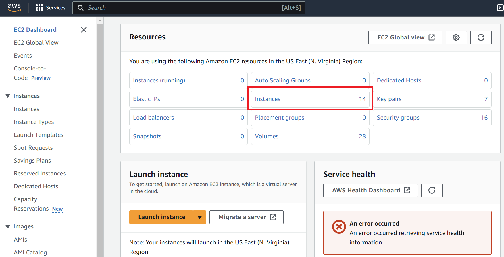
</div>


4. Select your instance and go to **Instance State > Start instance**. The designated instance is stated in the email with the AWS login instructions.
<div style="padding-left: 0px; padding-bottom: 30px; text-align: center;">
    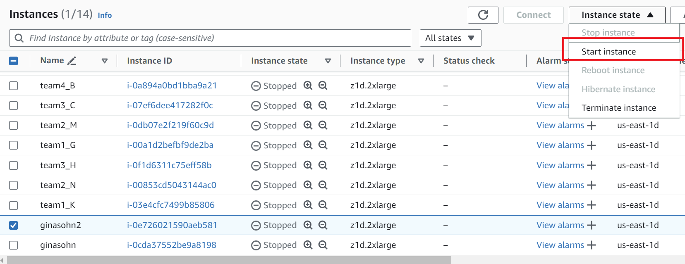
</div>


5. Click the 'Instance ID' and press 'connect'. 
    <div style="padding-left: 0px; padding-top: 0px; text-align: center;">
        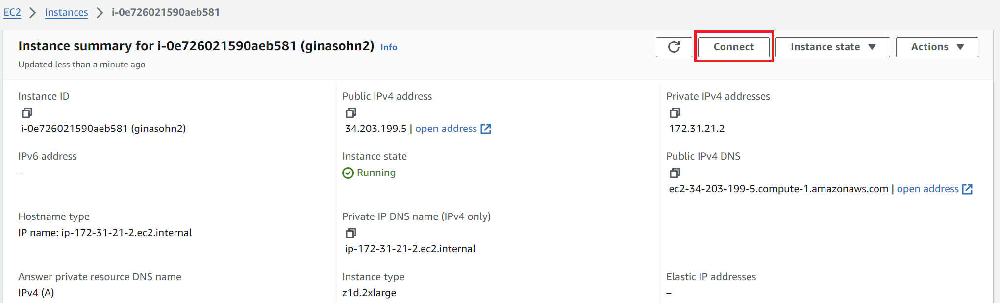
    </div>

    Move to the 'SSH Client' tab and copy the address shown in the boxed field in this picture. This address changes whenever you start the instance. 
    <div style="padding-left: 0px; padding-top: 10px; padding-bottom: 30px; text-align: center;">
        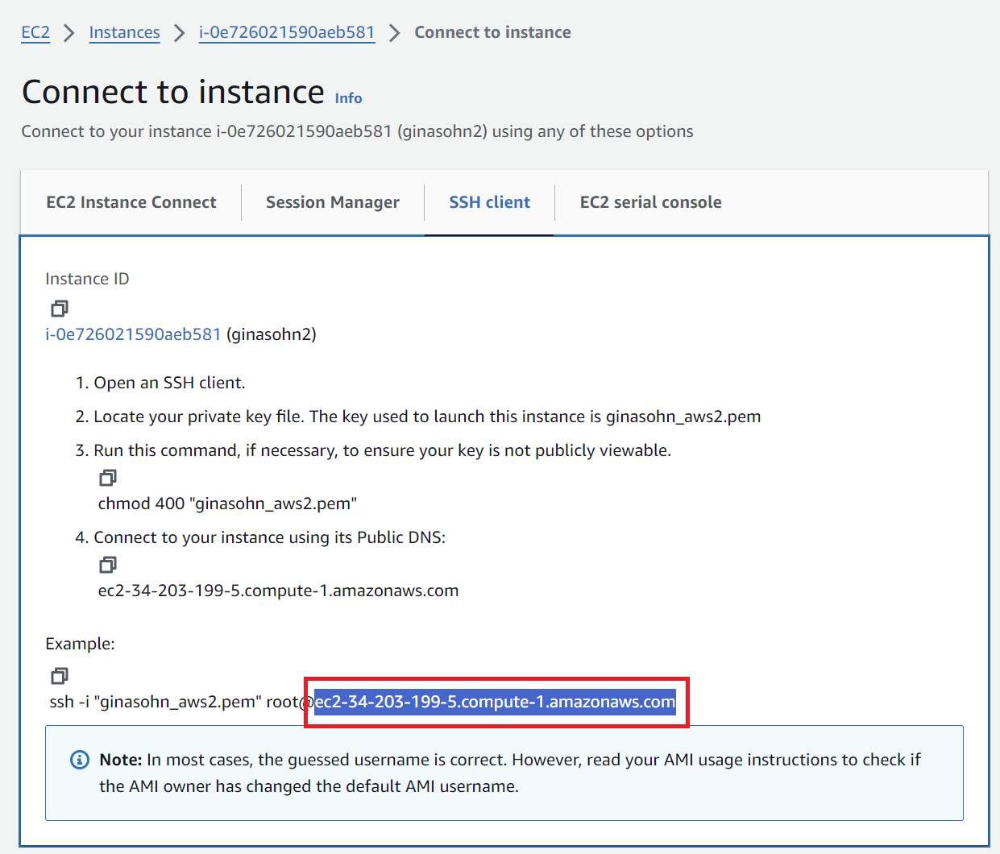
    </div>

6. SSH into your instance
    * Option 1: VSCode (We recommend this option when you edit code & run sw/hw emulations)
    
        1. Install the 'remote-ssh' extension
            <div style="padding-left: 0px; padding-bottom: 30px; text-align: center;">
                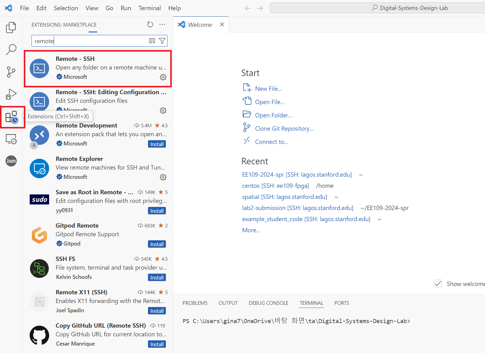
            </div>

        2. Press the small button on the lower right and select **Connect to host > Configure SSH Hosts** and choose the first file (this will look something like `\user\$USERNAME\.ssh\config`).
            <div style="padding-left: 0px; padding-bottom: 30px; text-align: center;">
                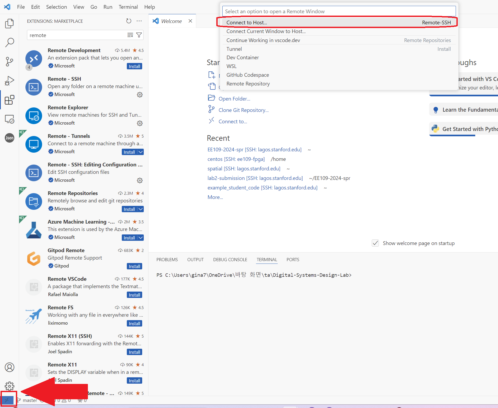
            </div>
        3. Add the following entry to the file and save it. The value for `HostName` is the address you copied in step 5. **This address changes whenever you start the instance. So you will have to update this field whenever you stop and re-start the instance.** The 'IdentityFile' field is the location where you saved the private key file in step 1. **In the screenshot shown in step 5, it uses 'root' as the user name, but use 'centos' instead.**
            ```bash
            Host ee109-vitis
                HostName ec2-34-203-199-5.compute-1.amazonaws.com
                User centos
                IdentityFile "C:\Users\gina7\.ssh\ginasohn_aws2.pem"
            ```
        4. Go back and press the small button on the lower right you clicked in step 6-2 and select **Connect to host**. The host you've just added will now appear. Selecting the newly added AWS host will connect you to your instance. Once you're connected, you can open folders in your instance using the 'File > Open Folder' feature and run code using the 'Terminal > New Terminal' feature.

    * Option 2: Terminal (We recommend this option when you want to open a gui to view the emulation reports) 
        The value after the `-i` option is the location of the private key.

        ```bash
        ssh -i \Users\gina7\.ssh\ginasohn_aws2.pem centos@ec2-34-203-199-5.compute-1.amazonaws.com
        ``` 
    

7. Install packages
    ```bash
    sudo yum install libXtst
    sudo yum install xorg-x11-apps
    sudo yum install xorg-x11-xauth
    sudo yum install xorg-x11-fonts-*
    sudo yum install xorg-x11-utils
    ```

8. Clone the github repository and source the vitis_setup.sh script:
    ```bash
    git clone https://github.com/aws/aws-fpga.git $AWS_FPGA_REPO_DIR
    cd $AWS_FPGA_REPO_DIR
    source vitis_setup.sh    
    ```
    
9. Accept the assignment in Github Classroom and clone your Lab3 directory.

10. Copy the `hello_world_demo` folder to the Vitis xilinx folder.
    ```
    cp -rf $LAB3_DIR/hello_world_demo $VITIS_DIR/examples/xilinx
    ```

11. Move to the Vitis directory 
    ```bash
    cd $VITIS_DIR/examples/xilinx/hello_world_demo
    ```

12. Edit your code and run emulations. For more information see: [SW emulation](https://github.com/aws/aws-fpga/tree/master/Vitis#software-sw-emulation), [HW emulation](https://github.com/aws/aws-fpga/tree/master/Vitis#hardware-hw-emulation)
    ```bash
    # Software Emulation
    make clean
    make run TARGET=sw_emu DEVICE=$AWS_PLATFORM all

    # Hardware Emulation
    make clean
    make run TARGET=hw_emu DEVICE=$AWS_PLATFORM all
    ```

## Setting up X11 Forwarding

To view the emulation results, using the vitis analyzer's gui will be useful. However, to use a gui when working with a remote server, you will have to set up X11 forwarding. X11 forwarding is a mechanism that allows a user to start up remote applications, and then forward the application display to their local machine.

**For Mac users**, follow the ['X11 forwarding for Mac' section in this link](https://www.businessnewsdaily.com/11035-how-to-use-x11-forwarding.html#what-is-x11-forwarding). 

**For Window users**, follow these steps:
 * Install [PuTTy](https://www.chiark.greenend.org.uk/~sgtatham/putty/latest.html) on your local Windows machine: Download the installer & run it
 * Install [Xming](https://sourceforge.net/projects/xming/) on your local Windows machine: Download the installer & run it
 * Convert your private key from a pem format to a ppk format using PuTTygen. Follow the instructions in [this link](https://www.puttygen.com/convert-pem-to-ppk).
 * Open PuTTy and follow these steps to ssh into your instance.
    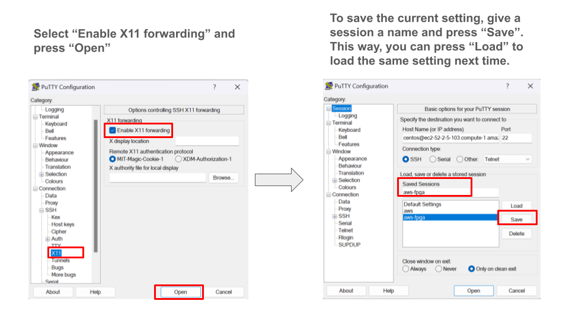

    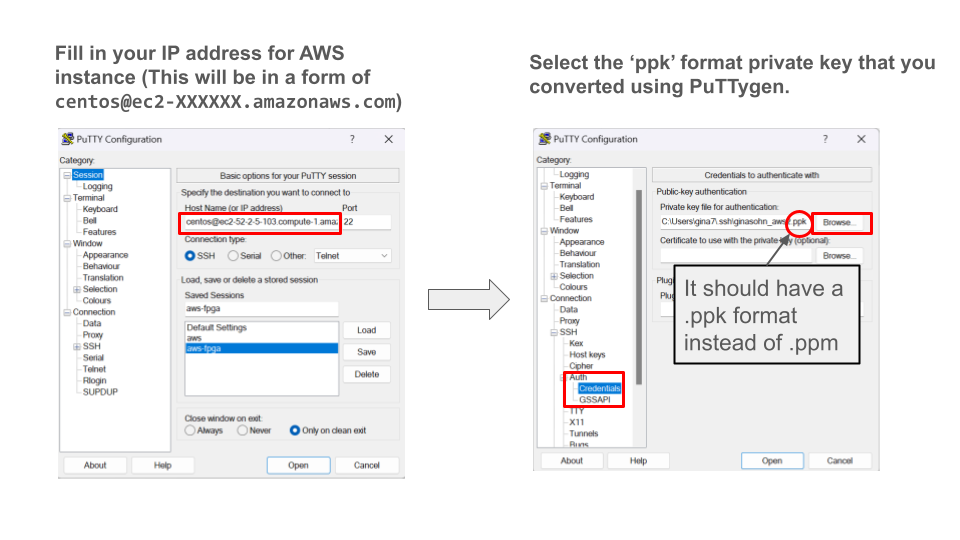
    
 * Activate xming.
 * Run this command in your instance. If you see a clock showing up, you're all set.
    ```bash
    xclock
    ```


<br/>

## Creating Alarm for you instance
AWS instances: We will soon set up a AWS credit limitation for each student. We are planning to allocate $200 − $250 for each student to cover both lab3 and the final project. We will announce more detailed information about this soon. However, in the meanwhile, **please make sure you stop your instances after using it so that you don't mistakenly use up all your credits!!**

To prevent such issues, we **highly recommend** setting up an alarm to stop the instance after a certain duration of low usage.

To set up the alarm, select the **+** button for your instance.
<div style="padding-left: 0px; padding-top: 0px; text-align: center;">
        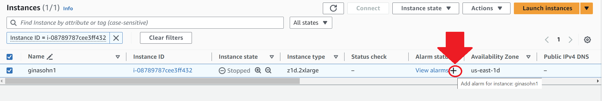
</div>

Then follow the instructions in this screenshot. This will be an example configuration for setting an alarm to stop the instance after the maximum CPU utilization was lower than 10% for more than an hour.
<div style="padding-left: 0px; padding-top: 0px; text-align: center;">
        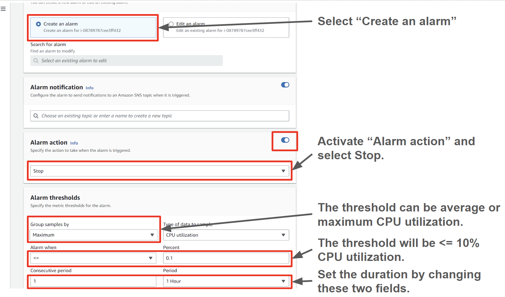
</div>


<br/>

<br/>

# Part1: A simple Spatial App
A simple Spatial app that adds two `DATA_SIZE`-long 32bit integer vectors is provided under `src/test/scala/hello-world.scala`.

Let's assume the datawidth between the on-chip and off-chip transfer is 512 bits. `SpatialVaddSeq` will load `NUM_WORDS` number of elements from DRAM to SRAM in parallel (this is similar as loading in a `NUM_WORDS`-long vector). It will then do an element-wise add for the `NUM_WORDS` elements in parallel and store it back to DRAM. This process will be sequentially repeated until all the `DATA_SIZE` elements are computed (iterations of the outer loop will not be pipelined due to the `Sequential` directive in front of the `Foreach` controller).


<br/>

<br/>

# Part2: Understanding Vitis C++ code
Now we will look at the Vitis C++ code for the same application. The code can be found under `hello_world_demo/src` in Lab3's directory. `host.cpp` describes the behavior of the host and the accelerator design is specified in `vadd.cpp` which is the equivalent to the `Accel` block in Spatial.

When accelerating applications with FPGAs, there are three major components. Host, Global Memory (DRAM), and the on-chip memory and logic on the FPGA accelerator.

<div style="padding-left: 0px; padding-top: 0px; text-align: center;">
    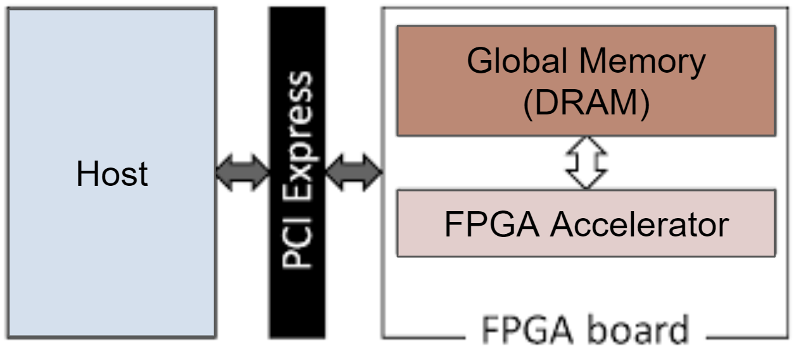
</div>

<br/> 

## Section A: create test data in the host memory (`host.cpp`)
The first step is to create test data in the host memory. If you are not familiar with `std::vector`, please read [this](https://www.geeksforgeeks.org/vector-in-cpp-stl/).
```c++
// host.cpp
std::vector<int, aligned_allocator<int> > source_in1(DATA_SIZE);
std::vector<int, aligned_allocator<int> > source_in2(DATA_SIZE);
std::vector<int, aligned_allocator<int> > source_hw_results(DATA_SIZE);
std::vector<int, aligned_allocator<int> > source_sw_results(DATA_SIZE);

// Create the test data
std::generate(source_in1.begin(), source_in1.end(), std::rand);
std::generate(source_in2.begin(), source_in2.end(), std::rand);
for (int i = 0; i < DATA_SIZE; i++) {
    source_sw_results[i] = source_in1[i] + source_in2[i];
    source_hw_results[i] = 0;
}
```

<br/>

## Getting the device and kernel ready (`host.cpp`)
The code in this region upto **section D** will program the device and run the FPGA accelerator. To do this, it will use several OpenCL C++ Bindings such as `cl::Program, cl::Context, cl::CommandQueue, cl::Kernel`.

The first step is to get the list of devices connected to the Xilinx platform.
```c++
auto devices = xcl::get_xil_devices();
```

Then it will get the binary file of the kernel to run. To learn more about `cl::Program::Binaries`, read:
* [`cl::Program`](https://github.khronos.org/OpenCL-CLHPP/classcl_1_1_program.html)
* [OpenCL C++ doc page 28](https://registry.khronos.org/OpenCL/specs/opencl-cplusplus-1.2.pdf)
```c++
auto fileBuf = xcl::read_binary_file(binaryFile);
cl::Program::Binaries bins{{fileBuf.data(), fileBuf.size()}};
```

In the following for loop, the Context and Command Queue are created for the device.
* Reference:
    * [`cl::Context`](https://github.khronos.org/OpenCL-CLHPP/classcl_1_1_context.html)
    * [OpenCL C++ doc page 6](https://registry.khronos.org/OpenCL/specs/opencl-cplusplus-1.2.pdf)
    * [`cl::CommandQueue`](https://github.khronos.org/OpenCL-CLHPP/classcl_1_1_command_queue.html)
    * [OpenCL C++ doc page 47](https://registry.khronos.org/OpenCL/specs/opencl-cplusplus-1.2.pdf)
```c++
OCL_CHECK(err, context = cl::Context(device, nullptr, nullptr, nullptr, &err));
OCL_CHECK(err, q = cl::CommandQueue(context, device, CL_QUEUE_PROFILING_ENABLE, &err));        
```

Then, it tries to program the selected device using the binary of the kernel. 
* Reference:
    * [`cl::Program`](https://github.khronos.org/OpenCL-CLHPP/classcl_1_1_program.html)
    * [OpenCL C++ doc page 28](https://registry.khronos.org/OpenCL/specs/opencl-cplusplus-1.2.pdf)
    * [`cl::Kernel`](https://github.khronos.org/OpenCL-CLHPP/classcl_1_1_kernel.html)
    * [OpenCL C++ doc page 36](https://registry.khronos.org/OpenCL/specs/opencl-cplusplus-1.2.pdf)
```c++
cl::Program program(context, {device}, bins, nullptr, &err);
if (err != CL_SUCCESS)
{
    std::cout << "Failed to program device[" << i << "] with xclbin file!\n";
}
else
{
    std::cout << "Device[" << i << "]: program successful!\n";
    OCL_CHECK(err, krnl_vector_add = cl::Kernel(program, "vadd", &err));
    valid_device = true;
    break; // we break because we found a valid device
}
```

<br/>

## Section B: allocate DRAM in Global Memory (`host.cpp`)
Then, we allocate DRAM that will hold the input vectors and the output vector in Global Memory. The DRAMs are initialized with the vectors created in section A. To express DRAMs in Global Memory, we will use [OpenCL Buffers](https://downloads.ti.com/mctools/esd/docs/opencl/memory/buffers.html). `buffer_in1` and `buffer_in2` will be the DRAMs that store the input vectors and the output will be stored in `buffer_output` DRAM.

```c++
// Allocate Buffer in Global Memory
// Buffers are allocated using CL_MEM_USE_HOST_PTR for efficient memory and
// Device-to-host communication
OCL_CHECK(err, cl::Buffer buffer_in1(context, CL_MEM_USE_HOST_PTR | CL_MEM_READ_ONLY, vector_size_bytes,
                                        source_in1.data(), &err));
OCL_CHECK(err, cl::Buffer buffer_in2(context, CL_MEM_USE_HOST_PTR | CL_MEM_READ_ONLY, vector_size_bytes,
                                        source_in2.data(), &err));
OCL_CHECK(err, cl::Buffer buffer_output(context, CL_MEM_USE_HOST_PTR | CL_MEM_WRITE_ONLY, vector_size_bytes,
                                        source_hw_results.data(), &err));
```

We have created the kernel that will run on the FPGA accelerator (`krnl_vector_add`) in [this section](./lab3_vitis_spatial.md#getting-the-device-and-kernel-ready-hostcpp). We will set the arguments for this kernel now.
```c++
int size = DATA_SIZE;
OCL_CHECK(err, err = krnl_vector_add.setArg(0, buffer_in1));
OCL_CHECK(err, err = krnl_vector_add.setArg(1, buffer_in2));
OCL_CHECK(err, err = krnl_vector_add.setArg(2, buffer_output));
OCL_CHECK(err, err = krnl_vector_add.setArg(3, size));

// Copy input data to device global memory
OCL_CHECK(err, err = q.enqueueMigrateMemObjects({buffer_in1, buffer_in2}, 0 /* 0 means from host*/));
```

<br/>

## Section C: Invoke the kernel (`host.cpp`)
Finally, we will invoke the HLS kernel so the program can run on the FPGA accelerator.
```c++
// Launch the Kernel
// For HLS kernels global and local size is always (1,1,1). So, it is
// recommended
// to always use enqueueTask() for invoking HLS kernel
OCL_CHECK(err, err = q.enqueueTask(krnl_vector_add));
```

<br/>

## Section D: Bring back results from DRAM (`host.cpp`)
Then, the we will bring back the results from the output DRAM in globa memory (`buffer_output`) to the host memory.
```c++
OCL_CHECK(err, err = q.enqueueMigrateMemObjects({buffer_output}, CL_MIGRATE_MEM_OBJECT_HOST));
q.finish();
```

<br/>

## Section E: Compare with gold (`host.cpp`)
Since we are done working with the FPGA accelerator, there will be no OpenCL C++ bindings from this section and will only be C++. The results will be stored in the `source_hw_results` and we compare this with the gold `source_sw_results` we have computed in section A.

<br/>

<br/>

# Your Turn:
## Compare Spatial & Vitis C++
In the `hello_world_demo/src/host.cpp`, we have added section notations (A~E). Find the corresponding lines in `src/test/scala/hello-world.scala` (Line 13 ~ Line 53) and write down your answers in `lab3_submit.md`.

<br/>

## Complete the Vitis C++ code and report the numbers you see in the hardware emulation
In `hello_world_demo/src/vadd.cpp`, there is a section with the commend `EE109: Fill in the TODO parts in this for loop` in the `comput_add` function. Please complete this part and uncomment the for loop once you're done with your implementation. You can run the software and hardware emulation to verify the correctness of your design. Software emulations are faster, so we recommend using this in the initial stages of your implementation.
Once you're happy with your implementation, run hardware emulation and report the kernel execution time and compute unit utilization. Write down your answers in `lab3_submit.md`. **Don't forget to update the cpp files in youre lab3 directory! We will grade using your lab3 directory, so make sure you copy your `host.cpp` and `vadd.cpp` files from the AWS FPGA repo to your lab3 repository and push them.**


The kernel execution time and compute unit utilization can be found in the 'profile summary' tab in the `xrt.run_summary' file.
You can open this with a gui by running:
```bash
cd $VITIS_DIR/examples/xilinx/hello_world_demo
vitis_analyzer xrt.run_summary
```

<div style="padding-left: 0px; padding-top: 0px; text-align: center;">
    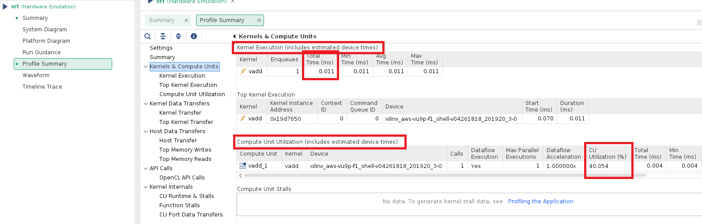
</div>

<br/>


## How can you improve performance?
You do not have to actually implement this. However, suggest two ways of how you can improve performance. If you think restructuring the code helps, write the pseudo code showing how you would restructure it. If you think using specific HLS constructs help, specifically state which construct and where you would apply it. Afterwards, briefly explain in around 2 sentences why you think this method can improve performance. Write down your answers in `lab3_submit.md`.

<br/>

## Extra Credit  (10 points out of 100)
Implement at least one of the method you suggested and show how it improved the **latency** and **compute unit utilization** by comparing the numbers from the **hardware emulation**. Write down your answers in `lab3_submit.md`. Leave your design in the `hello_world_extra/src` directory.

* **For groups with three members: It is mandatory to implement as least one method to improve performance.** The group will receive extra credits only when they implement both methods.
* **For groups with one or two members**: The group will receive extra credits if aleast one optimization is implemented.


<br/>

# Submission:
* Gradescope: a doc with your commit ID & repo
* Convolution: Leave your implementation under **your Github Classroom repository's** `src/test/scala/Lab3.scala` file.
* Vitis-Spatial Hello World: Leave your implementation under **your Github Classroom repository's** `hello_world_demo/src/vadd.cpp`
    * For extra credit, implement your design under the cpp files in **your Github Classroom repository's** `hello_world_extra/src/`.
* Fill in **your Github Classroom repository's** `lab3_submit.md`


<br/>

<br/>

# Additional Materials for Vitis C++
This is a very simplified example to introduce how to develop hardware with Vitis and show how we can translate Spatial code to Vitis C++ code. There are many other ways to make this code better.
* **dataflow pragma**: The dataflow pragma instructs the compiler to enable task-level pipelining. This is required for load/compute/store functions to execute in a parallel and pipelined manner. The new implementation of the same application using dataflow pramas can be found [here](https://github.com/Xilinx/Vitis_Accel_Examples/tree/f61637e9263ecc1be3df34182ea6c53a0ca10447/hello_world).
* [Various example kernels](https://github.com/Xilinx/Vitis_Accel_Examples/tree/f61637e9263ecc1be3df34182ea6c53a0ca10447/cpp_kernels): The Vitis repository has a series of example kernel implementations, which can be a useful reference.
* [Vitis Unified Software Platform Documentation](https://docs.amd.com/r/en-US/ug1393-vitis-application-acceleration/Getting-Started-with-Vitis): This official documentation hold many useful information. Especially, the 'Profiling and Debugging the Application' chapter can help you better understand the reports from the sw/hw emulation.
* [Vitis HLS Command Reference](https://docs.amd.com/r/en-US/ug1399-vitis-hls/Vitis-HLS-Command-Reference): This will be useful to look up HLS pragmas and HLS data types (these will start with a `hls::` prefix in the code).