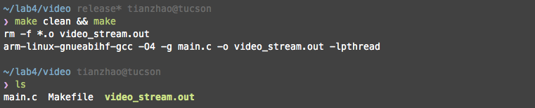

# Laboratory Exercise 4: Embedded Linux Programming
This lab focuses on practicing embedded linux programming techniques. It is separated into three sections. In the first section, you will need to implement on-board video streaming. In the second section, you will learn about establishing client-to-server communication via the UDP protocol. In the third section, you will be working on implementing a remote video system by combining your knowledge about UDP, the camera driver and the framebuffer driver.

The source code is under lab4 directory.

We prepare two FPGA boards for this lab. The boards IP addresses are: `172.24.89.138` and `172.24.89.140`.

The board with the IP address `172.24.89.140` is connected to a camera and a monitor, and you can use this board to test part 1 of this lab.

The board with the IP address `172.24.89.138` is only connected to a camera. You will use it as the remote board to test part 2 and 3.

To sign into either one of the board, run:
```bash
ssh root@IP_ADDRESS
```
For example, for part 1, you need to sign in by running:
```bash
ssh root@172.24.89.140
```

After you sign in, you will see a directory called `gold`. This directory contains the reference implementation. You will also see directories named after your Stanford username. We assign one directory for each student. You can test your executables in your directory.

## Realtime Video Streaming
The working directory of this section is in ```./video```.

In class, we covered the details of registering device drivers of the on-board camera and the DisplayPort frame buffer. More specifically, both the on-board camera and the frame buffer are revealed to the developer as files. To read / write to the files, one need to memory-map the files. The memory-map process would return the developer with a pointer that points to the device memory of the camera / the frame buffer.

For example, in order to register a frame buffer and write to it, one will need to call the following procedures:
```c
    char g_fb_device[100] = "/dev/fb0";
    struct fb_var_screeninfo vinfo;
    struct fb_fix_screeninfo finfo;
    long screensize, index;
    int fbfd = 0;
    char *fbp;
    long *bgr_buff;
    char *yuv_buff;

    /* Open framebuffer device */
    if ((fbfd = open(g_fb_device, O_RDWR, 0)) < 0)
    {
        printf("Unable to open %s\n", g_fb_device);
        return 0;
    }

    /* Get fixed screen information */
    if (ioctl(fbfd, FBIOGET_FSCREENINFO, &finfo)) {
        printf("Error reading fixed information.\n");
        exit(2);
    }

    /* Get variable screen information */
    if (ioctl(fbfd, FBIOGET_VSCREENINFO, &vinfo)) {
        printf("Error reading variable information.\n");
        exit(3);
    }

    /* Figure out the size of the screen in bytes */
    screensize = vinfo.xres * vinfo.yres * vinfo.bits_per_pixel / 8;

    /* Map the device to memory */
    fbp = (char *) mmap(0, screensize, PROT_READ | PROT_WRITE, MAP_SHARED,fbfd, 0);
    if ((int)fbp == -1) {
        printf("Error failed to map framebuffer device to memory.\n");
        exit(4);
    }
```

After memory-mapping the two devices, one would have obtained two pointers. One pointer points to the device memory of the camera, and the other points to the device memory of the frame buffer. In order to transmit a frame of data from the camera to the frame buffer, one would need to call a memcpy. However, since the camera and the framebuffer are using different color formats, we would need to implement a color-space translation function called ```yuyv_to_rgb32```. Your task in this section would be to implement the translation function. Let's take a look at the ```yuyv_to_rgb32``` function:

```c
static void yuyv_to_rgb32 (int width, int height, char *src, long *dst)
{
    unsigned char *s;
    unsigned long *d;
    int l, c, alpha = 0x0;
    int r, g, b, cr, cg, cb, y1, y2;

    l = height;
    s = src;
    d = dst;
    while (l--) {
        c = width >> 1;
        while (c--) {
            // Every pixel in src of type short is expanded to 2 ARGB pixel of type long. 
            // Step 1: Process the first YUV pixel. 
            // Please follow the instructions to calculate cb and cg. 
            y1 = *s++;
            cb = 
            cg = 


            // Step 2: Process the second YUV pixel.
            // Please follow the instructions to calculate cr and cg.
            y2 = *s++;
            cr = 
            cg = 


            // Step 3: Calculate the first ARGB pixel.
            // Please follow the instructions to calculate r, g, b, and the pixel value at the destination.
            r =
            b =
            g =
            SAT(r);
            SAT(g);
            SAT(b);
            *dst++ = 

            // Step 4: Calculate the second ARGB pixel.
            // Please follow the instructions to calculate r, g, b, and the pixel value at the destination. 
            r =
            b =
            g =
            SAT(r);
            SAT(g);
            SAT(b);
            *dst++ =
        }
    }
}
```
The ```src``` buffer contains one frame fetched from the camera device, and the ```dst``` buffer will be sent to the frame buffer after the colorspace conversion is completed. To smooth the edges between pixels, we need to process two consecutive pixels a time. Specifically, at each pixel, we bring in two YUV pixels and create two ARGB pixels side-by-side. Let's say we start at the ```n```th YUV pixel. The YUV values at pixel ```n```, ```n+1``` are ```m```, ```k```, respectively. The pseudo-code for creating the ARGB pixels looks as follows:

- Calculate Cb, Cg of the ```n```th pixel by using:
    - Cb = ((m - 128) * 454) >> 8
    - Cg = (m - 128) * 88

- Calculate Cr, Cg of the ```n+1```th pixel by using:
    - Cr = ((k - 128) * 359) >> 8
    - Cg = (Cg + (k - 128) * 183) >> 8

- Calculate the first ARGB pixel
    - r = m + Cr
    - b = m + Cb
    - g = m - Cg
    - Value of ARGB pixel = alpha \| r \| g \| b, where each channel is a byte.
    - Write the current ARGB pixel back to ```dst```

- Calculate the second ARGB pixel
    - r = k + Cr
    - b = k + Cb
    - g = k - Cg
    - Value of ARGB pixel = alpha \| r \| g \| b, where each channel is a byte.
    - Write the current ARGB pixel back to ```dst```


After completing the color-space conversion function, you can compile your implementation by running:
```bash
make clean && make
```
A compiled binary named ```video_stream.out``` would show up if you call ```ls```
```bash
ls
```


You will need to ```scp``` this binary to the FPGA board that's connected to a camera and a monitor. In this lab, the IP address of this FPGA board is `172.24.89.140`. After ```scp``` finishes, you can start the video streaming by running:
```
./video_stream.out
```

Due to a few board issues, sometimes the camera device driver may not respond to your command instantaneously. For example, the following errors may show up:
```bash
root@arria10:~# ./video_stream.out
Allocating buffer of size 1843200...
Allocating buffer of size 1843200...
Allocating buffer of size 1843200...
Allocating buffer of size 1843200...
Allocating buffer of size 1843200...
Allocating buffer of size 1843200...
Allocating buffer of size 1843200...
Allocating buffer of size 1843200...
VIDIOC_STREAMON error
start_capturing failed
```
This is usually due to the fact that the camera driver needs a reset. You can simply rerun the app to reset the camera driver. If your app is implemented correctly, you will see a live video displayed on the monitor. The monitor, the camera and the boards are located in the lab space of EE 109 at the Packard Building. If you do not have access to the lab space, please send an email with your student ID to the class TA.

## UDP Communication
The working directory of this section is in ```./udp```.

In class, we covered an example of building a UDP server and a UDP client. In this section, we will be implementing a server-client pair. We have already provided a detailed explanation of what needs to be done in Lecture 07. Besides the provided material, there are also some lab-specific details: 
- The IP addresses of the server and the client can be modified in ```port.h```. 
- For this session, we have the following IP addresses assigned for the server and the client: `172.24.89.140` and `172.24.89.138`.
- Your task is to send a string called ```Thirsty Thursday``` from the client to the server. 
    - The server needs to always listen to the port 21234, which is the port number that the client would send a message to.
After you finish your implementation, you can generate the binary files by calling:
```bash
make clean && make 
```

You can test your implementation by running ```udp-send``` on the client and ```udp-recv``` on the server.

## Video Streaming through Network
Please navigate to ```./netvideo``` to work on this section.

In this section, your task is to combine the knowledge of UDP protocol and camera / frame buffer device drivers, and design a way to pass video frames from one FPGA board (the *camera board*) to another (the *display board*). We will only provide a few high-level guidelines in this section, since you already have all the pieces needed to build the streaming system from the first two sections.

There are a few questions we need to answer before starting implementing the system:
- A UDP packet can only hold up to 65,507 bytes, which is much smaller than the size of a frame. How are we going to send a frame via UDP?
    - Hint: since the frame stream is continuous, we would not need all the frame information to reconstruct one.
- When filling the UDP packet with pixels, what pixel format should we choose?
- Do we need any metadata in the packet?

You will need to update the IP addresses of your client and your server in ```port.h```.

After you finish your implementation, you can generate the binary files by calling: 
```bash
make clean && make
```
You can test your implementation by running ```./camera``` on the *camera* board and ```./display``` on the *display* board.

## Extra Credits (5 points out of 100) 
* In [UDP Communication](#udp-communication), the current implementation can only display the first character of the received message. Can you modify the code such that you can display the whole message? 
* In [Video Streaming through Network](#video-streaming-through-network), the frame rate at the receiver side is limited due to the fact that we can only fit a fraction of the frame in a UDP packet. Is there a way to increase the frame rate? If so, how would you approach it? 
