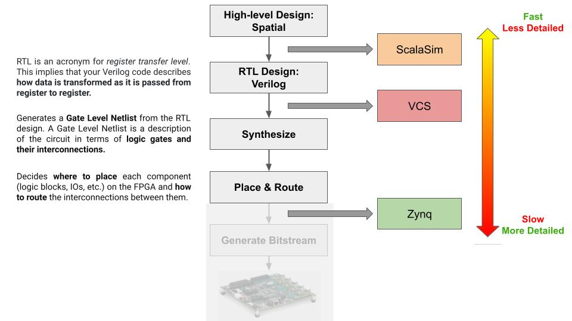
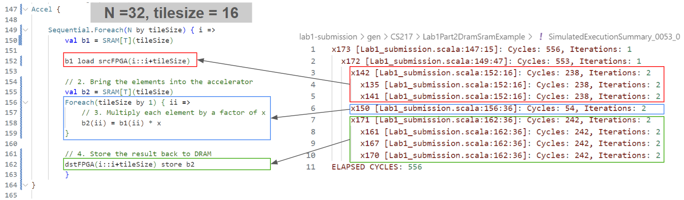
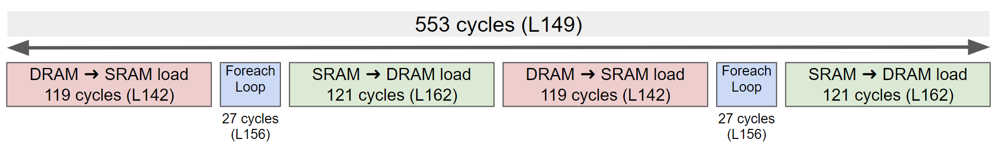
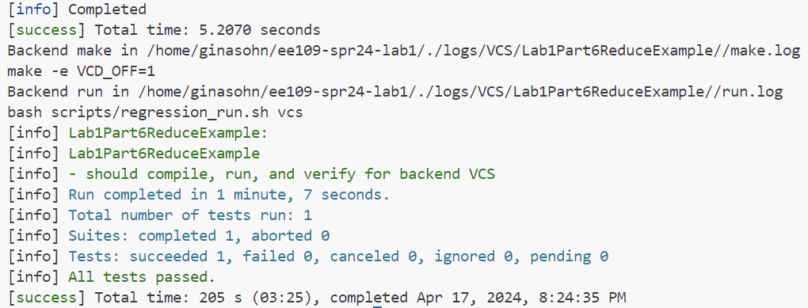
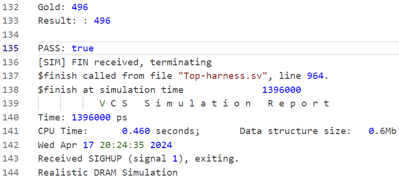
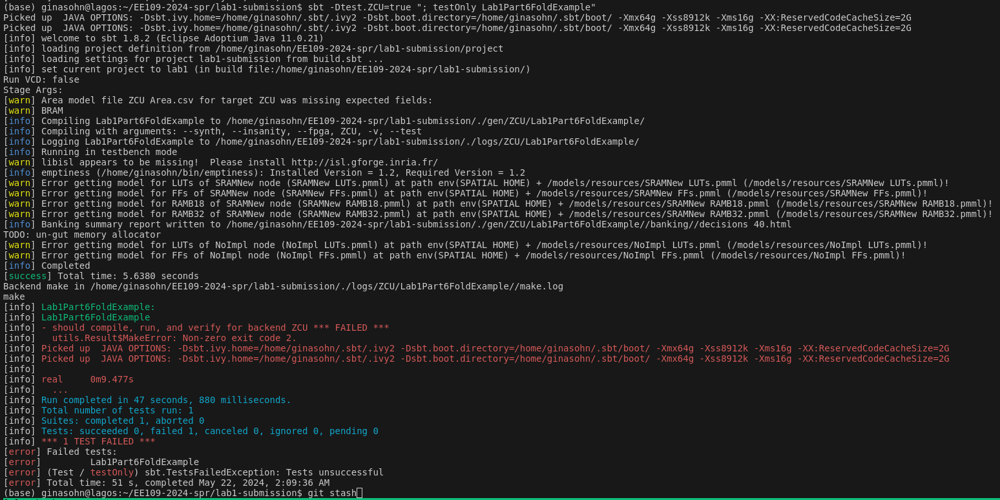

# Spatial Development Route

When using Spatial and its supported simulation backends to design your hardware, you will follow a design flow that is shown in this diagram. If you are not familiar with concepts such as RTL, Logic Synthesis, and Placement and Routing, please read throught the explanation of each step and terminonlogy in the diagram below.



For the scope of this course, you are required to synthesize and do the placement and routing of your design. More details on how to lower your design and conduct logic synthesis, placemane and routing will be introduced in the following sections together with instructions on how to run simulation in each step.
(We will not require you to actually run it on a actual FPGA.)

There are three simulations provided to help you check the correctness and improve performance of your design.

* Scalasim: This is the simulation we have used so far for the labs. It is much faster than the other two backends (VCS and ZCU) as it does not generate the Verilog desciption of your design and run synthesis. Therefore, the fast speed comes with the cost that it maybe less accurate and may not provide all the low-level profiling details of your design. However, it reports estimates of the resource utilization for your application and it can serve as a useful profiling tool that will help you to iterate over many designs in the early stage of your project.
	> Known issues on Scalasim: read [this section](./spatial-design-flow.md#scalasim-line-buffers)

* VCS: Unlike Scala simulation, VCS simulation generates RTL description (this will be in **Verilog**) of your design. Compared to Scala simulation, VCS simulation takes longer to complete (because the circuit needs to be simulated at every clock cycle), but it gives a simulation environment that's more similar to what will be running on the board. For example, you can have a design that passes the Scala simulation, but fails the VCS simulation because the circuit that gets generated is not correct.
	> NOTE: VCS and ZCU uses licensed software such as VCS and Vivado. We have these installed in the lagos server, so if you want to run these simulations, log into the lagos server with your SUID.

* ZCU: While the VCS simulation will generate the RTL description and do a cycle-accurate simulation on it, it does not do the logic synthesis and placement and routing. This backend will lower further from your RTL description and will target the Xilinx ZCU102 FPGA by conducting synthesis and placement and routing. This will give you detailed reports of your design's resource utilization on the target FPGA.
	> NOTE: VCS and ZCU uses licensed software such as VCS and Vivado. We have these installed in the lagos server, so if you want to run these simulations, log into the lagos server with your SUID.

---
1. [Scalasim](./spatial-design-flow.md#scalasim)
    * [How to run Scalasim simulation](./spatial-design-flow.md#how-to-run-scalasim-simulation)
    * [Simulation reports](./spatial-design-flow.md#simulation-reports)
		* [Cycle Count](./spatial-design-flow.md#cycle-count)
		* [Resource Utilization](./spatial-design-flow.md#resource-utilization)
		* [Test Results](./spatial-design-flow.md#test-results)
2. [VCS](./spatial-design-flow.md#vcs)
    * [How to run VCS simulation](./spatial-design-flow.md#how-to-run-vcs-simulation)
    * [Simulation reports](./spatial-design-flow.md#simulation-reports-1)
		* [Cycle Count](./spatial-design-flow.md#cycle-count-1)
		* [Resource Utilization](./spatial-design-flow.md#resource-utilization-1)
		* [Test Results](./spatial-design-flow.md#test-results-1)
3. [ZCU](./spatial-design-flow.md#zcu)
    * [How to run ZCU Backend](./spatial-design-flow.md#how-to-run-zcu-backend)
    * [Synthesis reports](./spatial-design-flow.md#synthesis-reports)
		* [Resource Utilization](./spatial-design-flow.md#resource-utilization-2)
4. [Known Issues](./spatial-design-flow.md#known-issue)
	* [Scalasim: line buffers](./spatial-design-flow.md#scalasim-line-buffers)
	* [Using math functions](./spatial-design-flow.md#using-math-functions)

---
## Scalasim
### How to run Scalasim simulation
You can run the scala simulation by running the following command (you should replace `$PROJECT_DIRECTORY` and `$TEST_NAME`):

```bash
cd $PROJECT_DIRECTORY  # Change this to your project directory
sbt -Dtest.CS217=true "; testOnly $TEST_NAME"
```

### Simulation reports
#### Cycle Count
After running your application, artifacts will be generated into `gen/CS217/$TEST_NAME`. The most important files are:
* `SimulatedExecutionSummary_*.log`: This captures the cycle count and trip count of each controller
* `info/PostExecution.html`: This contains an html-based information dump of the cycle count of each controller

Both of the files show the line of code for each controller, so you can use this information to match it with your code. For example, in lab1's Lab1Part2DramSramExample, you can use the `SimulatedExecutionSummary_*.log` to understand how long each parts of your codeo took like this:






For more detailed information, you can look at `info/PostExecution.html`. It contains informations such as initiaion interval and latency for the `Foreach` loops. (If you are not familiar with initiation interval or pipelining, read [this](https://www.intel.com/content/www/us/en/docs/programmable/683152/24-1/pipeline-loops.html).)

#### Resource Utilization
Scalasim also gives you a rough estimate of the resource utilization of your application. Whenever you run a simulation, a `Main.json` file will be created under `gen/CS217/$TEST_NAME/reports/`. For example, the file for `Lab1Part2DramSramExample` in Lab 1 will look like:
```json
{
	"bram": {
		"x224_b1_0": [32, [16], [0], 1],
		"x245_b2_0": [32, [16], [0], 1]
	},
	"fixed_ops": 5
}
```
You can also use the provided python script [computeResourceUtilization.py](https://github.com/cs217/example_student_code/blob/master/computeResourceUtilization.py) which summarizes the resource utilization in a more concise manner. Run the following script with the proper `$file_name`. (Note: **Memory sizes in this output are given in bits, not bytes**)
```bash
python computeResourceUtilization.py $file_name
# ex: python computeResourceUtilization.py gen/CS217/Lab1Part2DramSramExample/reports/Main.json
```

#### Test Results
**Terminal**
If you succeeded running the simulation, the terminal will let you know.

**`SimulatedExecutionLog_*.log`**
You can find this file under the `gen/CS217/$TEST_NAME` folder. This captures the print statements in your test case

---
## VCS

<!-- ### Prerequisite: Update & Rebuild Spatial
```bash
cd $SPATIAL_DIRECTORY # replace this with the location of the spatial directory in your computer
make clean
git pull
make publish
``` -->

### How to run VCS simulation
You can run the VCS simulation by running the following command (you should replace `$PROJECT_DIRECTORY` and `$TEST_NAME`):
```bash
cd $PROJECT_DIRECTORY 
source exports.sh
sbt -Dtest.VCS=true "; testOnly $TEST_NAME" 
```
For VCS and ZCU backend, you will have to set several environment variables using the `source exports.sh` command. Use the expoerts.sh file placed in lab3's skeleton repository.

### Simulation reports

#### Cycle Count
To see the cycle count for the controllers, open the `gen/VCS/$TEST_NAME/info/controller_tree.html`.

#### Resource Utilization
N/A
(To get the resource utilization information, you need to do placement and routing, which happens in the synthesis step.)

#### Test Results
**Terminal**
If you succeeded running the simulation, the terminal will let you know.



**run.log**
To view the results of the print statements you inserted, open the `logs/VCS/$TEST_NAME/run.log`. 
> Tip: If you're using Visual Studio Code IDE, hovering your mouse over the file name in the line `Backend run in $PROJECT_DIRECTORY/./logs/VCS/$TEST_NAME//run.log` and doing `ctrl + click` will directly open the file for you.

At the end of the file, you will be able to see the print statements in your tests (line 132-135 in the picture below).




---
## ZCU
### How to run the ZCU backend
```bash
cd $PROJECT_DIRECTORY 
source exports.sh
sbt -Dtest.ZCU=true "; testOnly $TEST_NAME" 
```
For VCS and ZCU backend, you will have to set several environment variables using the `source exports.sh` command. Use the expoerts.sh file placed in lab3's skeleton repository.
The synthesis process would take 30 min ~ 1 hour to run.

#### Known issues during synthesis
When running synthesis, there are some issues with building the host software. So you will see an error message in the terminal that looks like:


**However, this does not affect the synthesis stage of your hardware design. Check if the `end.log` file has been properly created under `gen/ZCU/$TEST_NAME/`.** The `end.log` contains the timestamp when the hardware synthesis is completed (this will usually be a 10-digit number). If you can find this file and can see the resource utilization report, then your hardware design has been successfully synthesized. The following section will explain how to see the resource utilization report.

### Synthesis reports
#### Resource Utilization
After the synthesis finishes, you will have access to the report of your design's resource utilization on the target FPGA. The report is located in `gen/$TEST_NAME/verilog-zcu/`. The resource utilization report is named `par_utilization.rpt`, and it contains information that looks like this (This is an example for `Lab2Part1SimpleMemReduce`):

```bash
+--------------------------------------+------+-------+-----------+-------+
|               Site Type              | Used | Fixed | Available | Util% |
+--------------------------------------+------+-------+-----------+-------+
| CLB LUTs                             | 6107 |     0 |    274080 |  2.23 |
|   LUT as Logic                       | 4375 |     0 |    274080 |  1.60 |
|   LUT as Memory                      |  882 |     0 |    144000 |  0.61 |
|     LUT as Distributed RAM           |  808 |     0 |           |       |
|     LUT as Shift Register            |   74 |     0 |           |       |
|   LUT used exclusively as pack-thrus |  850 |     0 |    274080 |  0.31 |
| CLB Registers                        | 6721 |     0 |    548160 |  1.23 |
|   Register as Flip Flop              | 6721 |     0 |    548160 |  1.23 |
|   Register as Latch                  |    0 |     0 |    548160 |  0.00 |
|   Register as pack-thrus             |    0 |     0 |    548160 |  0.00 |
| CARRY8                               |  186 |     0 |     34260 |  0.54 |
| F7 Muxes                             |   33 |     0 |    137040 |  0.02 |
| F8 Muxes                             |    1 |     0 |     68520 | <0.01 |
| F9 Muxes                             |    0 |     0 |     34260 |  0.00 |
+--------------------------------------+------+-------+-----------+-------+
```

If you would like to see how much on-chip memory your design requires, see the `par_ram_utilization.rpt` file. In the summary section, you will be able to see a table like this:
```bash
+--------------------------+------------+-----------+--------+------------+
| Memory Type              | Total Used | Available | Util % | Inferred % |
+--------------------------+------------+-----------+--------+------------+
| URAM                     |        0.0 |         0 |    0.0 |        0.0 |
| BlockRAM                 |        0.0 |       912 |    0.0 |        0.0 |
| LUTMs as Distributed RAM |      101.0 |    144000 |    0.1 |      100.0 |
|  LUTMs as RAM64M8        |          9 |           |        |      100.0 |
|  LUTMs as RAM32M16       |         92 |           |        |      100.0 |
+--------------------------+------------+-----------+--------+------------+
```

If you would like to learn more about the report, watching this [video](https://www.xilinx.com/video/hardware/analyzing-device-resource-statistics-in-vivado.html#t=2m19s) will be helpful.
(The video uses 'Slice' instead of 'CLB', but you can think of them similarly.)

**Difference between 'Slice' and 'CLB'** <br/>
In the context of FPGA design, particularly when using Xilinx FPGAs and the Vivado design suite, the terms "slice" and "Configurable Logic Block (CLB)" refer to specific components of the FPGA architecture. 
* **Configurable Logic Block (CLB)**:
	* A CLB is a fundamental building block of Xilinx FPGA architectures. It comprises several finer-grain components that provide the logic capabilities of the FPGA.
	* Typically, a CLB contains multiple slices (the exact number can vary based on the specific FPGA family), and these slices are the elements that actually implement the logic.
	* Each CLB is designed to perform a wide array of functions, which include combinational logic (like AND, OR, NOT operations) and sequential logic (like flip-flops or latches).
* **Slice**:
	* A slice is a part of a CLB and acts as the smallest unit of logic within the FPGA structure in Xilinx devices.
	* Each slice typically contains a set of Look-Up Tables (LUTs), flip-flops, and multiplexers.

In summary, the main difference lies in the hierarchy and scale of functionality: a CLB is a larger structural unit in an FPGA that contains multiple slices, which are the actual implementers of logic. The CLB coordinates the operations of its constituent slices to execute complex logic and storage operations. In Vivado, you'll often deal with both terms when defining and analyzing the physical layout and logical implementation of your FPGA designs.

---
## Known Issue
### Scalasim: line buffers
Scalasim can simulate the building blocks we have used so far in the labs except for line buffers. Unfortunately, Scalasim cannot properly simulate the line buffer, so if you want to use line buffers, you will have to simulate it with VCS like how we did in lab3.

### Using Math Functions
For math functions such as power, exponential, cos, sin, random number generation, etc., you have to implement them manually in your accelerator design or generate the numbers that use this in the host code region and read them in.

If you would like to implement the math functions in your accelerator design, consider either one of the following methods. Both algorithms will be an approximation; For CORDIC, you adjust the number of itertions and for Taylor Expansion, you adjust the number of terms for accuracy. Therefore, make sure what is the level of precision your application requires and check whether your implementation does not affect the correctness / quality of your application:
* CORDIC Algorithm
	* [CORDIC Basics](https://www.eit.lth.se/fileadmin/eit/courses/eitf35/2017/CORDIC_For_Dummies.pdf)
	* [Learn CORDIC with Chatgpt](./CORDIC.md): I (Gina) am also new to using CORDIC to implement math functions. I used chatgpt to get a first grasp of what the algorithm is and how I implement it, which ended up being quite useful. I collected parts of the responses I got from ChatGPT in this doc. Hope this helps some of you who are also new to CORDIC.
* Taylor Expansion:
	* [Taylor Series Expansions of Exponential Functions](https://www.efunda.com/math/taylor_series/exponential.cfm)
	* [Taylor Series Expansions of sin & cos Functions](https://ocw.mit.edu/courses/18-01sc-single-variable-calculus-fall-2010/242ad6a22b86b20799afc7f207cd4271_MIT18_01SCF10_Ses99c.pdf)


**Some Pros and Cons for each methods:**
* CORDIC Algorithm
	* Pros:
		- Hardware Efficiency: No Multipliers Needed. CORDIC only requires addition, subtraction, bit-shifting, and look-up tables, making it very efficient in terms of hardware resources.
		-  Versatility: CORDIC can compute a wide range of functions, including trigonometric, hyperbolic, exponential, and logarithmic functions, as well as square roots.
		- Iterative Refinement: The precision can be easily adjusted by changing the number of iterations, without having to change the euqation you are implementing.
	* Cons:
		* CORDIC Gain: The CORDIC gain (Scaling Factor) must be accounted for in the final result, adding an additional step to the computation.
		* Precomputed Values: Requires precomputed angle values stored in look-up tables, which consume some memory resources.

* Taylor Series
	* Pros:
		* Simplicity for Specific Functions: For certain functions, Taylor series can provide a direct and straightforward method for approximation. The mathematical foundation is easier to understand and implement for specific functions.
		* Accuracy for Small Intervals: For small intervals around the expansion point, the Taylor series can provide high accuracy with a few terms.
	* Cons:
		* Resource Intensive: Higher-order terms require multipliers, which can be resource-intensive on FPGAs.
		* Range of Convergence: The Taylor series is accurate only within a certain range around the expansion point. For values outside this range, the accuracy diminishes quickly.
		* Non-Iterative Nature: If you want to increase the number of terms for better accuracy, the equation you will have to implement will change.