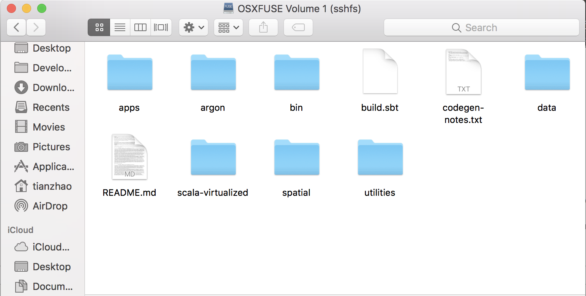
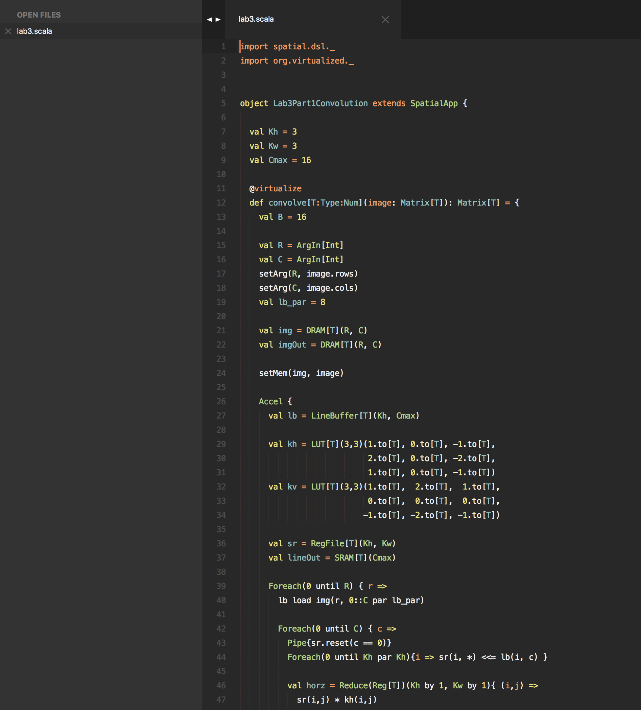

# Mount the Spatial Directory on Tucson

## Mac
### Prerequisites
Install [OSXFUSE](https://osxfuse.github.io/). 

### Mounting
First, create a folder in your home directory. In this example, we create a folder called spatial: 
```bash
cd ~/
mkdir spatial
```

Then, run the following commands to mount the Spatial test folder onto your local computer:
```bash
sshfs spatial@tucson.stanford.edu:/home/spatial/spatial-lang/ ./spatial -o allow_other
```

You will be prompted for a password. The password is spatial.

After you mount the test folder, you can view the test folder in your Finder. The test folder is named OSXFUSE Volume 1:


Go to apps/src, and you can open the apps using your favorite editor. In this example, we are opening the app called lab3.scala using Sublime: 


After you are done using the file system, you can unmount it by running the following commands:
```bash
cd ~/
umount -f spatial
```

These commands will unmount the remote file system. To verify that unmount is successful, run:
```bash
mount
```
You will see that the test folder (spatial) is no more mounted.

### Troubleshooting
Usually when you switch from one network to another, the SSHFS utilty will need to be restarted. In this case, you can run umount to unmount the remote network drive, and then mount again.
