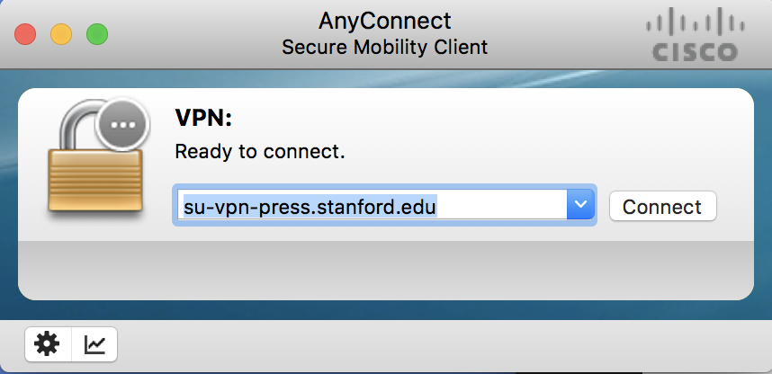
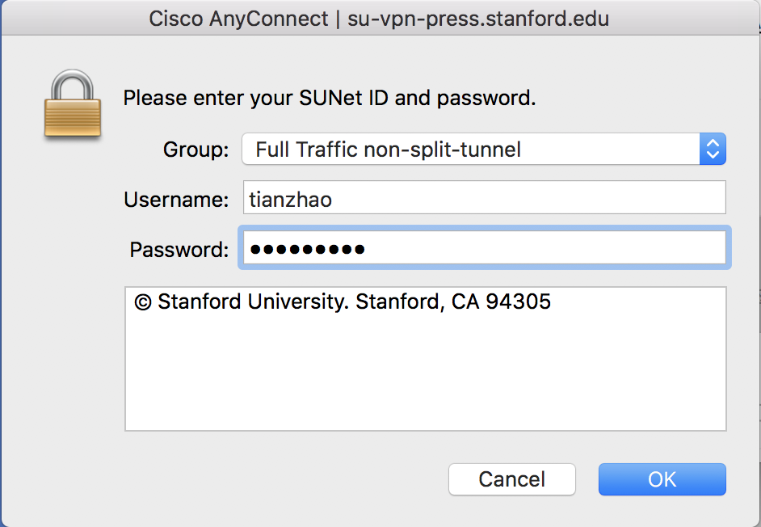
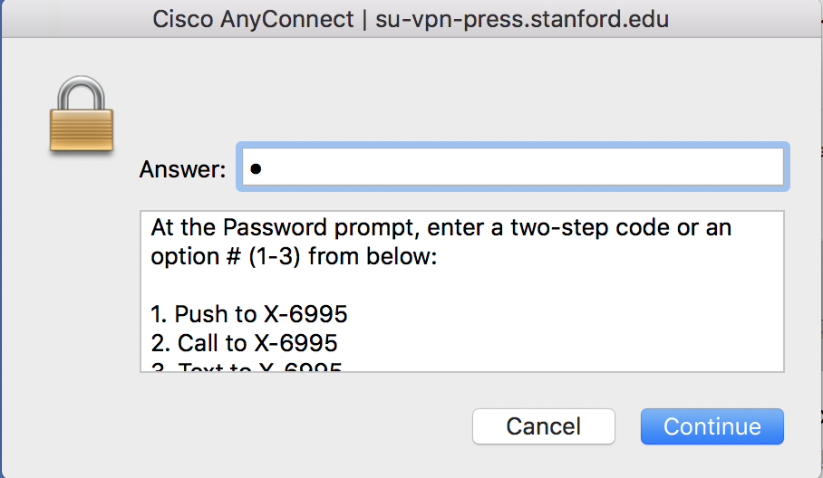
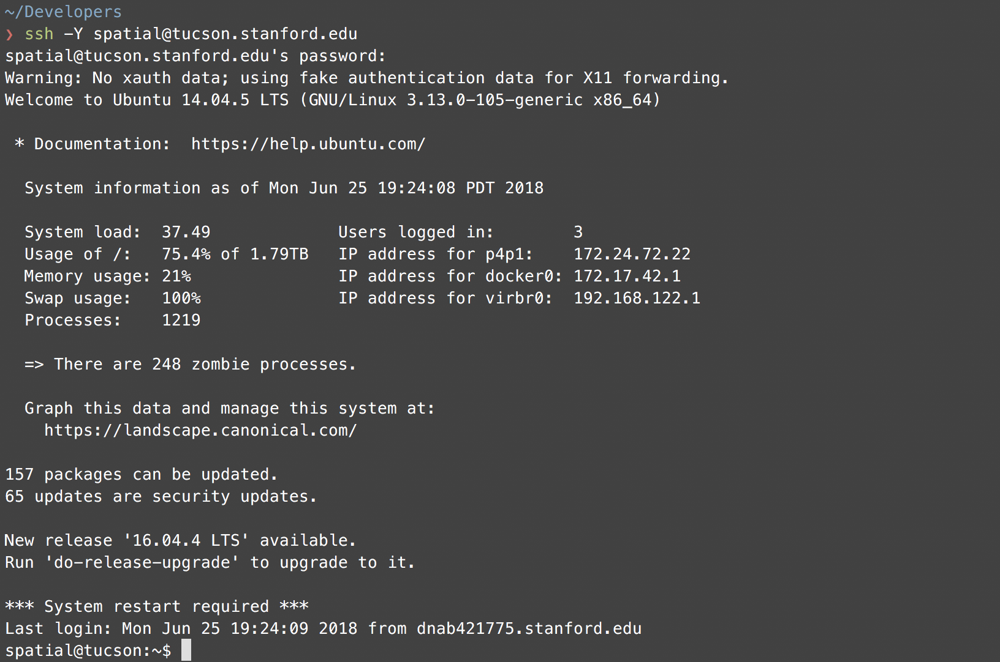
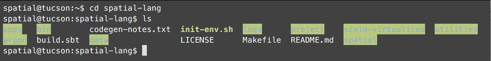
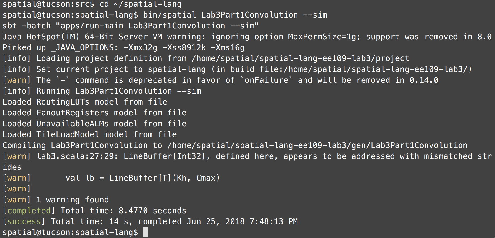
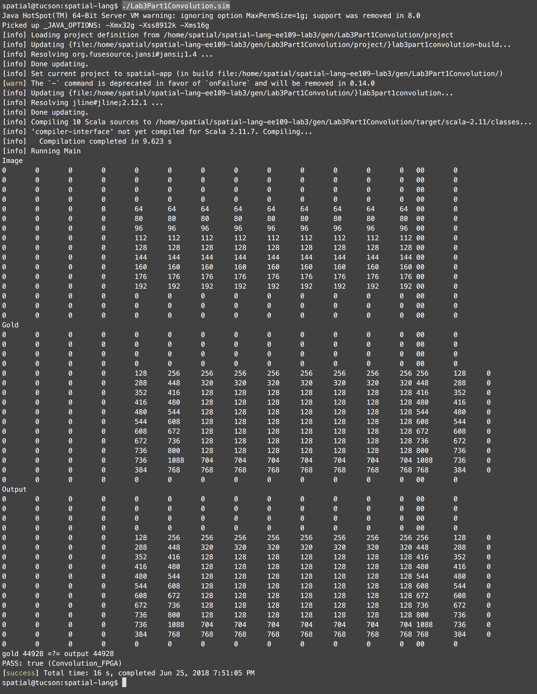
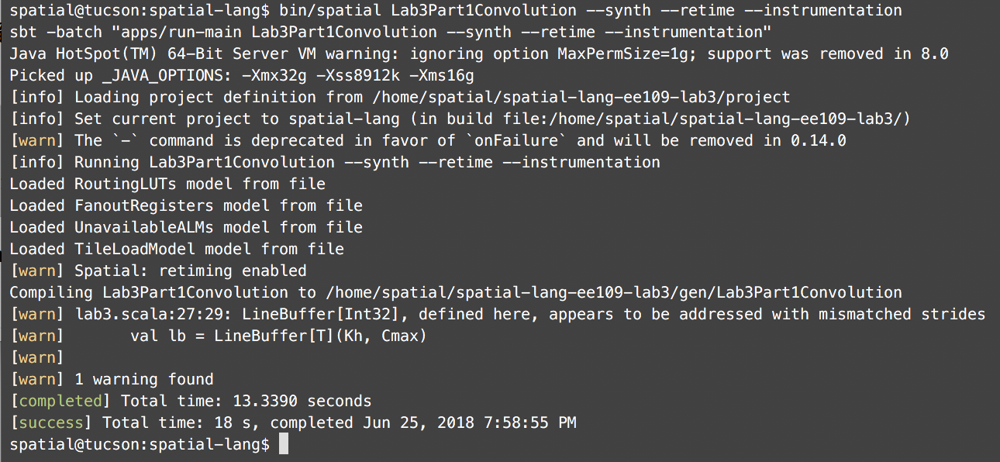
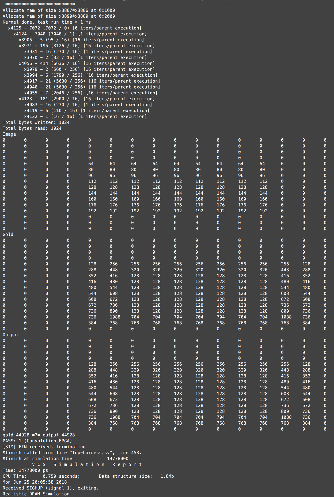

# For Test Users
If you only want to test the features of Spatial, we provide test accounts on tucson:
```
USERNAME: spatial
PASSWORD: spatial
```

## Set up VPN
To log in, first make sure that you are on the Stanford network by using Cisco Anyconnect VPN. The VPN can be downloaded at this [link](https://uit.stanford.edu/service/vpn/mac_anyconnect). After installation, a login page would appear: 



Click connect, and the VPN would ask for your password: 



Enter your password, and choose an option for the two-step authentication:


After you successfully connect to Stanford network, you can now proceed to connect to tucson, which is a server that hosts the environment for running Spatial. 


## SSH
in your terminal, run ssh with your password (spatial):
```bash
ssh -Y spatial@tucson.stanford.edu
```
You will see a login screen that looks like: 



## Scala Simulation
Spatial environment is hosted under the spatial-lang directory. You can go into the directory by running:
```bash
cd spatial-lang
ls
```



The apps are hosted under apps/src. In this example, we are going to run Scala simulation for 2D convolution. First, take a look at the convolution app: 
```bash
cd apps/src
vi lab3.scala
```

If you prefer using other editors, you can remotely mount the network drive by following this [tutorial](./sshfs.md)

The implementation of 2D Convolution is under: 
```scala
object Lab3Part1Convolution extends SpatialApp { // Line 5
  ...
} // Line 109
```

You can modify the app in anyway you want. After you finished modifying the app, go back to the main spatial-lang directory and generate the simulation files:
```bash
cd ~/spatial-lang
bin/spatial Lab3Part1Convolution --sim
```

After the generation finishes, you will see the following screen: 


This screen indicates that your simulation application is generated for Scala functional simulation successfully. To run the generated simulation app, run: 

```bash
./Lab3Part1Convolution.sim
```

You will see the following screen:


The result of your application is printed to the console. The last line of the log indicates that your application ran successfully in Scala simulation. 

## VCS Simulation
Next, we will go through the process for VCS simulation. In your terminal, type:
```bash
bin/spatial Lab3Part1Convolution --synth --retime --instrumentation
```

Here is an overview of what each flag does: 
- --synth: generate a synthesizable project.
- --retime: generate the design with retiming registers automatically inserted into the design. This feature breaks large combinational blocks into smaller ones.
- --instrumentation: generate the design with instrumentation registers inserted at each level of controller tree. This feature helps user understand the cycle counts spent at each controller.

And you will see the following screen: 


The generated synthesizable project is stored in gen. Navigate into gen and run ls: 
```bash
cd gen && ls
```


You will see that the synthesized project is called Lab3Part1Convolution. Navigate into this directory first, and then run make vcs to generate the VCS simulation project:

```bash
cd Lab3Part1Convolution
make vcs
```

VCS project generation would take a while to finish. After the generation is done, run the following commands to start VCS simulation:
```bash
bash run.sh
```

You will see the result of VCS simulation that looks like: 



The top controller ran for 7072 cycles in simulation.

## Cheat Sheet
We also provide a [cheat sheet](spatial-cheatsheet.md) for using Spatial.
